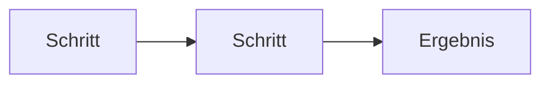

# Styleguide — Herzog CAB Handbuch

Verbindliche Schreibregeln für alle Handbuch-Seiten (seit Neuaufbau 07/2026).

## Zielgruppe und Ton

* **Leser:** Endanwender im Werk — Bediener, Arbeitsvorbereitung, Administratoren. KEINE Entwickler.
* **Anrede:** Sie-Form. Imperativ in Anleitungen („Klicken Sie auf **Speichern**").
* **Keine Code-Begriffe** im Fließtext (kein `QSettings`, `JSON`, „Widget", Klassennamen).
* **App-Begriffe = Handbuch-Begriffe:** Hohlgeflecht (nicht Rohrgeflecht), Geflechtsdichte (nicht Verlegelänge), Feinheit/Titer (nicht lineare Dichte), Produktlänge/-gewicht (nicht Seil…), Flechtmaschinen, Klöppel, Spulvolumen, Spulauftrag, Spulstelle.
* Datei- und URL-Namen bleiben **englisch und stabil** (wichtig für das F1-Mapping).

## Die drei Inhaltsebenen (WICHTIGSTE Regel)

1. **Grundlagen** (`basics/`) — bereichsübergreifende Bedienkonzepte. Werden verlinkt, nie kopiert.
2. **Desktop-App** (`orders/ … parameter-overview/`) — je App-Bildschirm GENAU EINE Referenzseite. Hier — und nur hier — wird jedes Feld und jede Schaltfläche erklärt. Das sind die F1-Zielseiten.
3. **Aufgaben & Abläufe** (`tasks/`) — Workflows über mehrere Module. Verlinken auf Referenz + Grundlagen, erklären selbst KEINE Felder.

Dazu seit 09/2026 zwei Ergänzungen, die dieselbe Regel einhalten:

* **Web-App** (`web/`) — je Modul der Web-App eine Seite mit Bedienung im Browser und den *Unterschieden* zur Desktop-App. Felder, die es in beiden gibt (Auftrags-Reiter, Rechner, Maschinendaten), werden **nicht** wiederholt, sondern auf die Desktop-Referenz verlinkt. Nur Web-eigene Bildschirme (Konto und Benutzer, Abo, Rollen, Import, Registrierung) werden dort vollständig beschrieben.
* **Lizenzportal** (`portal/`) — je Portal-Seite eine Referenzseite (Konto, Benutzer, Anfragen, Download, Sicherheit).

**How-To verlinkt, Referenz beschreibt.** Jedes Feld an genau einer Stelle.

## Seitentypen und Badges

Jede Seite beginnt direkt nach der H1 mit ihrem Typ-Badge:

| Typ | Badge (erste Zeile nach H1) |
|---|---|
| Referenz | `!!! abstract "Referenz — <Ein-Satz-Zweck>"` |
| How-To | `!!! example "Anleitung — <was am Ende fertig ist>"` |
| Konzept | `!!! info "Konzept — <was diese Seite erklärt>"` |
| Problembehebung | `!!! question "Problemlösung — <welches Problem>"` |

## Schablone: Referenzseite (Modul/Bildschirm)

```markdown
# <Bildschirmname wie in der App>

!!! abstract "Referenz — <Zweck in einem Satz>"

## Wofür Sie diesen Bereich nutzen
2–3 Sätze Einsatzzweck, typische Situationen.

## Der Bildschirm im Überblick
Screenshot (Vollansicht) + kurze Orientierung, was wo liegt.

## Bedienelemente im Detail
### <Bereich / Feld / Schaltfläche>
Je Element ein Absatz oder eine Tabelle: was es tut, erlaubte Werte,
Standardwert, wann es sichtbar/gesperrt ist.

## Verwandte Seiten
Links auf How-Tos (tasks/), Grundlagen (basics/) und Nachbar-Referenzen.
```

Reihenfolge der Bedienelemente = **Bildschirm-Layout** (oben → unten, links → rechts), nicht Aufgabenreihenfolge.

## Schablone: How-To / Workflow (tasks/)

```markdown
# <Verb + Ziel, z. B. „Spulen für einen Flechtauftrag planen">

!!! example "Anleitung — <Ergebnis>"

**Voraussetzungen:** …



## Schritt 1: <Aktion>
Nummerierte Handlungen, Bedienelemente **fett**. Feld-Details NICHT hier —
auf die Referenzseite verlinken.

## Ergebnis
Woran Sie den Erfolg erkennen.

## Wenn etwas nicht klappt
Links in den Hilfe-Tab.
```

## Schablone: Berechnungsseite (STRIKT formelfrei)

```markdown
# <Berechnungsname wie in der App>

!!! abstract "Referenz — Berechnung: <was sie liefert, ein Satz>"

## Wofür
Zweck und typischer Anwendungsfall (2–4 Sätze).

## Eingabewerte
| Feld | Bedeutung | Einheit / Auswahl |
|---|---|---|

## Ergebnis
| Wert | Bedeutung | Einheit |
|---|---|---|

## Bedienung
Besonderheiten DIESER Seite (Einheiten-Umschalter, Skizze, Live-Umrechnung …).
Der gemeinsame Aufbau aller Berechnungsseiten steht in
[So sind Berechnungsseiten aufgebaut](../../basics/calc-page-anatomy.md) — verlinken, nicht wiederholen.

## Berechnung
> Die genaue Berechnungsformel ist nicht Bestandteil dieser Dokumentation.

## Verwandte Berechnungen
```

**Policy:** Keine Formeln, keine Rechenwege, keine mathematischen Herleitungen — nirgends. Der Standardsatz unter „Berechnung" ist Pflicht.

## Screenshot-Platzhalter (Elke ersetzt sie später)

Wo ein Bild hingehört, aber noch fehlt, IMMER exakt dieses Muster (auffindbar über die Suche nach „Screenshot fehlt"):

```markdown
!!! warning "📷 Screenshot fehlt"
    **Motiv:** <was auf dem Bild zu sehen sein soll>
    **So erzeugen:** <welcher Bildschirm, welcher Zustand, ggf. Klickweg>
    **Ziel-Datei:** `assets/screenshots/<kapitel>/<name>.png`
```

Bestehende, noch gültige Screenshots weiterverwenden (`docs/assets/screenshots/…`); Bildpfade relativ zur Seite (`../assets/…` bzw. `../../assets/…`).

**Web-App und Lizenzportal** werden per Skript bebildert: `_tools/web_screenshots.py` (Playwright) rendert die lokale Testumgebung (Docker + Vite) mit 1440 × 900 px in `docs/assets/screenshots/web/` und `…/portal/`. Solange ein Bild fehlt, steht in der Seite derselbe Platzhalter wie oben, ergänzt um die Zeile `<!-- web-bild <pfad> -->`; `python _tools/web_platzhalter.py zurueck` tauscht Platzhalter gegen Bild, sobald die Datei existiert (`… ohne Argument` macht aus fehlenden Bildern wieder Platzhalter). Bei Oberflächenänderungen das Skript erneut laufen lassen statt von Hand zu fotografieren.

## Screenshot-Stil (für die Aufnahme)

* Immer **helles Theme**, gleiche Fensterbreite (~1600 px, 100 % Skalierung).
* Demo-Daten „Musterbetrieb" — keine echten Kunden-/Preisdaten.
* Annotationen: blaue Nummernkreise `#00459a`, gelber Fokus-Rahmen `#ffb800`, Rot NUR für Warnungen. Nummern möglichst per Text daneben statt ins PNG einbrennen.

## Formatierung

* Schaltflächen/Feldnamen **fett**: **Speichern**, **Neu…**
* Menüpfade kursiv mit >: *Datei > Einstellungen*
* Tasten mit `++`-Notation: ++f1++, ++ctrl+p++
* Hinweise als Admonitions: `!!! tip "Tipp"`, `!!! warning "Achtung"`, `!!! info "Hinweis"`
* Alternativen Wege (z. B. Maintenance-Tool vs. Windows-Einstellungen) als Content-Tabs (`=== "Weg A"`).
* Abläufe mit mehreren Stationen als Mermaid-`flowchart`.
* Kapitel-Startseiten (`index.md`) sind **Karten-Hubs** (Grid-Cards), keine Linklisten.

## F1-Verträglichkeit

Jede Referenzseite in „Funktionen"/„Verwaltung" gehört zu einem oder mehreren App-Nav-Keys. Die Zuordnung pflegt `f1-mapping.json` (Repo-Root, kanonisch). Beim Umbenennen/Verschieben von Seiten IMMER `f1-mapping.json` und `mkdocs.yml`-Redirects nachziehen.
