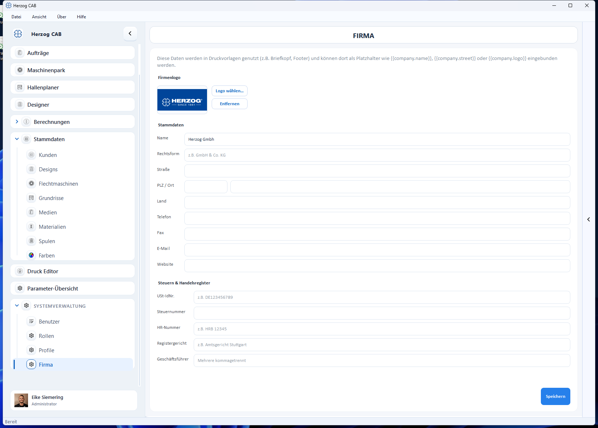

# Firma

!!! abstract "Referenz — Firmenstammdaten und Logo pflegen, die in Druckvorlagen verwendet werden."

## Wofür Sie diesen Bereich nutzen

Unter *Systemverwaltung > Firma* pflegen Sie Ihre Firmenstammdaten. Diese
Angaben werden in [Druckvorlagen](../print-templates/index.md) verwendet —
z. B. als Briefkopf oder Fußzeile — und stehen dort als Platzhalter wie
`{{company.name}}`, `{{company.street}}` oder `{{company.logo}}` zur
Verfügung.

!!! warning "Berechtigung erforderlich"
    Die Firmendaten dürfen nur Benutzer mit dem Recht
    **Firmendaten verwalten** ändern (siehe
    [Rollen und Berechtigungen](roles.md)).

## Der Bildschirm im Überblick

## Bedienelemente im Detail

### Firmenlogo

Über **Logo wählen…** hinterlegen Sie Ihr Firmenlogo (z. B. für den
Briefkopf); mit **Entfernen** löschen Sie es wieder. Solange kein Logo
hinterlegt ist, zeigt die Vorschau *kein Logo*.

### Stammdaten

| Feld | Beschreibung |
|---|---|
| **Name** | Firmenname. |
| **Rechtsform** | z. B. GmbH & Co. KG. |
| **Straße**, **PLZ / Ort**, **Land** | Anschrift. |
| **Telefon**, **Fax**, **E-Mail**, **Website** | Kontaktdaten. |

### Steuern & Handelsregister

| Feld | Beschreibung |
|---|---|
| **USt-IdNr.** | Umsatzsteuer-Identifikationsnummer (z. B. DE123456789). |
| **Steuernummer** | Steuernummer. |
| **HR-Nummer** | Handelsregisternummer (z. B. HRB 12345). |
| **Registergericht** | Zuständiges Amtsgericht (z. B. Amtsgericht Stuttgart). |
| **Geschäftsführer** | Mehrere durch Komma getrennt. |

### Speichern

**Speichern** sichert alle Angaben; die Statuszeile meldet
*„Firmendaten gespeichert."*

## Verwandte Seiten

* [Druckvorlagen](../print-templates/index.md) — wo die Firmendaten erscheinen
* [Rollen und Berechtigungen](roles.md)
