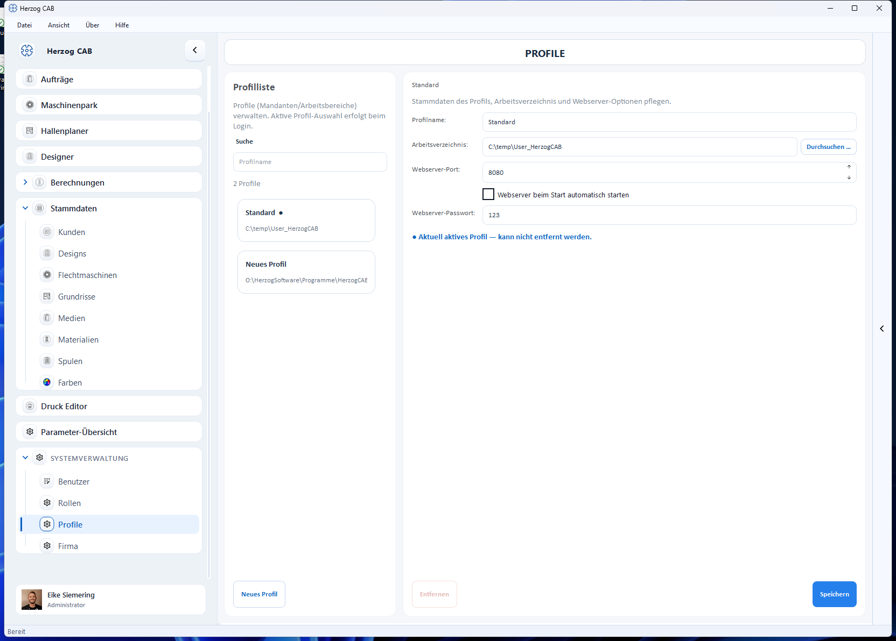

# Profile (Arbeitsbereiche)

!!! abstract "Referenz — Profile verwalten: Arbeitsverzeichnis, Webserver-Optionen, Profil wechseln und Migration aus Altversionen."

## Das Konzept: Workspace und Profil

Herzog CAB trennt **Daten** und **Konfiguration** über zwei Begriffe:

* Ein **Workspace** (Arbeitsverzeichnis / Arbeitsbereich) ist der Daten-Ordner
  mit allen Stammdaten, Aufträgen, Designs und Druckvorlagen. Was genau darin
  liegt, zeigt die Seite [Speicherort](storage-location.md).
* Ein **Profil** (Mandant) verbindet einen Namen mit einem Arbeitsverzeichnis
  und den zugehörigen Webserver-Optionen. Welches Profil aktiv ist, wählen
  Sie nach dem [Login](login.md#profil-auswahl-nach-der-anmeldung).

Mit mehreren Profilen können Sie z. B.

* mehrere **Mandanten** oder Werke getrennt halten (jeweils eigener
  Datenordner),
* einen **Test-** und einen **Produktiv-Arbeitsbereich** parallel betreiben,
* oder einen **gemeinsamen Workspace** auf einem Netzlaufwerk von mehreren
  Arbeitsplätzen nutzen.

## Der Bildschirm im Überblick

Die Profilverwaltung öffnen Sie über *Systemverwaltung > Profile* oder über
*Datei > Einstellungen > Allgemein >* **Profile verwalten …**. Links steht
die **Profilliste** mit Suchfeld (*Profilname*) und der Schaltfläche
**Neues Profil**, rechts der Editor des gewählten Profils. Das aktuell
aktive Profil ist in der Liste markiert.

!!! warning "Berechtigung erforderlich"
    Diesen Bereich sehen und nutzen nur Benutzer mit dem Recht
    **Workspace-Einstellungen**.

## Bedienelemente im Detail

### Profil-Editor

| Feld / Schaltfläche | Bedeutung |
|---|---|
| **Profilname** | Anzeigename des Profils (Pflichtfeld). |
| **Arbeitsverzeichnis** | Daten-Ordner des Workspace. **Durchsuchen …** öffnet die Ordnerauswahl. Auf den Ordner muss Schreibzugriff bestehen, sonst meldet der Editor *„Kein Schreibzugriff auf den Ordner."* |
| **Webserver-Port** | Port des eingebauten [Webservers](settings/web-server.md) für dieses Profil (Standard 8080). |
| **Webserver beim Start automatisch starten** | Startet den Webserver automatisch, sobald das Profil geöffnet wird. |
| **Webserver-Passwort** | Optionaler Zugriffsschutz für die mobile Ansicht. |
| **Entfernen** | Nimmt das Profil aus der Konfiguration heraus — der Datenordner selbst bleibt unangetastet. Das aktuell aktive Profil kann nicht entfernt werden. |
| **Speichern** | Sichert die Änderungen. |

## Profil wechseln

Sie können jederzeit in einen anderen Arbeitsbereich wechseln:

=== "Beim Login"

    Nach jeder Anmeldung fragt der Dialog **Profil auswählen**, welches
    Profil geöffnet werden soll — wählen Sie es aus und klicken Sie auf
    **Profil öffnen**.

=== "Im laufenden Programm"

    1. *Datei > Einstellungen*, Tab **Allgemein** öffnen.
    2. Auf **Profil wechseln …** klicken und das gewünschte Profil wählen.

!!! info "Wechsel über Programmneustart"
    Ein Profilwechsel startet Herzog CAB neu, damit der gewählte
    Arbeitsbereich sauber geladen wird. So wird zugleich verhindert, dass
    ungespeicherte Eingaben verloren gehen — sichern Sie offene Änderungen
    vorher.

## Arbeitsverzeichnis (Workspace-Pfad) ändern

1. *Systemverwaltung > Profile* öffnen (oder *Datei > Einstellungen >
   Allgemein >* **Profile verwalten …**).
2. Das Profil in der Liste wählen.
3. Beim Feld **Arbeitsverzeichnis** auf **Durchsuchen …** klicken und den
   gewünschten Ordner wählen.
4. Mit **Speichern** sichern.

!!! tip "Gemeinsamer Workspace im Netzwerk"
    Soll ein Arbeitsbereich von mehreren Rechnern genutzt werden, legen Sie
    das Arbeitsverzeichnis auf ein **Netzlaufwerk**, auf das alle
    Arbeitsplätze zugreifen können. Für die zentralen **Benutzerdaten**
    (Konten, Profile, Zuweisungen) gibt es dafür den eigenen Bildschirm
    [Speicherort](storage-location.md).

!!! warning "Neustart erforderlich"
    Das Ändern des Arbeitsverzeichnisses des **aktiven** Profils erfordert
    einen Neustart von Herzog CAB, damit die Daten sauber geladen werden.

## Migration aus älteren Versionen

Wenn Sie von einer älteren Version (vor 1.3) updaten, werden Benutzerdaten
und Druckvorlagen beim ersten Start automatisch und einmalig ins neue Format
migriert — Sie müssen nichts tun. Auch spätere interne Umbenennungen von
Datendateien erledigt Herzog CAB selbst beim ersten Start nach dem Update.

## Verwandte Seiten

* [Speicherort](storage-location.md) — zentrale Benutzerdaten und Inhalt des Arbeitsbereichs
* [Anmeldung und Abmelden](login.md) — Profil-Auswahl nach dem Login
* [Einstellungen: Webserver](settings/web-server.md) — mobile Ansicht mit QR-Code
