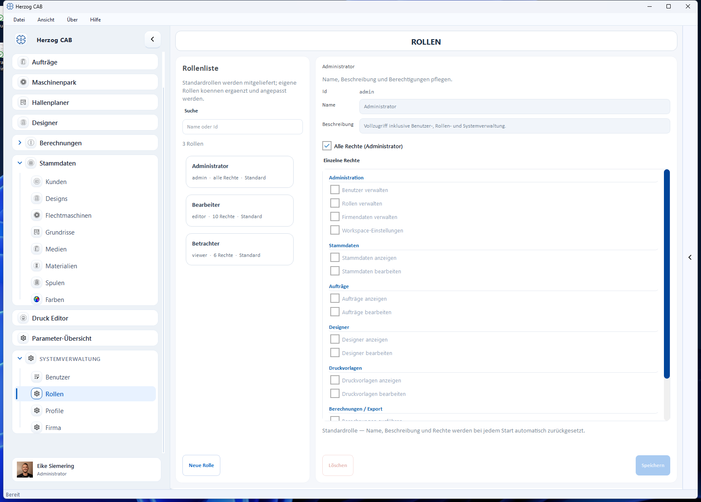

# Rollen und Berechtigungen

!!! abstract "Referenz — Das Rechtesystem von Herzog CAB: Standardrollen, Einzelrechte und eigene Rollen."

## Wofür Sie diesen Bereich nutzen

Herzog CAB hat ein **rollenbasiertes Rechtesystem**. Statt einzelne
Berechtigungen pro Benutzer zu setzen, weisen Sie [Benutzern](users.md)
Rollen zu — die Rolle bündelt die Berechtigungen. Die Verwaltung öffnen Sie
über *Systemverwaltung > Rollen*.

!!! warning "Berechtigung erforderlich"
    Diesen Bereich sehen und nutzen nur Benutzer mit dem Recht
    **Rollen verwalten**.

## Der Bildschirm im Überblick

Links steht die **Rollenliste** mit Suchfeld (*Name oder Id*) und der
Schaltfläche **Neue Rolle**, rechts der Editor der gewählten Rolle. Jeder
Listeneintrag zeigt den Rollennamen, die Anzahl der Rechte (bzw. *alle
Rechte*) und ob es sich um eine *Standard*- oder *eigene* Rolle handelt.

## Eingebaute Rollen

Herzog CAB liefert drei Standardrollen mit:

| Rolle | Zielgruppe | Rechte |
|---|---|---|
| **Administrator** | IT / Fachverantwortlicher | Vollzugriff inklusive Benutzer-, Rollen- und Systemverwaltung („Alle Rechte"). |
| **Bearbeiter** | Datenpflege / Arbeitsvorbereitung | Darf in allen Arbeitsbereichen voll arbeiten: Stammdaten, Aufträge, Designer, Druckvorlagen bearbeiten, Berechnungen ausführen. |
| **Betrachter** | Auszubildende / Gäste | Ausschließlich Lesezugriff auf alle Bereiche; darf zusätzlich Berechnungen ausführen sowie drucken/exportieren, aber keine Daten anlegen oder ändern. |

!!! info "Standardrollen sind schreibgeschützt"
    Bei Standardrollen werden Name, Beschreibung und Rechte **bei jedem
    Programmstart automatisch zurückgesetzt** — Anpassungen daran gehen
    verloren. Wenn Sie abweichende Rechte brauchen, legen Sie eine **eigene
    Rolle** an.

## Einzelne Rechte

Eine Rolle setzt sich aus Einzelrechten zusammen, gruppiert nach Bereichen:

| Bereich | Rechte |
|---|---|
| **Administration** | Benutzer verwalten · Rollen verwalten · Firmendaten verwalten · Workspace-Einstellungen |
| **Stammdaten** | Stammdaten anzeigen · Stammdaten bearbeiten |
| **Hallenplaner** | Hallenplaner anzeigen · Hallenplaner bearbeiten |
| **Aufträge** | Aufträge anzeigen · Aufträge bearbeiten |
| **Designer** | Designer anzeigen · Designer bearbeiten |
| **Druckvorlagen** | Druckvorlagen anzeigen · Druckvorlagen bearbeiten |
| **Berechnungen / Export** | Berechnungen ausführen · Drucken / Export |
| **Spezialwerkzeuge** | Parameter Explorer öffnen |

Mit der Option **Alle Rechte (Administrator)** erhält eine Rolle pauschal
sämtliche Berechtigungen — die Einzelrechte-Häkchen spielen dann keine Rolle
mehr.

!!! info "Rechte steuern auch die Navigation"
    Bereiche, für die das *Anzeigen*-Recht fehlt, erscheinen für diesen
    Benutzer gar nicht erst in der linken Navigation — siehe
    [Systemverwaltung im Überblick](index.md).

## Eigene Rollen anlegen und bearbeiten

1. Klicken Sie auf **Neue Rolle** und vergeben Sie im Dialog **Id** (nur
   Kleinbuchstaben, z. B. `supervisor`), **Name** und **Beschreibung**.
2. Haken Sie im Editor die gewünschten **Einzelnen Rechte** an — oder setzen
   Sie **Alle Rechte (Administrator)**. Mindestens ein Recht ist Pflicht.
3. **Speichern** sichert die Rolle.

**Löschen** entfernt eine eigene Rolle. Ist die Rolle noch Benutzern
zugewiesen, weist Herzog CAB vor dem Löschen darauf hin.

!!! tip "Sparsam mit Rollen"
    Beginnen Sie mit den Standardrollen. Eigene Rollen lohnen sich erst bei
    Sonderfällen — z. B. eine Rolle, die Berechnungen ausführen, aber nicht
    drucken darf.

## Verwandte Seiten

* [Benutzer](users.md) — Rollen pro Profil zuweisen
* [Authentifizierung](authentication.md) — Rollen automatisch über Verzeichnis-Gruppen vergeben
* [Benutzer und Rollen einrichten](../tasks/setup-users.md)
