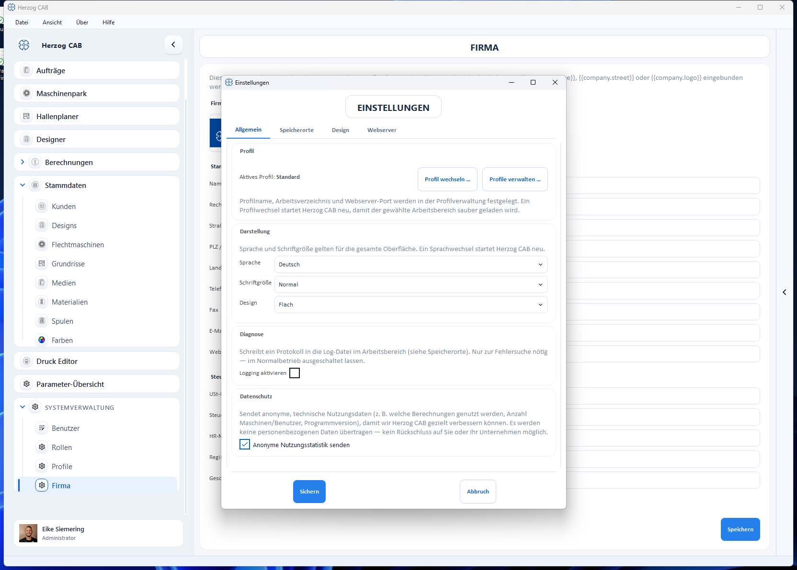

# Allgemein: Sprache, Darstellung, Datenschutz und Produktionsplanung

!!! abstract "Referenz — Tab „Allgemein" des Einstellungen-Dialogs: Profil-Schnellzugriff, Sprache, Schriftgröße, Design, Diagnose-Protokoll und anonyme Nutzungsstatistik."

## Wofür Sie diesen Bereich nutzen

Im Tab **Allgemein** (*Datei > Einstellungen*) stellen Sie die Sprache und
das Erscheinungsbild der gesamten Oberfläche ein, aktivieren bei Bedarf das
Diagnose-Protokoll und entscheiden über die anonyme Nutzungsstatistik.

## Bedienelemente im Detail

### Profil

Die Karte **Profil** zeigt das aktive Profil und bietet die Schaltflächen
**Profil wechseln …** und **Profile verwalten …**. Details dazu stehen auf
der Seite [Profile (Arbeitsbereiche)](../profiles.md) — Profilname,
Arbeitsverzeichnis und Webserver-Port werden dort gepflegt.

### Darstellung

| Einstellung | Optionen | Wirkung |
|---|---|---|
| **Sprache** | Deutsch, Englisch, Italienisch, Spanisch, Polnisch, Chinesisch | Sprache der gesamten Oberfläche. |
| **Schriftgröße** | Normal, Groß | Größere Schrift für bessere Lesbarkeit an großen oder weit entfernten Bildschirmen. Wirkt beim Umschalten sofort als Vorschau. |
| **Design** | Flach, Neumorph | Erscheinungsbild der Oberfläche (flache Flächen oder weiche, plastische Karten). Wirkt beim Umschalten sofort als Vorschau. |

!!! info "Sprachwechsel startet Herzog CAB neu"
    Damit alle Texte vollständig in der neuen Sprache geladen werden,
    startet ein Sprachwechsel das Programm nach dem **Sichern** neu.
    Sichern Sie offene Eingaben vorher.

### Diagnose

| Einstellung | Wirkung |
|---|---|
| **Logging aktivieren** | Schreibt ein Protokoll in die Log-Datei im Arbeitsbereich (`logs\herzogcab.log`, siehe [Speicherorte](files.md)). |

!!! tip "Diagnose nur bei Bedarf"
    Das Protokoll ist nur zur Fehlersuche nötig — im Normalbetrieb
    ausgeschaltet lassen. Der [Support](../../help/support.md) bittet Sie
    ggf., es vorübergehend einzuschalten.

### Datenschutz

| Einstellung | Wirkung |
|---|---|
| **Anonyme Nutzungsstatistik senden** | Sendet anonyme, technische Nutzungsdaten, damit Herzog CAB gezielt verbessert werden kann. |

Gesendet werden ausschließlich technische Angaben, zum Beispiel:

* welche Funktionen und Berechnungen genutzt werden,
* wie oft gedruckt oder exportiert wird,
* die Anzahl der angelegten Maschinen und Benutzer,
* Programmversion, Betriebssystem und Sprache,
* wie lange das Programm genutzt wird.

Es werden **keine personenbezogenen Daten** übertragen — ein Rückschluss auf
Sie oder Ihr Unternehmen ist nicht möglich.

!!! info "Ihre Entscheidung, jederzeit änderbar"
    Beim ersten Programmstart fragt Herzog CAB einmalig um Zustimmung
    (Dialog *„Herzog CAB verbessern"*). Ihre Wahl können Sie hier jederzeit
    ändern. In der **Testversion** ist die Statistik standardmäßig
    eingeschaltet, lässt sich aber ebenfalls hier abschalten.

### Produktionsplanung

| Einstellung | Wirkung |
|---|---|
| **Produktionsstunden je Arbeitstag** | Wie viele Stunden pro Arbeitstag produziert wird (1–24 h in Halbstundenschritten, Standard **8 h**). Damit rechnet Herzog CAB die Laufzeit-Hochrechnung eines Auftrags in Kalendertage um, wenn Sie im [Flechtauftrag](../../orders/braiding-order.md#tab-auftrag) oder [Spulauftrag](../../orders/winding-order.md) das **Produktionsende aus der Hochrechnung übernehmen**. Wochenenden werden dabei übersprungen. |

## Verwandte Seiten

* [Einstellungen (Dialog)](index.md) — Überblick über alle Tabs
* [Profile (Arbeitsbereiche)](../profiles.md)
* [Speicherorte (Dateien und Ordner)](files.md)
