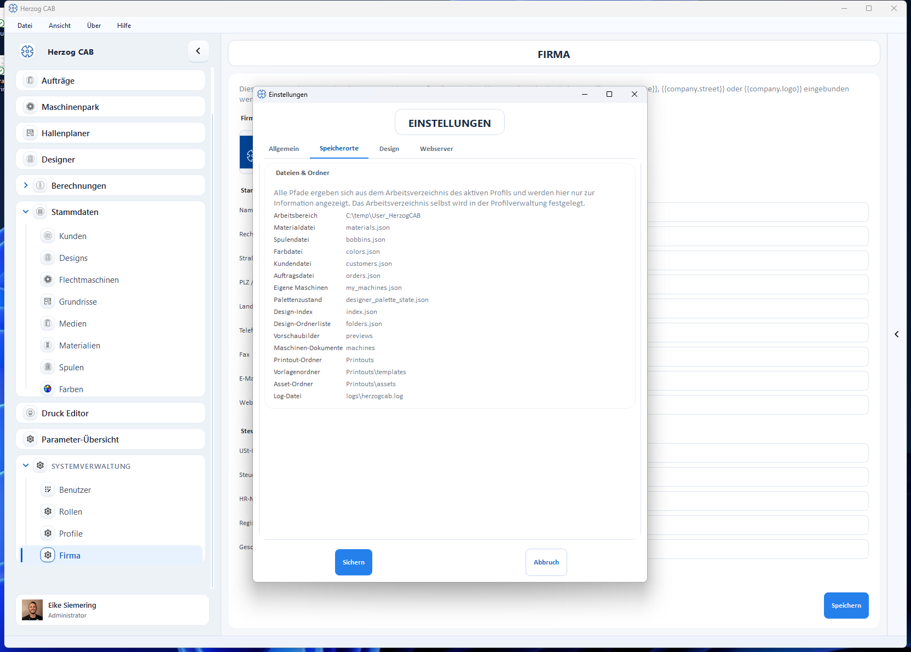

# Speicherorte (Dateien und Ordner)

!!! abstract "Referenz — Tab „Speicherorte" des Einstellungen-Dialogs: Anzeige aller Datei- und Ordnerpfade des aktiven Arbeitsbereichs."

## Wofür Sie diesen Bereich nutzen

Der Tab **Speicherorte** (*Datei > Einstellungen*) zeigt in der Karte
**Dateien & Ordner** — nur zur Information — wo Herzog CAB die einzelnen
Dateien und Ordner ablegt. Alle Pfade ergeben sich aus dem
**Arbeitsverzeichnis** des aktiven Profils; hier lässt sich nichts ändern.

## Die angezeigten Pfade

| Zeile | Inhalt |
|---|---|
| **Arbeitsbereich** | Das Arbeitsverzeichnis des aktiven Profils — der Wurzelordner aller folgenden Pfade. |
| **Materialdatei** / **Spulendatei** / **Farbdatei** / **Kundendatei** / **Auftragsdatei** / **Eigene Maschinen** | Die Stammdaten- und Auftragsdateien. |
| **Palettenzustand** | Die zuletzt verwendete Farbpalette des Designers. |
| **Design-Index** / **Design-Ordnerliste** / **Vorschaubilder** | Verwaltungsdateien und Vorschaubilder der Design-Bibliothek. |
| **Maschinen-Dokumente** | Ordner mit den zu Maschinen hinterlegten Dokumenten. |
| **Printout-Ordner** / **Vorlagenordner** / **Asset-Ordner** | Druckvorlagen mit Vorlagen- und Bilddateien. |
| **Log-Datei** | Das Diagnose-Protokoll (siehe [Diagnose](appearance.md#diagnose)). |

## Wo wird etwas geändert?

* Den **Speicherort der zentralen Benutzerdaten** (lokal oder Netzwerk) und
  die vollständige Übersicht, welche Datei was enthält, finden Sie auf der
  kanonischen Seite [Speicherort](../storage-location.md) in der
  Systemverwaltung.
* Das **Arbeitsverzeichnis** selbst legen Sie in der
  [Profilverwaltung](../profiles.md#arbeitsverzeichnis-workspace-pfad-andern)
  fest — nicht in diesem Tab.

## Verwandte Seiten

* [Speicherort](../storage-location.md) — die kanonische Speicherort-Seite
* [Profile (Arbeitsbereiche)](../profiles.md)
* [Dateiablage im Überblick](../../appendix/file-locations.md)
