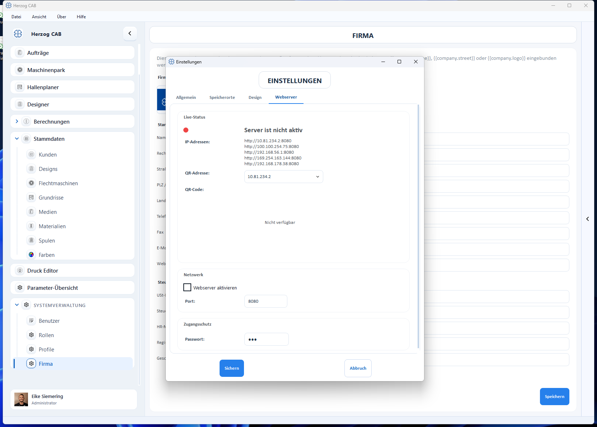

# Webserver und QR-Code

!!! abstract "Referenz — Tab „Webserver" des Einstellungen-Dialogs: den eingebauten Webserver starten, IP-Adresse wählen und den QR-Code für den mobilen Zugriff nutzen."

## Wofür Sie diesen Bereich nutzen

Der eingebaute **Webserver** stellt Auftrags- und Maschinendaten im Browser
bereit — z. B. am Smartphone direkt an der Maschine. Der Zugang erfolgt
bequem über einen **QR-Code**, den Sie hier anzeigen und auch auf
[Auftragspapiere drucken](../../orders/print.md) können.

!!! warning "Berechtigung erforderlich"
    Das Ändern der Webserver-Einstellungen erfordert das Recht
    **Workspace-Einstellungen**.

## Bedienelemente im Detail

### Karte „Live-Status"

| Element | Bedeutung |
|---|---|
| **Status** | Zeigt, ob der Server aktiv ist (*Server läuft auf Port …* bzw. *Server ist nicht aktiv*). |
| **IP-Adressen** | Liste der erreichbaren Adressen (je Netzwerkadapter), z. B. `http://192.168.178.38:8080`. |
| **QR-Adresse** | Auswahl der IP-Adresse, die im QR-Code verschlüsselt wird (manche Rechner haben mehrere Adressen). |
| **QR-Code** | Wird angezeigt, **sobald der Server aktiv ist** (bei inaktivem Server: *Nicht verfügbar*). Smartphone-Kamera darauf richten — der Browser öffnet die mobile Ansicht. |

### Karte „Netzwerk"

| Element | Bedeutung |
|---|---|
| **Webserver aktivieren** | Startet bzw. stoppt den Server. |
| **Port** | Port des Servers (Standard 8080). Schlägt der Start fehl (Port belegt), meldet Herzog CAB dies. |

### Karte „Zugangsschutz"

| Element | Bedeutung |
|---|---|
| **Passwort** | Optionales Passwort für die mobile Ansicht. |

!!! info "Einstellungen gelten pro Profil"
    Port, Autostart (*Webserver beim Start automatisch starten*) und Passwort
    werden **pro Profil** gespeichert und lassen sich auch in der
    [Profilverwaltung](../profiles.md) pflegen.

!!! warning "Sicherheits-Hinweis"
    Ein offener Webserver im Werks-Netz kann sensible Auftragsdaten
    preisgeben. Aktivieren Sie immer den **Passwortschutz** und wählen Sie
    eine IP-Adresse im internen Netz.

!!! tip "Richtige IP wählen"
    Hat der Rechner mehrere Netzwerkadapter, prüfen Sie, dass die im QR-Code
    verwendete IP auch vom Smartphone erreichbar ist (gleiches WLAN/Netz).

## Verwandte Seiten

* [Aufträge](../../orders/index.md) — welche Daten mobil bereitstehen
* [Auftragspapiere drucken](../../orders/print.md) — QR-Code auf dem Maschinenblatt
* [Profile (Arbeitsbereiche)](../profiles.md) — Port, Autostart und Passwort pro Profil
