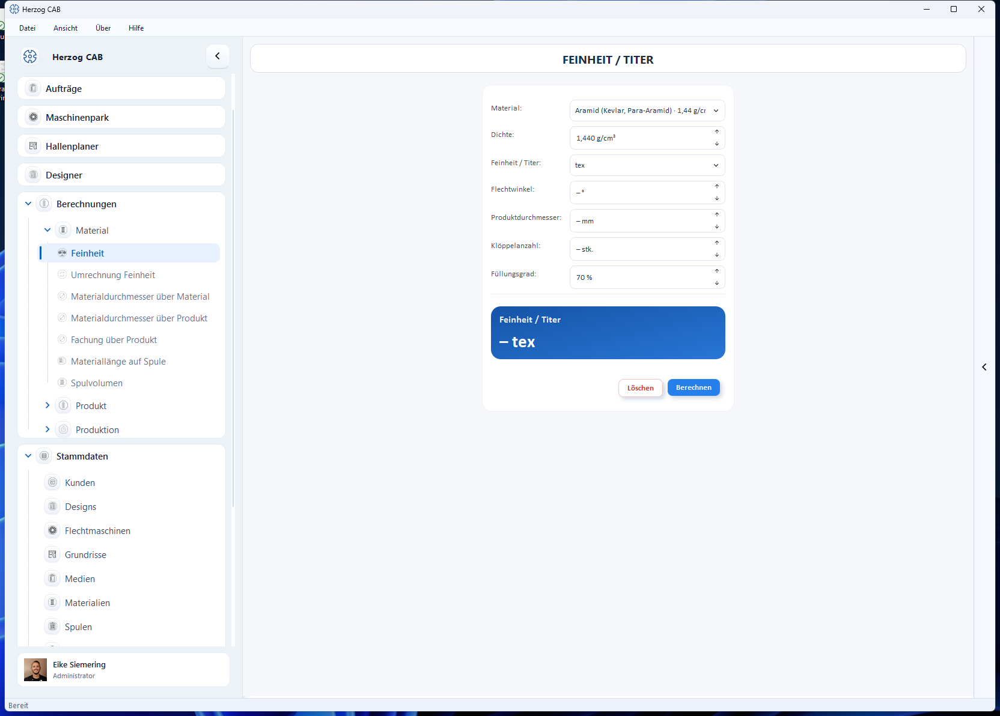

# So sind Berechnungsseiten aufgebaut

!!! info "Konzept — Der gemeinsame Aufbau aller Berechnungsseiten: Eingabe, Berechnen, Ergebnis-Kacheln"

Alle Berechnungen in Herzog CAB folgen demselben Baukasten. Wer eine Seite
kennt, findet sich auf allen zurecht. Diese Seite erklärt die gemeinsamen
Bedienelemente **einmal zentral** — die einzelnen
[Berechnungsseiten](../calculations/index.md) beschreiben nur noch ihre
Eingabe- und Ergebniswerte sowie Besonderheiten.

## Zwei Wege zu jeder Berechnung

1. **Kachel-Übersicht:** Der Navigationseintrag *Berechnungen* (bzw. eine
   seiner Gruppen) öffnet eine Übersicht aller Rechner als Kacheln.
2. **Navigationsbaum:** Direkt über die Gruppen *Material*, *Produkt* (mit
   *Hohlgeflecht*), *Produktion* und *Spulerei* in der
   [Navigation](navigation.md).

## Aufbau einer Berechnungsseite

Von oben nach unten: die **Titelzeile** mit dem Namen der Berechnung, die
weiße **Eingabe-Karte**, darunter (oder daneben, bei umfangreichen Seiten)
der **Ergebnisbereich** und die Schaltflächen **Löschen** und **Berechnen**.
Umfangreiche Seiten wie *Kern-Mantel-Produkt* oder *Maschinenlaufzeit pro
Spule-Satz* gliedern die Eingabe zusätzlich in überschriebene Abschnitte
oder nebeneinanderliegende Teilbereiche.

### Eingabefelder

| Feldtyp | Verhalten |
|---|---|
| **Zahlenfeld mit Einheit** | Die Einheit steht direkt im Feld (leer z. B. „– mm"). Sie geben nur die Zahl ein; kleine Pfeile am Feldrand zählen schrittweise hoch/runter. |
| **Auswahlliste (Dropdown)** | Feste Auswahl, z. B. Geflechtsart oder Maschinentype. |
| **Material-Auswahl** | Listet die [Material-Stammdaten](../master-data/materials.md); die Auswahl füllt abhängige Felder wie *Dichte* und *Feinheit* automatisch. Die Werte lassen sich anschließend übersteuern. |
| **Spulen-Auswahl** | Listet die [Spulen-Stammdaten](../master-data/bobbins.md), auf einigen Seiten vorgefiltert über das Feld *Maschinentype*. |
| **Trommel-Auswahl** | Listet die [Trommel-Stammdaten](../master-data/drums.md); die Maße kommen aus der gewählten Trommel (ab Version 2.1.0, z. B. *Produktlänge pro Trommel*). |
| **Umschalt-Knöpfe** | Für Entweder-oder-Angaben, z. B. Garnart *Multifil/Monofil* oder Schichtanzahl *1/2/3*. Je nach Wahl werden passende Felder ein- oder ausgeblendet. |
| **Einheiten-Auswahl am Feld** | Neben einzelnen Feldern (z. B. *Feinheit*) wählen Sie die Eingabe-Einheit: tex, dtex, den, Nr. metrisch, Nr. englisch. |

Einige Felder haben sinnvolle **Startwerte** (z. B. Füllungsgrad 70 %) —
diese können Sie einfach stehen lassen oder anpassen.

### Berechnen und Löschen

* **Berechnen** führt die Berechnung aus. Alternativ drücken Sie einfach
  ++enter++.
* **Löschen** setzt alle Eingabefelder auf ihre Startwerte zurück und leert
  den Ergebnisbereich.

### Eingabeprüfung (rote Felder)

Fehlt eine Pflichtangabe oder ist ein Wert unzulässig, passiert beim
**Berechnen** zweierlei:

* Die betroffenen Felder werden **rot umrandet** — Sie sehen sofort, wo
  etwas fehlt.
* Eine kurze Einblendung erscheint: „Bitte die Eingaben überprüfen!" Die
  Meldung blockiert nichts und verschwindet von selbst.

Auch fachlich unmögliche Kombinationen (z. B. eine Bedeckung über 100 %)
werden so gemeldet; einzelne Seiten zeigen dafür eigene Hinweistexte.

### Ergebnisbereich

* **Blaue Hauptkachel(n):** das zentrale Ergebnis, groß dargestellt.
* **Weiße Mini-Kacheln:** Neben- und Zwischenwerte, im Zweierraster.
* **Ergebnis-Tabellen:** Einige Seiten (z. B. *Kern-Mantel-Produkt*) zeigen
  zusätzlich eine Tabelle mit zwei Wertespalten.
* Vor der ersten Berechnung zeigt jede Kachel einen Strich mit der Einheit
  (z. B. „– tex") als Platzhalter.

### Einheiten-Umschalter an Ergebnis-Kacheln

An einzelnen Ergebnis-Kacheln (z. B. *Benötigte Feinheit* auf der Seite
[Materialdurchmesser über Produkt](../calculations/material/material-diameter-product.md))
sitzt eine kleine Einheiten-Auswahl direkt in der Kachel-Kopfzeile (z. B.
**tex/dtex**). Damit schalten Sie nur die **Anzeige-Einheit** des bereits
berechneten Werts um — es wird nichts neu berechnet.

## Sonderfall: Live-Umrechner

Zwei Seiten folgen einem einfacheren Muster ohne **Berechnen**-Schaltfläche:
[Umrechnung Feinheit](../calculations/material/linear-density-conversion.md)
und *Umrechnung Geflechtsdichte*. Sie bestehen aus:

* einem Eingabefeld für den Ausgangswert,
* den Auswahllisten **Von** und **Zu** für die Einheiten,
* einem runden **Tausch-Knopf** dazwischen, der die Umrechnungsrichtung
  umkehrt und das bisherige Ergebnis als neue Eingabe übernimmt,
* einer blauen Ergebnis-Kachel, die bei **jeder** Eingabe- oder
  Einheitenänderung sofort aktualisiert wird.

Live-Umrechner erzeugen bewusst keine [Verlaufseinträge](history.md).

## Verlauf, gemerkte Werte und Favoriten

* Jede erfolgreich abgeschlossene Berechnung landet im
  [Verlauf](history.md) (rechte Seitenleiste) und unter *Letzte
  Berechnungen* auf der [Startseite](home.md) — ein Klick lädt die
  damaligen Eingaben wieder.
* Innerhalb einer Sitzung bleiben Ihre Eingaben erhalten, auch wenn Sie
  zwischendurch andere Seiten öffnen.
* Häufig genutzte Berechnungen pinnen Sie per Rechtsklick als
  [Favorit](favorites.md) an.

## Ergebnis drucken

Auf jeder Berechnungsseite druckt *Datei > Drucken…* (++ctrl+p++) das
aktuelle Ergebnis über eine [Druckvorlage](../print-templates/index.md) vom
Typ „Berechnung". Gibt es mehrere passende Vorlagen, fragt ein Dialog, welche
verwendet werden soll; ohne eigene Vorlagen nutzt Herzog CAB eine
mitgelieferte Standardvorlage. Details unter
[Vorschau und Druck](../print-templates/preview-and-print.md).

## Testversion: begrenzte Berechnungsläufe

In der Testversion ist die Anzahl der Berechnungen **je Berechnungsart**
begrenzt. Nach jedem Lauf zeigt eine Einblendung den Reststand; ist das
Kontingent aufgebraucht, wird die Berechnung gesperrt. Die Vollversion
rechnet unbegrenzt — siehe [Testversion und Kontingente](trial-quotas.md).

## Verwandte Seiten

* [Berechnungen (Übersicht aller Rechner)](../calculations/index.md)
* [Verlauf der Berechnungen](history.md)
* [Materialien (Stammdaten)](../master-data/materials.md)
* [Spulen (Stammdaten)](../master-data/bobbins.md)
* [Vorschau und Druck](../print-templates/preview-and-print.md)
