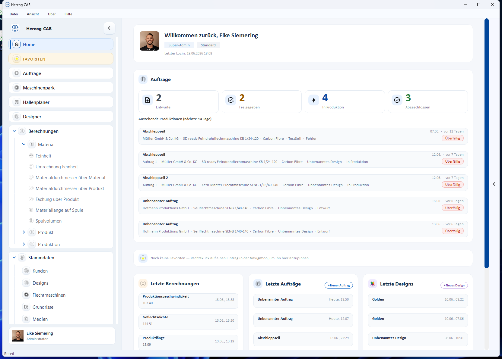

# Startseite (Home)

!!! abstract "Referenz — Das persönliche Dashboard beim Programmstart"

## Wofür Sie diesen Bereich nutzen

**Home** ist die erste Seite nach der Anmeldung und Ihr persönliches
Dashboard: Sie sehen auf einen Blick den Stand Ihrer Aufträge, anstehende
Produktionen, Ihre Favoriten und die zuletzt bearbeiteten Berechnungen,
Aufträge und Designs. Jeder Benutzer hat ein eigenes Home — die Inhalte
richten sich nach dem angemeldeten Benutzer und dem aktiven Arbeitsbereich.

## Der Bildschirm im Überblick

Von oben nach unten: Begrüßungs-Kachel, ggf. Testversions-Kachel und
Hinweis-Banner, Aufträge-Bereich, Favoriten, drei Spalten mit letzten
Aktivitäten und — für Verwalter — der Workspace-Status. Die Seite wird bei
jedem Öffnen neu aufgebaut, die Zahlen sind also immer aktuell.

## Bedienelemente im Detail

### Begrüßungs-Kachel

Ganz oben steht „Willkommen zurück" mit Ihrem **Profilbild** (bzw. Ihren
Initialen), Ihrem Anzeigenamen, Ihren **Rollen** und dem Namen des aktiven
**Arbeitsbereichs** als kleine Plaketten sowie — sofern bekannt — dem
Zeitpunkt Ihres letzten Logins. Profilbild und Anzeigename ändern Sie unter
[Mein Profil](../admin/my-profile.md).

### Testversions-Kachel (nur Testversion)

In der Testversion zeigt eine eigene Kachel die **Restlaufzeit** („noch
X Tage", farblich abgestuft) und vier Zähler-Kacheln mit den verbrauchten
Kontingenten für **Kunden**, **Designs**, **Maschinen** und **Aufträge**
(z. B. „2 / 3"). Ist ein Kontingent voll, wird der Zähler rot. Details unter
[Testversion und Kontingente](trial-quotas.md). In der Vollversion erscheint
diese Kachel nicht.

### Hinweis-Banner

* **Update-Banner** — erscheint, wenn eine neue Programmversion verfügbar
  ist („Version X ist verfügbar."). Die Schaltfläche **Details &
  Installation** startet die Aktualisierung, siehe
  [Updates installieren](../setup/update.md).
* **Neuigkeiten-Banner** — verweist auf Neuigkeiten, Releases und die
  Feedback-Seite. **Öffnen** ruft die Herzog-CAB-Seite auf; **Nicht mehr
  anzeigen** blendet das Banner dauerhaft aus.

### Bereich „Aufträge"

Sichtbar für Benutzer mit dem Recht, Aufträge anzusehen.

| Element | Funktion |
|---|---|
| Status-Kacheln **Entwürfe**, **Freigegeben**, **In Produktion**, **Abgeschlossen** | Zeigen die Anzahl der Aufträge im Arbeitsbereich je Status. Ein Klick auf eine Kachel öffnet die [Auftragsübersicht](../orders/index.md), bereits gefiltert auf diesen Status. |
| Aufteilung „X Flecht · Y Spul" | Erscheint unter der großen Zahl, sobald mindestens ein Spulauftrag existiert, und schlüsselt die Summe nach Auftragsart auf. |
| Liste **Anstehende Produktionen (nächste 14 Tage)** | Zeigt bis zu fünf nicht abgeschlossene Aufträge, deren Produktionsdatum innerhalb der nächsten 14 Tage liegt oder bereits überschritten ist, sortiert nach Fälligkeit. Jede Zeile nennt Auftragsname, Auftragsart (bei Spulaufträgen), Auftragsnummer, Kunde, Maschine, Material und Design sowie rechts das Datum mit relativer Angabe („heute", „morgen", „in 3 Tagen"). |
| Status-Plakette je Zeile | Zeigt den Auftragsstatus; liegt das Produktionsdatum in der Vergangenheit, erscheint stattdessen die rote Plakette **Überfällig**. |
| Klick auf eine Zeile | Öffnet den Auftrag direkt im [Flechtauftrag-](../orders/braiding-order.md) bzw. [Spulauftrag-Editor](../orders/winding-order.md). |

Gibt es keine passenden Aufträge, steht dort „Keine anstehenden Produktionen
in den nächsten 14 Tagen."

### Bereich „Favoriten"

Zeigt Ihre angepinnten Navigationseinträge als klickbare Karten (Symbol,
Name und Herkunftsbereich). Solange nichts angepinnt ist, erscheint nur eine
schmale Hinweiszeile: „Noch keine Favoriten — Rechtsklick auf einen Eintrag
in der Navigation, um ihn hier anzupinnen." Wie das Anpinnen funktioniert,
lesen Sie unter [Favoriten](favorites.md).

### Letzte Aktivitäten (drei Spalten)

| Spalte | Inhalt |
|---|---|
| **Letzte Berechnungen** | Die bis zu fünf zuletzt durchgeführten Berechnungen mit Ergebnis und Zeitpunkt. Ein Klick öffnet die Berechnung mit den damaligen Eingabewerten (siehe [Verlauf](history.md)). Der Link **Alle Berechnungen →** führt zur [Berechnungs-Übersicht](../calculations/index.md). |
| **Letzte Aufträge** | Die zuletzt geöffneten Aufträge (Spulaufträge sind gekennzeichnet). **+ Neuer Auftrag** legt direkt einen neuen Auftrag an; **Alle Aufträge →** öffnet die [Auftragsübersicht](../orders/index.md). |
| **Letzte Designs** | Die zuletzt geöffneten Designs. **+ Neues Design** startet den [Designer](../designer/index.md) mit einem neuen Design; **Alle Designs →** öffnet die [Design-Bibliothek](../master-data/designs.md). |

Die Spalten erscheinen nur, wenn Ihre Berechtigungen den jeweiligen Bereich
zulassen; leere Spalten zeigen einen Hinweis wie „Noch keine Berechnungen in
diesem Arbeitsbereich."

### Bereich „Workspace-Status" (nur für Verwalter)

Benutzer mit mindestens einem Verwaltungsrecht sehen unten eine
Status-Kachel mit:

* **Benutzer und Profile** — Anzahl der Benutzerkonten (davon aktive),
  Anzahl der Arbeitsbereichs-Profile und dem letzten Login im System.
* **Speicherort** — ob der zentrale Datenspeicher erreichbar ist (bei
  Netzwerk-Speicherort) bzw. der Hinweis „Speicher: lokal auf dieser
  Maschine". Ist der zentrale Speicher **nicht** erreichbar, erscheint die
  Meldung rot — prüfen Sie dann die Verbindung, siehe
  [Speicherort](../admin/storage-location.md).

<!-- TODO(Verifikation): Ein Dialog „Home anpassen" (Bereiche ein-/ausblenden,
Reihenfolge per Ziehen ändern) ist im Programmcode vorhanden
(home_customize_dialog.cpp), aber in der aktuellen Version 1.4.5 nirgends in
der Oberfläche verdrahtet — kein Zahnrad-Symbol auf der Home-Seite gefunden.
Erst dokumentieren, wenn der Aufruf in der App sichtbar ist. -->

## Verwandte Seiten

* [Oberfläche im Überblick](interface.md)
* [Favoriten](favorites.md)
* [Verlauf der Berechnungen](history.md)
* [Testversion und Kontingente](trial-quotas.md)
* [Auftragsübersicht](../orders/index.md)
