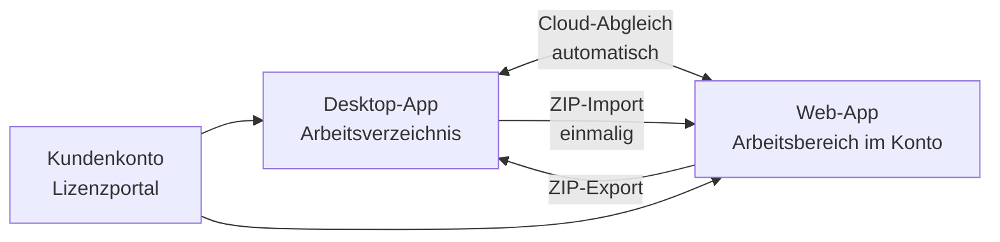

# Desktop-App oder Web-App?

!!! info "Konzept — Die beiden Formen von Herzog CAB, ihre Stärken und wie sie zusammenarbeiten"

Seit Version 2.0 gibt es Herzog CAB zweimal:

* Die **Desktop-App** — installiert auf Windows oder macOS, arbeitet mit
  einem Arbeitsverzeichnis auf dem Rechner oder Netzlaufwerk, lizenziert
  über das Kundenkonto oder (Bestand) einen Dongle.
* Die **Web-App** — im Browser unter
  [app.herzog-cab.com](https://app.herzog-cab.com), arbeitet im
  Arbeitsbereich des Kundenkontos auf dem Herzog-Server, lizenziert über
  dasselbe Jahresabo wie die Desktop-App.

Beide teilen sich das **Kundenkonto** (ein Login), das **Datenmodell**
(Aufträge, Designs, Maschinen, Stammdaten, Druckvorlagen) und die
**Rechenkerne** — Ergebnisse und Flechtbilder sind identisch.

## Wann welche?

| Situation | Empfehlung |
|---|---|
| Ein fester Arbeitsplatz in der Arbeitsvorbereitung, Daten sollen im Haus bleiben | Desktop-App |
| Bediener an mehreren Orten, Tablets in der Halle, Home-Office | Web-App |
| Mischdesigns, Texturen | Desktop-App (nur dort enthalten) |
| Druckvorlagen gestalten | Beide: Druck-Editor im Programm oder [Druck Editor](../web/print-editor.md) im Browser (Vorlagen aus der Web-App kommen ab Programmversion 2.1.0 auch ins Programm) |
| Ein Team soll gleichzeitig auf denselben Datenbestand sehen | Web-App (ein Arbeitsbereich je Konto) — oder Desktop-App mit Arbeitsverzeichnis auf dem Netzlaufwerk |
| Kein Rechner mit Adminrechten, keine Installation möglich | Web-App |
| Arbeit ohne Internet (Messe, Baustelle) | Desktop-App mit Offline-Miete |
| Erst einmal ausprobieren | Beide: [Testversion](../web/trial.md) bei Herzog anfragen, 30 Tage im Programm und im Browser |

Viele Betriebe nutzen beides: die Desktop-App als führendes System in der
Arbeitsvorbereitung, die Web-App zum Nachsehen und Rechnen in der Halle
und im Vertrieb.

## Zusammenspiel

* **Cloud-Abgleich** (Desktop ⇄ Web): Die Desktop-App lädt ihr
  Arbeitsverzeichnis automatisch hoch, sobald der Schalter unter
  [Einstellungen > Lizenz](../admin/settings/license.md) gesetzt ist, und
  holt danach zurück, was in der Web-App angelegt, geändert oder gelöscht
  wurde (abschaltbar). Bei Konflikten gewinnt der Desktop.
* **ZIP-Import / -Export**: Einmalige Übernahme in beide Richtungen über
  [Import aus dem Desktop](../web/import.md).
* **Kundenkonto**: Benutzer, Rollen und Bausteine gelten für beide — siehe
  [Kundenkonto und Einladung](../setup/account.md).

!!! warning "Abgleich in beide Richtungen — der Desktop hat Vorrang"
    Mit eingeschaltetem Rückweg kommen Änderungen aus der Web-App ins
    Arbeitsverzeichnis, Löschungen eingeschlossen. Ändern beide Seiten
    denselben Eintrag, gilt die Fassung des Desktops. Ist der Rückweg aus,
    fließt nichts zurück. Wie Sie das passend einrichten, steht unter
    [Daten vom Desktop in die Web-App bringen](../tasks/desktop-to-web.md).

## Was es nur in einer der beiden gibt

| Nur Desktop-App | Nur Web-App |
|---|---|
| Mischdesigns, Texturen, Zwei-Fenster-Vergleich im Designer | Bedienung am Tablet und Smartphone |
| Mehrere Profile (Arbeitsbereiche), lokale Benutzer, Entra/LDAP | Eigene Rollen je Konto mit Kästchen-Zuweisung |
| Eingebauter Webserver mit QR-Code | Abo und Bestellung im Browser |
| — | Ein gemeinsamer Arbeitsbereich je Konto ohne Pfade |

Die vollständige Gegenüberstellung steht unter [Web-App](../web/index.md).

## Verwandte Seiten

* [Einsatz-Szenarien](../setup/topology.md) — Aufbauten im Werk
* [Web-App](../web/index.md)
* [Kundenkonto und Einladung](../setup/account.md)
