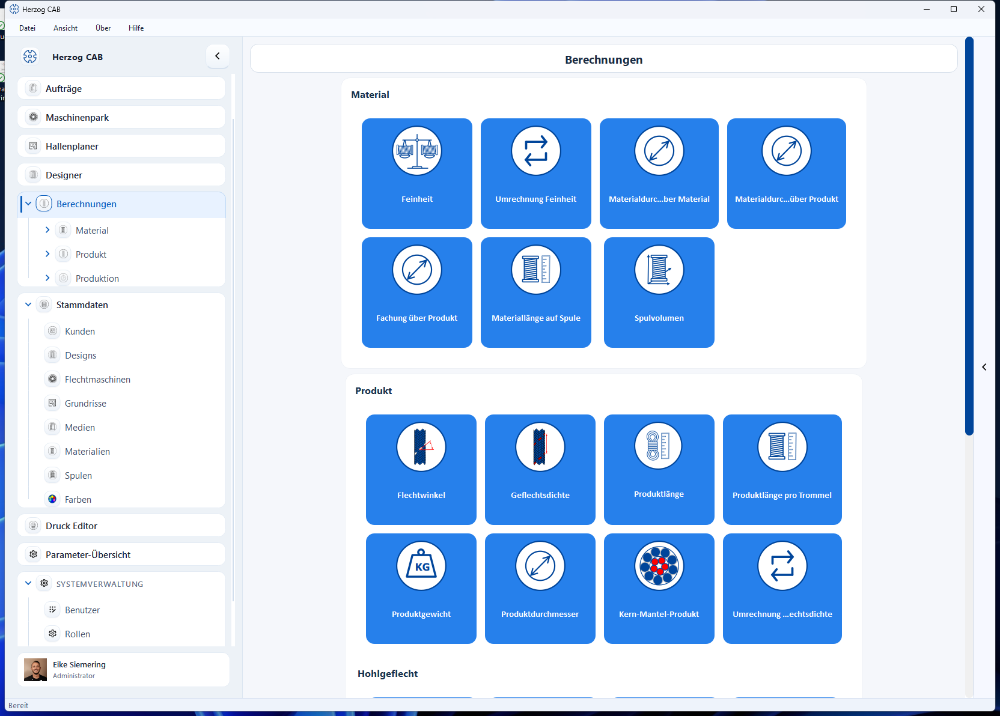
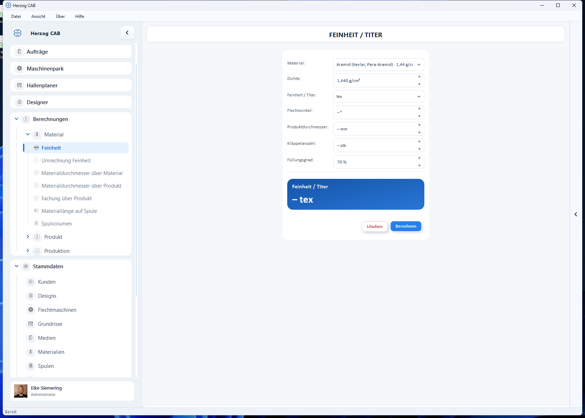

# Berechnungen

Das Herz von Herzog CAB sind die **Berechnungen**. Sie sind über den
Navigationspunkt *Berechnungen* erreichbar; dort öffnet sich zunächst eine
Übersicht aller Rechner als Kacheln, gruppiert wie in der App.

## Gruppen

- :material-tune-variant: __[Material](material/index.md)__

    ---
    Feinheit (Titer), Materialdurchmesser, Materiallänge auf Spule, Spulvolumen

- :material-shape-outline: __[Produkt](product/index.md)__

    ---
    Flechtwinkel, Geflechtsdichte, Durchmesser, Länge, Gewicht – inkl.
    [Hohlgeflecht](tubular-braid/index.md)

- :material-cog-outline: __[Produktion](machine/index.md)__

    ---
    Geschwindigkeit, Maschinenmaße, Laufzeit, Spulmaschinen, Wechselräder

## Bedienung der Berechnungen

Alle Berechnungen sind gleich aufgebaut: Eingabefelder oben, Ergebnis darunter,
Schaltfläche **Berechnen**.

| Bereich | Inhalt |
|---|---|
| **Eingabe** | Felder für die Eingangsgrößen. |
| **Auswahl** | Optional: Material/Spule/Maschine aus den Stammdaten übernehmen. |
| **Ergebnis** | Berechnete Ausgabewerte (oft mehrere gleichzeitig). |
| **Berechnen / Löschen** | Ergebnis berechnen bzw. Eingaben zurücksetzen. |

!!! tip "Berechnungen rückwärts lösen"
    Viele Berechnungen lassen sich umkehren: Lassen Sie das gesuchte Feld leer
    und tragen Sie stattdessen das Ergebnis ein – Herzog CAB rechnet in die
    andere Richtung.

## Verlauf der Berechnungen (rechte Seitenleiste)

Am rechten Fensterrand können Sie über den Pfeil die **Verlaufs-Leiste**
auf- und zuklappen. Sie listet die **zuletzt durchgeführten Berechnungen** mit
ihrem Ergebnis. Ein Klick auf einen Eintrag öffnet die Berechnung erneut – mit
allen Eingabewerten, die Sie zuletzt verwendet haben. So springen Sie schnell
zwischen mehreren Rechnern hin und her, ohne Werte neu einzugeben.

## Werte zwischenspeichern

Eingegebene Werte bleiben erhalten, solange das Programm läuft. Wechseln Sie auf
eine andere Berechnung und kommen später zurück, finden Sie Ihre Eingaben
unverändert vor. Nach einem Programmneustart sind die Werte zurückgesetzt.

## Im Auftrag rechnen

Im [Auftrag](../orders/create.md) öffnen Sie viele dieser Rechner direkt über
das Rechner-Symbol neben den Feldern; das Ergebnis wird in den Auftrag
zurückgeschrieben.
