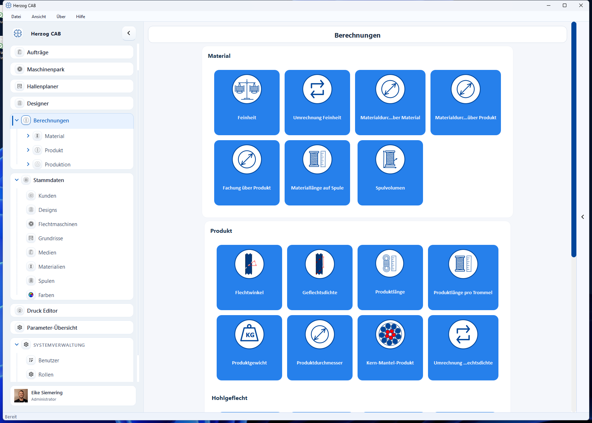

# Berechnungen

!!! abstract "Referenz — Übersicht aller Berechnungen in Herzog CAB"

## Wofür Sie diesen Bereich nutzen

Das Herz von Herzog CAB sind die **Berechnungen**. Sie sind über den
Navigationspunkt *Berechnungen* erreichbar; dort öffnet sich zunächst eine
Übersicht aller Rechner als Kacheln, gruppiert wie in der App. Ob Feinheit,
Geflechtsdichte, Produktionsgeschwindigkeit oder Spulzeit — jede Berechnung
hat eine eigene Referenzseite mit allen Feldern.

## Die fünf Gruppen

- :material-tune-variant: __[Material](material/index.md)__

    ---
    Feinheit (Titer), Materialdurchmesser, Materiallänge auf Spule, Spulvolumen

- :material-shape-outline: __[Produkt](product/index.md)__

    ---
    Flechtwinkel, Geflechtsdichte, Durchmesser, Länge, Gewicht, Kern-Mantel-Produkt

- :material-pipe: __[Hohlgeflecht](tubular-braid/index.md)__

    ---
    Klöppelanzahl, Durchmesser, Materialbreite und Bedeckung von Rohr-/Schlauchgeflechten

- :material-cog-outline: __[Produktion](production/index.md)__

    ---
    Geschwindigkeit, Maschinenmaße, Laufzeit pro Spulensatz, Wechselräder

- :material-tray-full: __[Spulerei](winding/index.md)__

    ---
    Spulzeit, Fadengeschwindigkeit, Spulenkapazität, Materialbedarf und mehr — neu seit 07/2026

## Bedienung der Berechnungen

Alle Berechnungen sind gleich aufgebaut: Eingabefelder oben, Ergebnis darunter,
Schaltfläche **Berechnen**.

| Bereich | Inhalt |
|---|---|
| **Eingabe** | Felder für die Eingangsgrößen. |
| **Auswahl** | Optional: Material/Spule/Maschine aus den Stammdaten übernehmen. |
| **Ergebnis** | Berechnete Ausgabewerte (oft mehrere gleichzeitig). |
| **Berechnen / Löschen** | Ergebnis berechnen bzw. Eingaben zurücksetzen. |

!!! tip "Berechnungen rückwärts lösen"
    Viele Berechnungen lassen sich umkehren: Lassen Sie das gesuchte Feld leer
    und tragen Sie stattdessen das Ergebnis ein – Herzog CAB rechnet in die
    andere Richtung.

Den vollständigen, für alle Berechnungsseiten gültigen Aufbau (Eingabetypen,
Ergebnis-Kacheln, Einheiten-Umschalter, Testversion-Kontingente) finden Sie
unter [So sind Berechnungsseiten aufgebaut](../basics/calc-page-anatomy.md).

## Verlauf der Berechnungen

Am rechten Fensterrand blenden Sie über den Pfeil die **Verlaufs-Leiste** ein,
die zuletzt durchgeführte Berechnungen mit ihrem Ergebnis auflistet und per
Klick wieder öffnet. Details dazu finden Sie unter
[Verlauf der Berechnungen](../basics/history.md).

## Im Auftrag rechnen

Im [Flechtauftrag](../orders/braiding-order.md) öffnen Sie viele dieser Rechner
direkt über das Rechner-Symbol neben den Feldern; das Ergebnis wird in den
Auftrag zurückgeschrieben.
