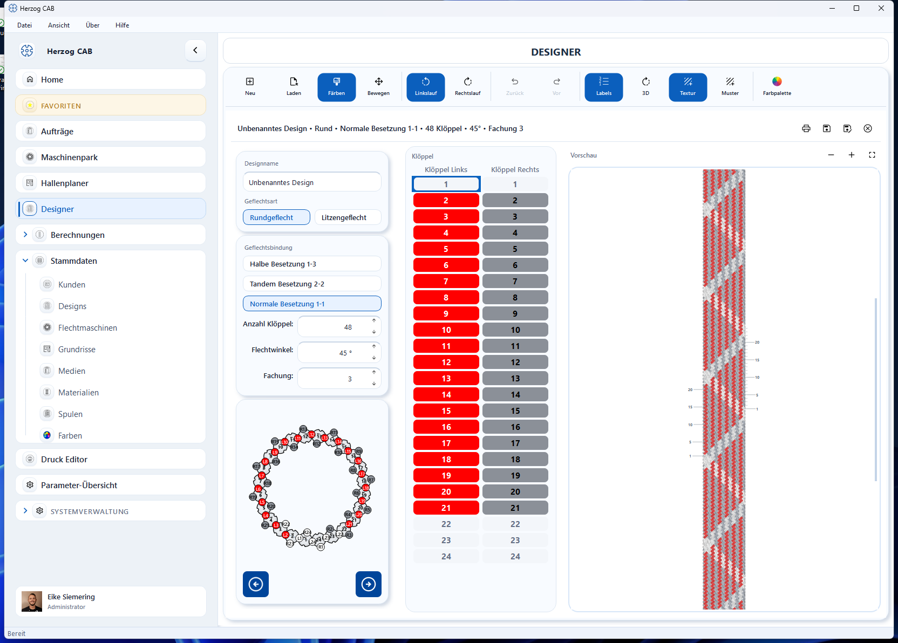

# Designer-Oberfläche

Sobald Sie ein Design öffnen oder neu anlegen, zeigt der Designer die
Bearbeitungsansicht. Sie gliedert sich in Werkzeugleiste (oben),
Einstellungen (links), Klöppel-Tabelle (Mitte) und Muster-Vorschau (rechts).

## Werkzeugleiste

| Werkzeug | Funktion |
|---|---|
| **Neu** / **Laden** | Neues Design anlegen / gespeichertes Design öffnen |
| **Färben** | Einzelne Klöppel mit der aktiven Farbe einfärben |
| **Bewegen** | Ansicht verschieben |
| **Linkslauf** / **Rechtslauf** | Farbreihenfolge der Klöppel schrittweise rotieren |
| **Zurück** / **Vor** | Letzte Änderung rückgängig machen / wiederherstellen |
| **Labels** | Klöppelnummern ein-/ausblenden |
| **3D** | 3D-Vorschau des Rundgeflechts ein-/ausblenden |
| **Textur** / **Muster** | Darstellung zwischen Textur und Musteransicht umschalten |
| **Farbpalette** | Farbpalette für das Einfärben wählen |

## Einstellungen (links)

* **Designname** – Bezeichnung des Designs.
* **Geflechtart** – **Rundgeflecht** oder **Litzengeflecht**.
* **Geflechtsbindung** – Besetzung, z. B. *Halbe Besetzung*, *Tandem
  Besetzung*, *Normale Besetzung* (mit Rapport, z. B. 1-1).
* **Anzahl Klöppel** – Anzahl der Klöppel auf der Maschine.
* **Flechtwinkel** – Flechtwinkel in Grad.
* **Fachung** – Anzahl der Fäden je Klöppel.
* Darunter zeigt ein **Klöppel-Ring** die aktuelle Besetzung mit Nummern und
  Farben.

## Klöppel-Tabelle (Mitte)

Die Tabelle listet alle Klöppel mit ihrer aktuell zugewiesenen Farbe. Sie ist
die genaue, nummerierte Entsprechung zum Klöppel-Ring und zur Vorschau.

## Muster-Vorschau (rechts)

Die Vorschau zeigt das resultierende Geflecht aus den aktuellen
Klöppelfarben – so sehen Sie sofort, wie sich Farbänderungen auf das Muster
auswirken.

→ Wie Sie Farben und Muster konkret setzen, steht unter
[Farben und Muster](colors.md).
