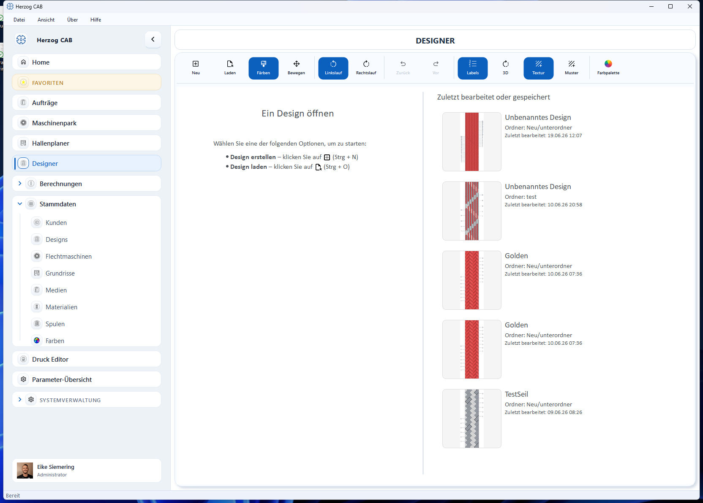

# Design

Im **Designer** entwerfen Sie Flechtmuster und Farbreihenfolgen für Rund- und
Litzengeflechte. Ein Design legt fest, welche Klöppel welche Farbe führen –
daraus ergeben sich Muster wie Spiralen, Ringe oder Karos. Designs lassen sich
speichern, in [Aufträgen](../orders/create.md) verwenden und drucken.

## In diesem Kapitel

* [Designer-Oberfläche](designer.md) – Aufbau, Werkzeugleiste und Bereiche
* [Farben und Muster](colors.md) – Klöppel färben, Paletten, Texturen
* [Produkt-Design](product.md) – Geflechtart, Besetzung und Verwendung im Auftrag

## Design öffnen oder anlegen

Auf dem Startbildschirm des Designers haben Sie zwei Möglichkeiten:

* **Design erstellen** (++ctrl+n++) – ein neues, leeres Design.
* **Design laden** (++ctrl+o++) – ein gespeichertes Design öffnen.

Rechts sehen Sie unter **Zuletzt bearbeitet oder gespeichert** Ihre letzten
Designs mit Vorschaubild – ein Doppelklick öffnet sie direkt.

!!! info "Designs sind Stammdaten"
    Gespeicherte Designs liegen im Workspace und sind über
    *Stammdaten → Designs* in einer Ordnerstruktur organisierbar.
