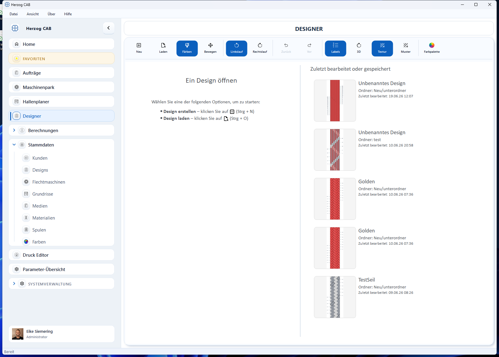

# Designer

!!! abstract "Referenz — der Design-Editor: Flechtdesigns entwerfen, einfärben, animieren, vergleichen, speichern und drucken."

## Wofür Sie diesen Bereich nutzen

Im **Designer** entwerfen Sie Flechtdesigns: Sie wählen die Geflechtsart und die
Geflechtsbindung, legen Klöppelzahl, Flechtwinkel und Fachung fest und färben
dann die einzelnen Klöppel ein. Das Flechtbild entsteht dabei live — so sehen Sie
sofort, welches Muster (Spirale, Ring, Karo …) aus Ihrer Farbbelegung wird.
Fertige Designs speichern Sie in der [Design-Bibliothek](../master-data/designs.md),
verwenden sie in [Flechtaufträgen](../orders/braiding-order.md) und drucken sie
als Maschinenbelegblatt.

## In diesem Kapitel

- :material-tune: **Geflechtsart und Parameter**

    ---

    Rund-, Litzen-, Quadrat- und Packungsgeflecht; Bindung, Klöppelzahl,
    Flechtwinkel, Fachung.

    [:octicons-arrow-right-24: Geflechtsart und Parameter](parameters.md)

- :material-palette: **Färben und Texturieren**

    ---

    Malmodus, Farbbibliothek, Benutzerfarben, Farbwähler, Texturen und
    Seitenfilter.

    [:octicons-arrow-right-24: Färben und Texturieren](painting.md)

- :material-play-circle-outline: **Besetzung und Gangbahn-Animation**

    ---

    Die Maschinen-Draufsicht mit Flügelrädern, die animierten Gangbahnen und
    die Farbrotation.

    [:octicons-arrow-right-24: Besetzung und Animation](animation.md)

- :material-rotate-3d: **3D-Ansicht**

    ---

    Das Flechtbild als runder Geflechtstrang statt als flacher Ausschnitt.

    [:octicons-arrow-right-24: 3D-Ansicht](view-3d.md)

- :material-content-save-outline: **Speichern und Drucken**

    ---

    Speichern mit Zielordner-Auswahl, Speichern unter neuem Namen, Drucken mit
    Vorlagenauswahl und Vorschau.

    [:octicons-arrow-right-24: Speichern und Drucken](save-print.md)

## Der Bildschirm im Überblick

### Startansicht (noch kein Design geöffnet)

Solange kein Design geöffnet ist, zeigt der Designer eine Startansicht mit
Kurzanleitung und Ihren zuletzt verwendeten Designs:

* **Ein Design öffnen** (links) — die beiden Wege zum Start: **Design
  erstellen** (++ctrl+n++) legt ein neues, leeres Design an, **Design laden**
  (++ctrl+o++) öffnet ein gespeichertes.
* **Zuletzt bearbeitet oder gespeichert** (rechts) — Ihre fünf zuletzt
  geänderten Designs, jeweils mit Vorschaubild, Namen, Ordner und dem
  Zeitstempel der letzten Bearbeitung bzw. Speicherung. Ein **Doppelklick**
  öffnet das Design direkt.

### Bearbeitungsansicht

Sobald ein Design geöffnet ist, erscheint die Bearbeitungsansicht. Sie besteht
aus fünf Bereichen:

!!! warning "📷 Screenshot fehlt"
    **Motiv:** Designer-Bearbeitungsansicht mit geöffnetem Rundgeflecht-Design:
    Werkzeugleiste oben, Dokument-Kopfzeile, links Parameter-Panel mit allen
    vier Geflechtsarten und Besetzungsübersicht, Mitte Klöppeltabelle, rechts
    Flechtbild-Vorschau.
    **So erzeugen:** *Designer* öffnen, **Neu** klicken, Fenster breit ziehen
    (Farb- und Texturpalette sichtbar in der Werkzeugleiste), einige Klöppel
    einfärben.
    **Ziel-Datei:** `assets/screenshots/designer/designer-bearbeitungsansicht.png`

| Bereich | Inhalt |
|---|---|
| **Werkzeugleiste** (oben) | Modus-Umschalter, Seitenfilter, Rückgängig/Wiederherstellen, Anzeige-Schalter sowie Farb- und Texturpalette. |
| **Dokument-Kopfzeile** (je Design-Fenster) | Zusammenfassung des Designs und die Aktionen **Drucken**, **Speichern**, **Speichern unter neuem Namen**, **Ansicht schließen**. |
| **Parameter-Panel** (links) | Designname, [Geflechtsart und Parameter](parameters.md) sowie darunter die [Besetzungsübersicht](animation.md). |
| **Klöppeltabelle** (Mitte) | Alle Klöppelpositionen mit ihrer aktuellen Farbe — hier können Sie auch direkt färben. |
| **Vorschau** (rechts) | Das Flechtbild, das aus der aktuellen Farbbelegung entsteht, mit eigenen Zoom-Schaltflächen. |

## Bedienelemente im Detail

### Werkzeugleiste

| Schaltfläche | Funktion |
|---|---|
| **Neu** (++ctrl+n++) | Öffnet ein neues Designfenster mit Standardwerten (Rundgeflecht, Normale Besetzung 1-1). Ist bereits ein Design geöffnet, entsteht ein zweites Fenster daneben (siehe unten). |
| **Laden** (++ctrl+o++) | Wechselt in die [Design-Bibliothek](../master-data/designs.md), wo Sie ein gespeichertes Design auswählen und öffnen. |
| **Färben** | Malmodus: Klicks im Flechtbild oder in der Klöppeltabelle färben Klöppel mit der aktiven Farbe ein — siehe [Färben und Texturieren](painting.md). |
| **Bewegen** | Verschiebemodus: mit gedrückter linker Maustaste verschieben Sie die Ansicht, ohne zu färben. |
| **Linkslauf** / **Rechtslauf** | Seitenfilter für das Färben: legt fest, welche Laufrichtung ein Klick einfärbt. Nur bei Rund- und Quadratgeflecht sichtbar (zwei Läufe). |
| **Zurück** (++ctrl+z++) / **Vor** (++ctrl+y++) | Macht den letzten Färbeschritt rückgängig bzw. stellt ihn wieder her. |
| **Labels** | Blendet die Klöppelbezeichnungen im Flechtbild ein oder aus (Standard: ein). |
| **3D** | Schaltet die [3D-Ansicht](view-3d.md) ein oder aus (nur Rund- und Quadratgeflecht). |
| **Textur** | Schaltet die Texturdarstellung im Flechtbild ein oder aus (Standard: ein). |
| **Muster** | Öffnet die Texturpalette zur Auswahl der Faser-Textur. |
| **Farbe** / **Farbpalette** | Die Farbpalette mit aktiver Farbe, Bibliotheksfarben und Benutzerfarben. |

!!! info "Paletten passen sich der Fensterbreite an"
    In breiten Fenstern liegen die Gruppen **Farbe** und **Texturen** direkt in
    der Werkzeugleiste. Wird das Fenster schmal, klappen sie zu den
    Popup-Schaltflächen **Farbpalette** und **Muster** zusammen — der Inhalt ist
    derselbe.

### Dokument-Kopfzeile

Jedes Design-Fenster hat eine eigene Kopfzeile:

* **Zusammenfassung** (links) — Designname und die wichtigsten Einstellungen in
  einer Zeile, z. B. Geflechtsart, Bindung, Klöppelzahl, Flechtwinkel und
  Fachung. Bei Quadrat- und Packungsgeflecht stehen zusätzlich die
  Flügelrad-Anordnung und (beim Packungsgeflecht) die Zahl der Gangbahnen dabei.
* **Drucken** — startet den [Druck mit Vorlagenauswahl](save-print.md).
* **Speichern** / **Speichern unter neuem Namen** — legt das Design in der
  [Design-Bibliothek](../master-data/designs.md) ab, siehe
  [Speichern und Drucken](save-print.md).
* **Ansicht schließen** (✕) — schließt dieses Design-Fenster. Bei
  ungespeicherten Änderungen fragt die App vorher nach.

### Zwei Designs nebeneinander vergleichen

Der Designer kann **zwei Design-Fenster gleichzeitig** anzeigen — praktisch, um
zwei Farbvarianten direkt zu vergleichen:

1. Öffnen Sie das erste Design.
2. Klicken Sie auf **Neu** — ein zweites, leeres Designfenster erscheint daneben
   und ist aktiv.
3. Klicken Sie auf **Laden** und wählen Sie das zweite Design — es wird in das
   aktive Fenster geladen.

Das **aktive Fenster** erkennen Sie an der Hervorhebung; ein Klick in ein
Fenster aktiviert es. Werkzeugleiste und Parameter-Panel wirken immer auf das
aktive Fenster. Mehr als zwei Fenster sind bewusst nicht möglich — beim Versuch
erscheint der Hinweis *„Es können maximal zwei Designs gleichzeitig geöffnet
sein"*. Schließen Sie dann zuerst eines über das ✕ in dessen Kopfzeile.

### Zoomen und Verschieben

| Aktion | Bedienung |
|---|---|
| Zoomen | **Mausrad** über dem Flechtbild — gezoomt wird an der Mausposition. |
| Zoomen (Schaltflächen) | **Hineinzoomen** / **Herauszoomen** oben rechts an der Vorschau-Karte. |
| Ansicht einpassen | **Ansicht einpassen** (Vollbild-Symbol) an der Vorschau-Karte — das Flechtbild wird wieder komplett eingepasst. |
| Verschieben | **Rechte Maustaste** gedrückt halten und ziehen — funktioniert jederzeit, auch im Malmodus. |
| Verschieben (Modus) | Werkzeug **Bewegen** wählen und mit der **linken Maustaste** ziehen. |

Die [Besetzungsübersicht](animation.md) hat eine eigene, unabhängige
Zoom-und-Verschieben-Bedienung.

### Geführte Tour

Für den Einstieg bietet der Designer eine eingebaute [Guided Tour](../basics/guided-tour.md):
Sie startet in der Startansicht, legt auf Wunsch ein neues Design an und erklärt
anschließend Schritt für Schritt alle Werkzeuge und Bereiche der
Bearbeitungsansicht.

## Verwandte Seiten

* [Ein Design von Grund auf entwerfen](../tasks/design-from-scratch.md) — der Workflow von leerem Design bis zum Druck
* [Design-Bibliothek](../master-data/designs.md) — gespeicherte Designs verwalten
* [Farben (Stammdaten)](../master-data/colors.md) — Farbpaletten für den Designer pflegen
* [Flechtauftrag](../orders/braiding-order.md) — Designs im Auftrag verwenden
