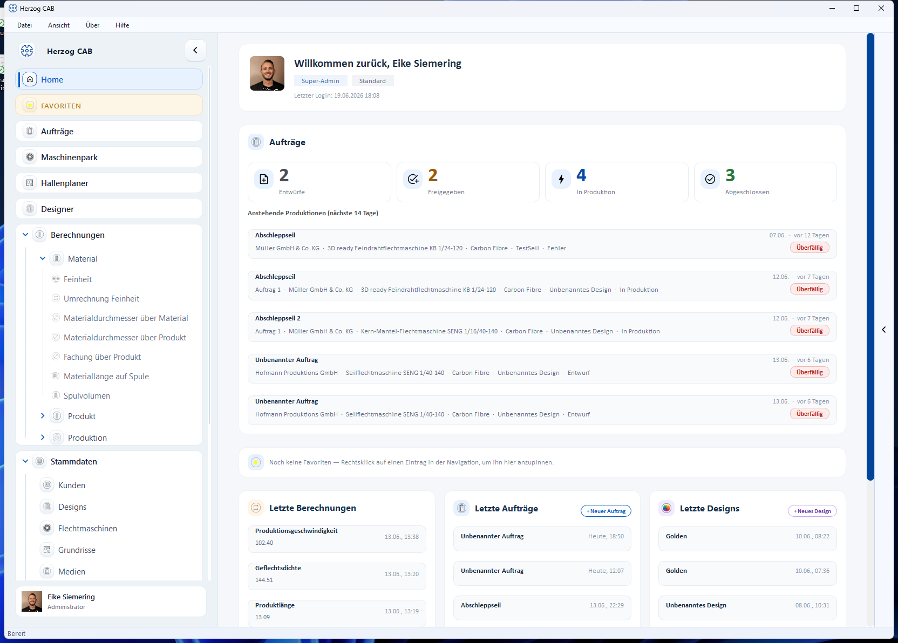

# Oberfläche im Überblick

Nach der Anmeldung startet Herzog CAB mit der **Startseite (Home)**. Von hier aus
erreichen Sie alle Bereiche über die Navigation links.

## Aufbau des Hauptfensters

### Menüleiste (oben)

| Menü | Inhalt |
|---|---|
| **Datei** | Einstellungen, Drucken (++ctrl+p++), Beenden |
| **Ansicht** | Anzeigeoptionen, Navigation ein-/ausblenden |
| **Über** | Programm- und Versionsinformationen |
| **Hilfe** | Hilfe, Feedback, Updates |

### Navigation (links)

Der seitliche Navigationsbereich führt zu allen Modulen. Aufklappbare Gruppen
(Pfeil-Symbol) enthalten Unterpunkte:

* **Home** – die Startseite
* **Aufträge** – [Auftragsverwaltung](../orders/index.md)
* **Maschinenpark** – [Flotten-Übersicht](../master-data/machine-park.md)
* **Hallenplaner** – Maschinen auf dem Hallen-Grundriss anordnen
* **Designer** – [Flechtmuster entwerfen](../design/index.md)
* **Berechnungen** – [alle Rechner](../calculations/index.md) (Gruppen Material, Produkt, Produktion)
* **Stammdaten** – [Kunden, Designs, Flechtmaschinen, Grundrisse, Medien, Materialien, Spulen, Farben](../master-data/index.md)
* **Druck Editor** – [Druckvorlagen](../print-templates/index.md)
* **Parameter-Übersicht** – alle aktuellen Parameter auf einen Blick
* **Systemverwaltung** – [Benutzer, Rollen, Profile, Firma](../users/index.md)

Über den Pfeil am oberen Rand der Navigation klappen Sie die Leiste ein, um mehr
Platz für den Hauptbereich zu schaffen.

### Hauptbereich (Mitte)

Zeigt den Inhalt der gewählten Seite – z. B. eine Stammdaten-Liste, eine
Berechnung oder den Auftrags-Editor.

### Verlauf / Historie (rechts)

Am rechten Rand lässt sich über den Pfeil eine **Verlaufs-Leiste** ein- und
ausklappen. Sie listet die zuletzt geöffneten Seiten – insbesondere die zuletzt
durchgeführten [Berechnungen](../calculations/index.md) – und bringt Sie per
Klick direkt dorthin zurück. Mehr dazu unter
[Navigation und Verlauf](navigation.md).

### Profil-Leiste (unten links)

Unten links zeigt das **Benutzersymbol** den angemeldeten Benutzer mit Profilbild
und Rolle (siehe [Eigenes Profil](../users/my-profile.md)).

## Die Startseite (Home)

Die Startseite fasst das Wichtigste zusammen:

* **Begrüßung** mit Ihrem Namen, Ihren Rollen und dem letzten Login.
* **Aufträge** – Kennzahlen je Status (Entwürfe, Freigegeben, In Produktion, Abgeschlossen) und die anstehenden Produktionen der nächsten 14 Tage.
* **Favoriten** – angepinnte Navigationspunkte (Rechtsklick auf einen Eintrag in der Navigation).
* **Letzte Berechnungen / Aufträge / Designs** – schneller Wiedereinstieg.

## Toast-Meldungen

Hinweise und Bestätigungen erscheinen kurz als **Toast-Benachrichtigung**
(z. B. „Auftrag gespeichert") und verschwinden von selbst wieder.
