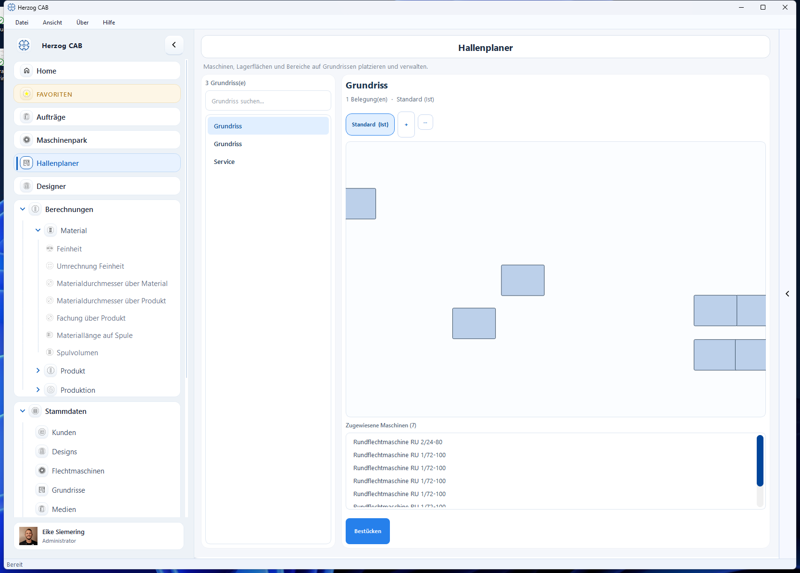

# Hallenplaner

!!! abstract "Referenz — Übersicht der Hallen-Grundrisse und ihrer Belegungen: Szenarien verwalten, Ist-Belegung festlegen, Bestücken starten"

## Wofür Sie diesen Bereich nutzen

Im **Hallenplaner** bilden Sie Ihre Produktion maßstäblich ab: Maschinen,
Lagerflächen und Bereiche werden auf einem Hallen-Grundriss platziert. So
behalten Sie den Überblick, welche Maschine wo steht, planen Stellflächen und
Wege und können Umbauten als Szenarien durchspielen, bevor in der Halle
tatsächlich etwas bewegt wird.

### Grundriss und Belegung — zwei getrennte Dinge

Der Hallenplaner unterscheidet konsequent zwischen:

* **Grundriss** — die Halle selbst: Wände, Flächen, Türen und Tore. Grundrisse
  sind Stammdaten und werden unter
  [Stammdaten > Grundrisse](../master-data/floor-plans.md) verwaltet und im
  [Editor](editor.md) (Geometrie-Modus) gezeichnet.
* **Belegung** — ein Bestückungs-Szenario: welche Maschinen wo auf diesem
  Grundriss stehen. Zu jedem Grundriss können Sie **mehrere Belegungen**
  anlegen (z. B. „Standard", „Umbau 2027", „Variante Nachtproduktion") und
  eine davon als **Ist-Belegung** markieren — sie beschreibt den tatsächlichen
  Zustand Ihrer Halle.

Ändern Sie die Hallengeometrie, gilt die Änderung automatisch für alle
Belegungen dieses Grundrisses.

- :material-pencil-ruler: **Editor — Grundriss und Bestückung**

    Wände, Flächen und Bauelemente zeichnen; Maschinen platzieren, ausrichten
    und verteilen.

    [:octicons-arrow-right-24: Zum Editor](editor.md)

- :material-video-3d: **3D-Hallenansicht**

    Die geplante Halle dreidimensional begehen — mit Wänden, Maschinen und
    Status-Leuchtkugeln.

    [:octicons-arrow-right-24: Zur 3D-Ansicht](view-3d.md)

## Der Bildschirm im Überblick

Die Übersicht ist zweigeteilt:

1. **Grundriss-Liste** (links) — alle vorhandenen Hallen-Grundrisse mit
   Suchfeld und Zähler.
2. **Detailbereich** (rechts) — für den gewählten Grundriss: die
   Belegungs-Pillenleiste, eine Vorschau, die Liste der zugewiesenen Maschinen
   und die Schaltfläche **Bestücken**.

## Bedienelemente im Detail

### Grundriss-Liste (links)

* **Zähler** — Anzahl der (sichtbaren) Grundrisse.
* **Grundriss suchen…** — filtert die Liste während der Eingabe.
* **Liste** — ein Klick wählt einen Grundriss aus und aktualisiert den
  Detailbereich; ein **Doppelklick** öffnet direkt den
  [Editor](editor.md) im Bestückungs-Modus.

Grundrisse anlegen, umbenennen, duplizieren oder löschen Sie unter
[Stammdaten > Grundrisse](../master-data/floor-plans.md) — der Hallenplaner
zeigt sie hier nur an und arbeitet mit ihren Belegungen.

### Belegungs-Pillenleiste

Über der Vorschau erscheint für den gewählten Grundriss eine Reihe von
Schaltflächen („Pillen") — eine je Belegung:

* **Belegungs-Pille** — ein Klick wählt die Belegung; Vorschau und
  Maschinenliste zeigen dann deren Stand. Die aktive Ist-Belegung ist am
  Zusatz **(Ist)** erkennbar, z. B. *Standard (Ist)*.
* **+** — legt eine **neue Belegung** (Szenario) an; Sie vergeben einen Namen.
  Die erste Belegung eines Grundrisses wird automatisch zur Ist-Belegung.
* **⋯** (Belegung verwalten) — öffnet ein Menü mit Aktionen für die gewählte
  Belegung:

    | Aktion | Wirkung |
    |---|---|
    | **Als Ist-Belegung setzen** | Markiert die gewählte Belegung als tatsächlichen Hallenzustand; die bisherige Ist-Kennzeichnung wird entfernt. |
    | **Umbenennen…** | Neuen Namen für die Belegung vergeben. |
    | **Duplizieren…** | Kopie der Belegung anlegen — ideal, um ein Umbau-Szenario ausgehend vom Ist-Zustand zu planen. |
    | **Löschen…** | Entfernt die Belegung nach Rückfrage. Der Grundriss und die Maschinen-Stammdaten bleiben erhalten. |

!!! info "Bearbeitungsrechte"
    Belegungen anlegen und ändern erfordert das Bearbeitungsrecht für den
    Hallenplaner, Grundriss-Aktionen das Stammdaten-Bearbeitungsrecht. Die
    Rechte vergibt Ihr Administrator über [Rollen](../admin/roles.md).

### Vorschau

Die Vorschau rechts zeigt den gewählten Grundriss (Wände und farbige Flächen)
und — sobald eine Belegung gewählt ist — die darin platzierten Maschinen als
neutrale Kacheln. Ohne Auswahl erscheint der Hinweis *Kein Grundriss gewählt*,
bei einem noch leeren Grundriss *Grundriss noch leer*.

### Zugewiesene Maschinen

Unter der Vorschau listet **Zugewiesene Maschinen (N)** alle Maschinen der
gewählten Belegung. Ein Klick auf einen Eintrag hebt die zugehörige Maschine
in der Vorschau grün hervor — so finden Sie eine bestimmte Maschine schnell
auf dem Plan. Der Tooltip eines Eintrags zeigt den Maschinentyp.

### Bestücken

Die Schaltfläche **Bestücken** öffnet den [Editor](editor.md) im
Bestückungs-Modus für den gewählten Grundriss und die gewählte Belegung. Dort
platzieren, drehen und ordnen Sie die Maschinen.

## Voraussetzungen für ein maßstäbliches Bild

Damit die Darstellung stimmt, sollten zwei Dinge gepflegt sein:

* Ein **Grundriss** mit Wänden bzw. kalibriertem Grundriss-Bild — siehe
  [Grundrisse](../master-data/floor-plans.md) und [Editor](editor.md).
* Die **Maschinenmaße** (Länge × Breite × Höhe) in den
  [Flechtmaschinen](../master-data/braiding-machines.md)- bzw.
  [Spulmaschinen](../master-data/winding-machines.md)-Stammdaten. Maschinen
  ohne Maße werden mit einer Ersatzgröße dargestellt und im Katalog mit dem
  Hinweis *Maße fehlen* markiert.

## Verwandte Seiten

* [Editor — Grundriss und Bestückung](editor.md) — die Referenz zum
  Zeichnen und Bestücken.
* [3D-Hallenansicht](view-3d.md) — die Halle dreidimensional betrachten.
* [Grundrisse (Stammdaten)](../master-data/floor-plans.md) — Grundrisse
  anlegen und verwalten.
* [Eine Halle aufbauen](../tasks/build-hall.md) — Schritt-für-Schritt-Anleitung
  vom leeren Grundriss zur bestückten Halle.
* [Maschinenpark](../machine-park/index.md) — Betriebs- und Statusübersicht
  aller Maschinen.
