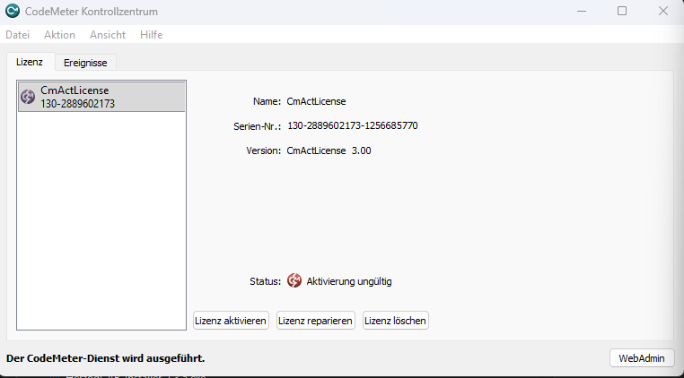
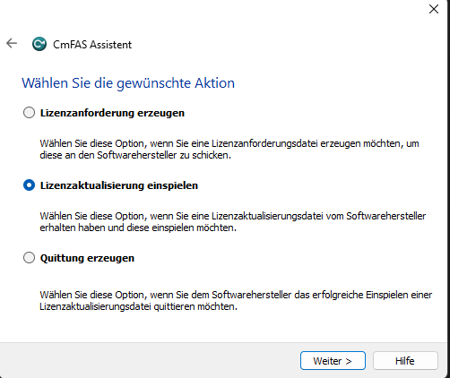

# Lizenz aktivieren

Herzog CAB nutzt **Wibu CodeMeter** als Lizenzsystem. Ohne gültige Lizenz
lässt sich die Anwendung nicht starten.

!!! info "Voraussetzung"
    Die [CodeMeter-Runtime](codemeter.md) muss bereits installiert sein.

## Lizenztyp

| Typ            | Artikel  | Product Code | Umfang                                              |
|----------------|----------|--------------|-----------------------------------------------------|
| Vollversion    | 88805    | 200006       | Alle Funktionen, unbefristet                        |

Der Firmencode bei Wibu CodeMeter ist immer **6001037** (Herzog GmbH).

## Bezugswege

Es gibt zwei gängige Wege, die Lizenz auf den Rechner zu bekommen:

| Bezugsweg                       | Wann?                                                                 |
|---------------------------------|-----------------------------------------------------------------------|
| **CmDongle** (USB-Lizenzstick)  | Wenn Sie einen physischen Dongle bestellt haben.                      |
| **CmActLicense** (Software-Lizenz) | Wenn Ihre Lizenz an den **Fingerabdruck** des Rechners gebunden ist. |

---

## Variante A - Lizenz per USB-Dongle

Sie haben mit Ihrer Bestellung einen kleinen Wibu-Dongle erhalten. Die
Lizenz ist bereits auf dem Dongle vorinstalliert. Voraussetzung ist,
dass auf dem Rechner die [CodeMeter-Runtime](codemeter.md) bereits
installiert ist.

So gehen Sie vor:

1. Schließen Sie das Programm Herzog CAB, falls es läuft.
2. Stecken Sie den **CmDongle** in einen freien USB-Anschluss.
3. Warten Sie kurz - Windows erkennt den Stick und CodeMeter liest die
   Lizenz automatisch ein.

Sie erkennen den Erfolg am **CodeMeter-Tray-Icon** unten rechts in der
Taskleiste: es wechselt von grau auf blau.

> :material-image-area: *Screenshot: Tray-Icon-Farbwechsel grau → blau*

4. Öffnen Sie das **CodeMeter Kontrollzentrum** (Doppelklick auf das
   Tray-Symbol) und prüfen Sie, dass eine Lizenz mit Firmencode
   **6001037** und Artikel **88805** (Vollversion) angezeigt wird.

> :material-image-area: *Screenshot: Kontrollzentrum mit erkanntem Dongle*

!!! warning "Dongle muss eingesteckt bleiben"
    Der Dongle muss während des Betriebs von Herzog CAB **eingesteckt
    bleiben** - sonst wird die Lizenz nicht gefunden. Ziehen Sie ihn
    erst nach dem Beenden des Programms wieder ab.

!!! tip "Mehrere Arbeitsplätze"
    Wenn Sie nur einen Dongle haben, können Sie ihn zwischen mehreren
    Rechnern wechseln - aber immer nur an einem Rechner zur gleichen
    Zeit.

---

## Variante B - Software-Lizenz per CmAct-Dateiaustausch

Software-Lizenzen sind an den **Fingerabdruck** Ihres Rechners
(Hardware-Merkmale) gebunden. Die Aktivierung läuft über einen
mehrstufigen Dateiaustausch zwischen Ihnen und der Herzog GmbH.

### Überblick

```text
1. Empty.WibuCmLif      Herzog GmbH  →  Sie    (leerer Lizenz-Container)
2. Request.WibuCmRaC    Sie          →  Herzog (Anforderung mit Fingerabdruck)
3. Update.WibuCmRaU     Herzog GmbH  →  Sie    (gültige Lizenz)
4. Receipt.WibuCmRaC    Sie          →  Herzog (Quittung)
```

Der Vorteil: Ihr Rechner braucht **keine direkte Internetverbindung**
zu Wibu - der Austausch läuft per E-Mail. Der Nachteil: ein bisschen
Hin-und-Her, plant ungefähr einen Arbeitstag ein.

### Schritt 1 - Leeren Container einspielen

Sie erhalten von Herzog GmbH per E-Mail eine Datei mit dem Namensschema

```
Herzog-CAB-Container_CmActLicense_6001037.WibuCmLif
```

1. Speichern Sie die Datei auf dem Zielrechner ab.
2. **Doppelklick** auf die Datei genügt - das CodeMeter Kontrollzentrum
   öffnet sich automatisch und richtet einen leeren Container für den
   Hersteller *Herzog GmbH* ein.
3. Alternativ: CodeMeter Kontrollzentrum öffnen und die `.WibuCmLif`-Datei
   mit der Maus in das Fenster ziehen.

Im Kontrollzentrum erscheint jetzt unter *Lizenz* ein Eintrag
**CmActLicense** für die Firma *Herzog GmbH*. Der Status zeigt
**„Aktivierung ungültig"** - das ist nach diesem Schritt korrekt, die
Aktivierung folgt erst in Schritt 3.

> :material-image-area: *Screenshot: Kontrollzentrum direkt nach Doppelklick auf den `.WibuCmLif`-Container*

### Schritt 2 - Lizenzanforderung erzeugen

1. Öffnen Sie das **CodeMeter Kontrollzentrum**.
2. Wählen Sie den Container *Herzog GmbH* aus.
3. Klicken Sie unten auf **Lizenz aktivieren** (in älteren Versionen
   *„Lizenzaktualisierung…"*).
4. Im **CmFAS-Assistenten** wählen Sie als Aktion
   **Lizenzanforderung erzeugen** und klicken auf **Weiter**.

> :material-image-area: *Screenshot: CmFAS-Assistent mit ausgewählter Option „Lizenzanforderung erzeugen"*

5. Als Hersteller **Herzog GmbH** auswählen (steht nach Schritt 1 in der
   Liste) und auf **Weiter** klicken.
6. **Lizenz für diesen leeren Container anfordern** wählen, dann
   **Weiter**.
7. Wählen Sie einen Speicherort - die erzeugte Datei hat die Endung
   `.WibuCmRaC`.

### Schritt 3 - Anforderung zurücksenden

Senden Sie die `.WibuCmRaC`-Datei als E-Mail-Anhang an Ihren
Herzog-Ansprechpartner. Die Standard-Adresse ist:

```
e.siemering@herzog-online.com
```

### Schritt 4 - Aktivierungsdatei einspielen

Sie erhalten kurzfristig eine Datei mit der Endung `.WibuCmRaU` zurück.

!!! warning "Wichtig: gleicher Rechner"
    Spielen Sie die `.WibuCmRaU`-Datei **auf dem gleichen Rechner** ein,
    von dem Sie die Anforderung in Schritt 2 erstellt haben. Die Lizenz
    ist an den Fingerabdruck dieses Rechners gebunden und funktioniert
    auf keinem anderen Rechner.

So geht's:

1. **Doppelklick** auf die `.WibuCmRaU`-Datei reicht - die Lizenz wird
   automatisch eingespielt.

Alternativ über das Kontrollzentrum:

1. Kontrollzentrum öffnen und den Container *Herzog GmbH* auswählen.
   Der Container ist sichtbar (Name: *CmActLicense*, Serien-Nr. wird
   angezeigt), aber der Status zeigt noch **„Aktivierung ungültig"**.



2. Klicken Sie auf den Button **Lizenz aktivieren** unten im Fenster.
3. Im **CmFAS-Assistenten** wählen Sie als Aktion
   **Lizenzaktualisierung einspielen** und klicken auf **Weiter**.



4. Wählen Sie die `.WibuCmRaU`-Datei aus und folgen Sie den Anweisungen
   des Assistenten bis zum Ende.

### Schritt 5 - Erfolg prüfen

Im CodeMeter Kontrollzentrum sollte unter *Herzog GmbH* jetzt die
aktive Lizenz **Herzog CAB** mit Product Code **200006** (Vollversion)
erscheinen. Beim nächsten Start von Herzog CAB ist die Vollversion
freigeschaltet.

### Schritt 6 - Quittung erzeugen und zurücksenden

Damit Herzog GmbH die erfolgreiche Aktivierung dokumentieren kann,
erzeugen Sie zum Abschluss eine Quittung:

1. Kontrollzentrum öffnen → Container *Herzog GmbH* auswählen →
   **Lizenz aktivieren** → **CmFAS-Assistent**.
2. Als Aktion **Quittung erzeugen** wählen, dann **Weiter**.
3. Speicherort wählen - die erzeugte Datei hat ebenfalls die Endung
   `.WibuCmRaC`.
4. Schicken Sie diese Quittung per E-Mail an Ihren Herzog-Ansprechpartner.

---

## Wichtige Hinweise zu CmActLicense

!!! warning "Rechner-Bindung"
    CmActLicenses sind an den Rechner gebunden, auf dem Sie die
    Anforderung in Schritt 2 erstellt haben.

!!! warning "Hardware-Wechsel oder Umzug"
    Wenn Sie auf einen anderen Rechner umziehen oder Hardware tauschen
    (Mainboard, Festplatte), muss die Lizenz **vor dem Umzug** über
    eine separate Umzugs-Prozedur zurückgegeben und danach neu
    aktiviert werden. Wenden Sie sich dafür rechtzeitig an Ihren
    Herzog-Ansprechpartner.

---

## Lizenzprüfung durch Herzog CAB

Beim Start prüft Herzog CAB, ob eine gültige Lizenz vorhanden ist:

| Status                      | Verhalten                                       |
|-----------------------------|-------------------------------------------------|
| Lizenz vorhanden, gültig    | Programm startet normal.                        |
| Lizenz abgelaufen           | Hinweis-Dialog, Programm startet nicht.         |
| Keine Lizenz gefunden       | Hinweis-Dialog, Programm startet nicht.         |

Wenn die Lizenzprüfung fehlschlägt, lesen Sie
[Lizenzprobleme](../help/license-problems.md).

## Nächster Schritt

Mit der gültigen Lizenz ist die Installation abgeschlossen. Wie Sie das
Programm einrichten und sich zurechtfinden, lesen Sie im Kapitel
[Erste Schritte](../getting-started/index.md).
