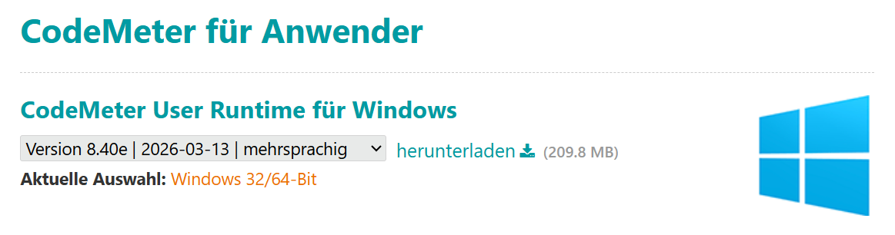
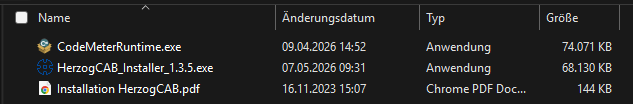
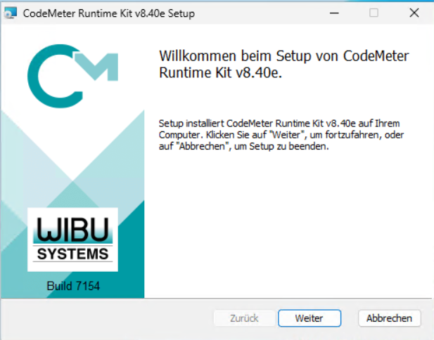
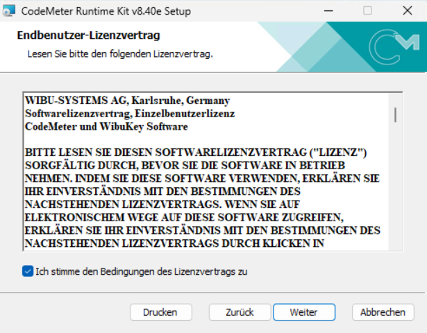
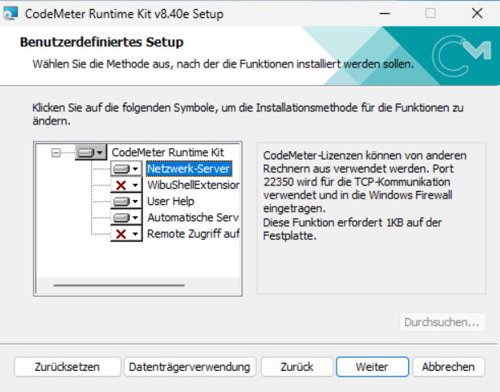
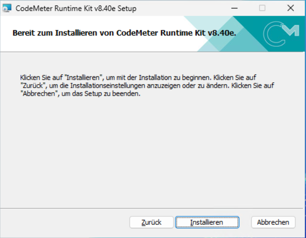
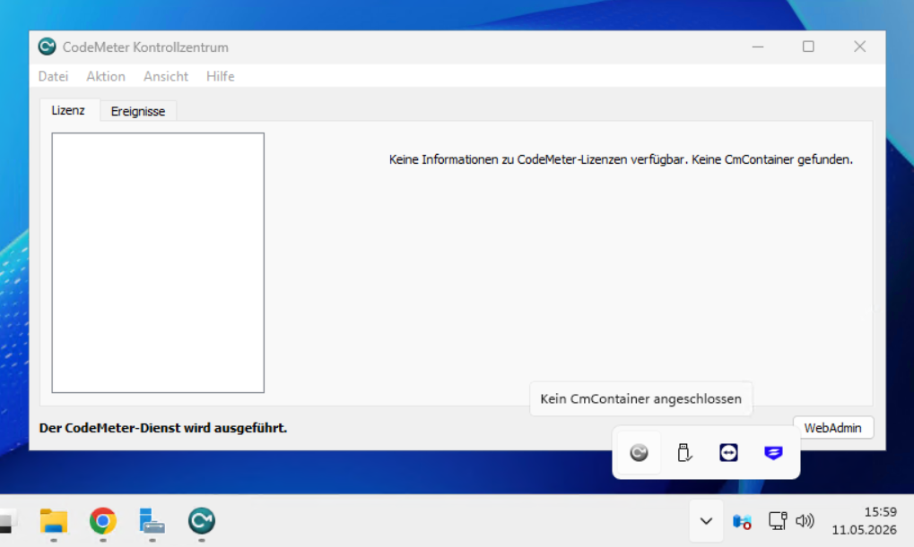

# CodeMeter installieren

Herzog CAB nutzt für die Lizenzprüfung das System **Wibu CodeMeter**.
Bevor Sie Herzog CAB selbst installieren, muss auf dem Rechner die
**CodeMeter User Runtime** vorhanden sein. Sie bringt das *CodeMeter
Control Center* und das *CodeMeter WebAdmin* mit, über die Lizenzen
verwaltet werden.

!!! info "Reihenfolge"
    Wir empfehlen, CodeMeter **vor** dem Herzog-CAB-Installer einzurichten.
    So ist die Runtime beim ersten Programmstart bereits vollständig
    initialisiert.

!!! tip "Vorab klären: Einsatz-Szenario"
    Wie CodeMeter aufgebaut werden soll, hängt davon ab, ob nur ein
    Anwender oder mehrere Bediener / Rechner damit arbeiten. Ein Blick
    auf die [Einsatz-Szenarien](topology.md) hilft, das passende Setup
    zu wählen.

## Woher bekommen Sie die Runtime?

Es gibt zwei Bezugsquellen — beide führen zum gleichen Ergebnis und
sind unabhängig vom Lizenztyp:

| Bezugsquelle                       | Wann?                                                                 |
|------------------------------------|-----------------------------------------------------------------------|
| **Download von wibu.com**          | Immer möglich. Liefert die aktuellste Version. **Empfohlen.**         |
| **Mitgelieferter USB-Stick**       | Nur wenn Sie einen **CmDongle** bestellt haben — dort liegt zusätzlich der Installer bei. Praktisch, wenn der Rechner kein Internet hat. |

Auch Dongle-Kunden können also die Runtime von Wibu herunterladen — der
beigelegte USB-Stick ist nur ein Bequemlichkeits-Bonus.

---

## Variante A - Runtime von wibu.com herunterladen

1. Öffnen Sie im Browser
   [https://www.wibu.com/de/support/anwendersoftware.html](https://www.wibu.com/de/support/anwendersoftware.html).
2. Wählen Sie unter *CodeMeter User Runtime für Windows* die aktuelle
   Version (im Beispiel v8.40e). Die Variante **Windows 32/64-Bit**
   passt für alle aktuellen Windows-PCs.
3. Klicken Sie auf **herunterladen**. Sie erhalten die Datei
   `CodeMeterRuntime.exe`.

4. Doppelklicken Sie die heruntergeladene `CodeMeterRuntime.exe` und
   bestätigen Sie die Windows-Abfrage nach Administratorrechten mit **Ja**.
5. Folgen Sie dem [Setup-Assistenten](#setup-assistent-durchlaufen) (siehe unten).

!!! tip "Versionen kompatibel"
    CodeMeter-Runtimes sind abwärtskompatibel. Eine neuere Version als
    auf einem mitgelieferten USB-Stick zu installieren ist in der Regel
    kein Problem.

---

## Variante B - Runtime vom mitgelieferten USB-Stick

Nur relevant, wenn Sie einen **CmDongle** bestellt haben. Mit der
Dongle-Lieferung erhalten Sie zwei USB-Datenträger:

* den **CmDongle** selbst (kleiner Stick mit der Lizenz)
* einen zusätzlichen **USB-Stick mit der Software**

So gehen Sie vor:

1. Stecken Sie den **Software-USB-Stick** (nicht den Dongle!) in einen
   freien USB-Anschluss.
2. Öffnen Sie den Stick im Windows-Explorer. Sie finden dort:

3. Doppelklicken Sie `CodeMeterRuntime.exe`.
4. Bestätigen Sie die Windows-Abfrage nach Administratorrechten mit **Ja**.
5. Folgen Sie dem [Setup-Assistenten](#setup-assistent-durchlaufen) (siehe unten).

Den USB-Stick können Sie nach erfolgreicher Installation wieder
abziehen und sicher aufbewahren - Sie brauchen ihn nur, falls die
Runtime später neu installiert werden muss.

---

## Setup-Assistent durchlaufen

Der Setup-Assistent ist für beide Varianten identisch.

### Schritt 1 - Willkommen

Klicken Sie auf **Weiter**.

### Schritt 2 - Lizenzvereinbarung

Lesen Sie die Vereinbarung, setzen Sie das Häkchen bei
**Ich stimme den Bedingungen des Lizenzvertrags zu** und klicken Sie
auf **Weiter**.

### Schritt 3 - Komponenten-Auswahl

Hier entscheiden Sie, welche Funktionen installiert werden sollen.

!!! warning "Wichtig bei Floating-Lizenzen / Lizenzserver"
    Wenn dieser Rechner als **Lizenzserver** dienen soll (Variante 3
    aus den [Einsatz-Szenarien](topology.md) — Floating-Lizenzen für
    mehrere Clients), **muss die Komponente *Netzwerk-Server* aktiviert
    werden**. Klicken Sie dazu auf das Symbol vor *Netzwerk-Server* und
    wählen Sie **Wird auf lokaler Festplatte installiert**.

    Die Komponente öffnet **Port 22350** für die TCP-Kommunikation mit
    den Clients und trägt eine Ausnahme in die Windows-Firewall ein.

!!! info "Bei Single-Platz oder Client-Installation"
    Wenn dieser Rechner **kein Lizenzserver** wird (Variante 1 oder 2,
    oder ein Client in Variante 3), reichen die Standard-Komponenten —
    *Netzwerk-Server* muss **nicht** aktiviert werden.

Klicken Sie nach der Auswahl auf **Weiter**.

### Schritt 4 - Installation starten

Klicken Sie auf **Installieren**.

Der Vorgang dauert je nach Rechner ein bis zwei Minuten. Schließen Sie
den Assistenten am Ende mit **Fertigstellen**.

---

## Prüfen, ob CodeMeter läuft

Nach der Installation läuft CodeMeter als Hintergrunddienst. Prüfen
Sie den Erfolg so:

1. Schauen Sie unten rechts in den Windows-Infobereich (neben der Uhr).
   Dort sollte das **CodeMeter-Symbol** erscheinen (kleines C in einem
   Kreis). Eventuell müssen Sie das Tray-Menü mit dem Pfeil aufklappen,
   um es zu sehen.
2. Klicken Sie es doppelt - das **CodeMeter Kontrollzentrum** öffnet
   sich.

Im Kontrollzentrum ist die Lizenzliste **noch leer** — die Meldung
*„Keine Informationen zu CodeMeter-Lizenzen verfügbar. Keine
CmContainer gefunden."* ist an dieser Stelle korrekt. Wichtig ist nur
der Status unten links: **„Der CodeMeter-Dienst wird ausgeführt."**

Die Herzog-Lizenz wird erst im nächsten Schritt aktiviert.

---

## Nächster Schritt

Jetzt können Sie [Herzog CAB installieren](installer.md).
