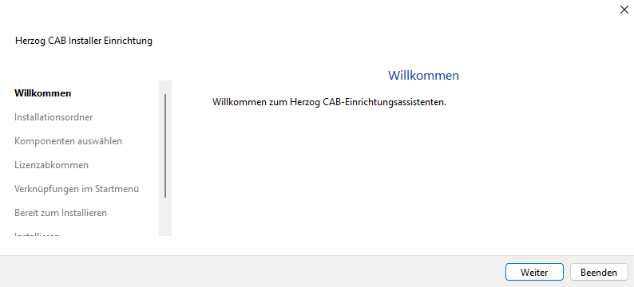
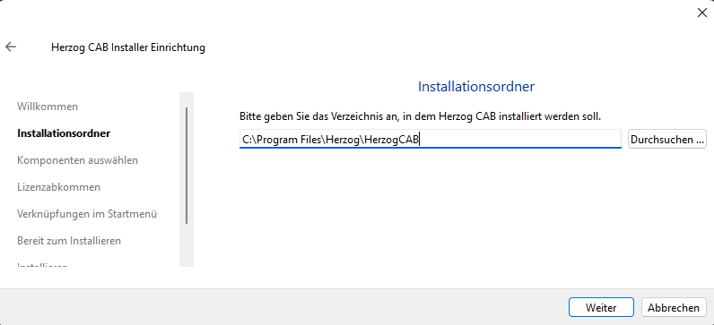
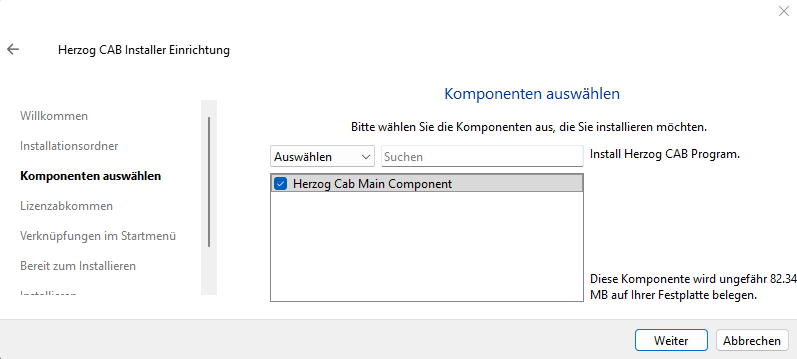
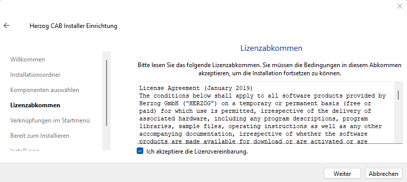
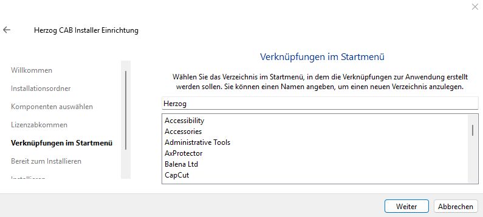
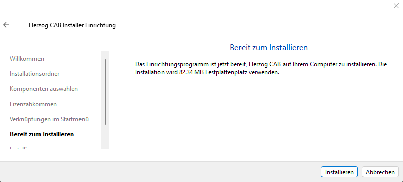
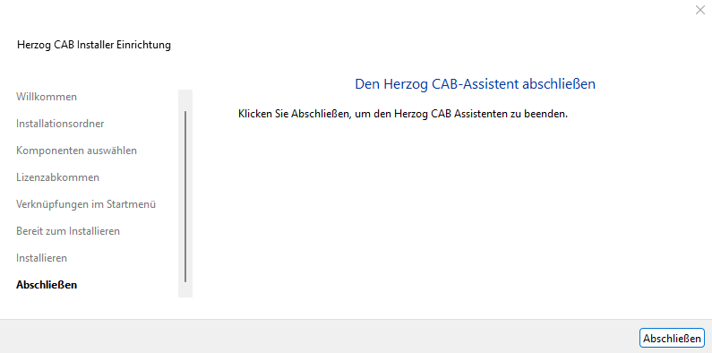

# Herzog CAB installieren

!!! info "Voraussetzung"
    Die [CodeMeter-Runtime](codemeter.md) sollte zuerst installiert
    sein, sonst meldet das Programm beim ersten Start eine fehlende
    Lizenz-Komponente.

## Woher bekommen Sie den Installer?

Wie bei CodeMeter gibt es zwei Bezugsquellen:

| Bezugsquelle                       | Wann?                                                                 |
|------------------------------------|-----------------------------------------------------------------------|
| **Download vom Herzog-Feedback-Repo** | Immer möglich, liefert die aktuellste Version. **Empfohlen.** Öffnen Sie [github.com/Herzog-GmbH/HerzogCAB-Feedback](https://github.com/Herzog-GmbH/HerzogCAB-Feedback) und laden Sie den aktuellen Installer (z.B. `HerzogCAB_Installer_1.3.6.exe`) herunter. |
| **Mitgelieferter USB-Stick**       | Nur wenn Sie einen **CmDongle** bestellt haben — auf dem mitgelieferten Software-USB-Stick liegt der Installer mit dabei. Praktisch, wenn der Rechner kein Internet hat. |

Doppelklicken Sie die heruntergeladene oder vom USB-Stick gestartete
Datei und bestätigen Sie die Windows-Abfrage nach Administratorrechten
mit **Ja**.

---

## Setup-Assistent durchlaufen

Der Einrichtungsassistent führt Sie in sieben Schritten durch die
Installation. Die linke Seitenleiste zeigt jederzeit, wo Sie sich
befinden.

### Schritt 1 - Willkommen



Klicken Sie auf **Weiter**.

### Schritt 2 - Installationsordner



Standardmäßig wird Herzog CAB nach

```
C:\Program Files\Herzog\HerzogCAB
```

installiert. Sie können über **Durchsuchen** einen anderen Ordner
wählen — wir empfehlen aber, die Vorgabe zu belassen, sofern kein
besonderer Grund dagegen spricht.

Klicken Sie auf **Weiter**.

### Schritt 3 - Komponenten auswählen



Aktuell gibt es nur eine Komponente: **Herzog Cab Main Component**
(die Hauptanwendung, ca. 82 MB). Lassen Sie das Häkchen gesetzt und
klicken Sie auf **Weiter**.

### Schritt 4 - Lizenzabkommen



Lesen Sie das *License Agreement* der Herzog GmbH, setzen Sie das
Häkchen bei **Ich akzeptiere die Lizenzvereinbarung** und klicken Sie
auf **Weiter**.

### Schritt 5 - Verknüpfungen im Startmenü



Der Installer legt eine Verknüpfung im Windows-Startmenü an. Vorgegeben
ist der Ordner-Name **Herzog**. Sie können einen anderen Namen tippen
oder einen vorhandenen Ordner aus der Liste auswählen.

Klicken Sie auf **Weiter**.

### Schritt 6 - Bereit zum Installieren



Der Assistent fasst zusammen, was passieren wird (Festplattenbedarf,
Zielordner). Klicken Sie auf **Installieren**.

Der Vorgang dauert je nach Rechner eine bis zwei Minuten. Während der
Installation sehen Sie einen Fortschrittsbalken.

### Schritt 7 - Abschließen



Klicken Sie auf **Abschließen**. Herzog CAB ist jetzt installiert und
über das Startmenü unter *Herzog > Herzog CAB* erreichbar.

---

## Nächster Schritt

Bevor Sie das Programm zum ersten Mal starten, sollten Sie die
[Lizenz aktivieren](activate-license.md).
