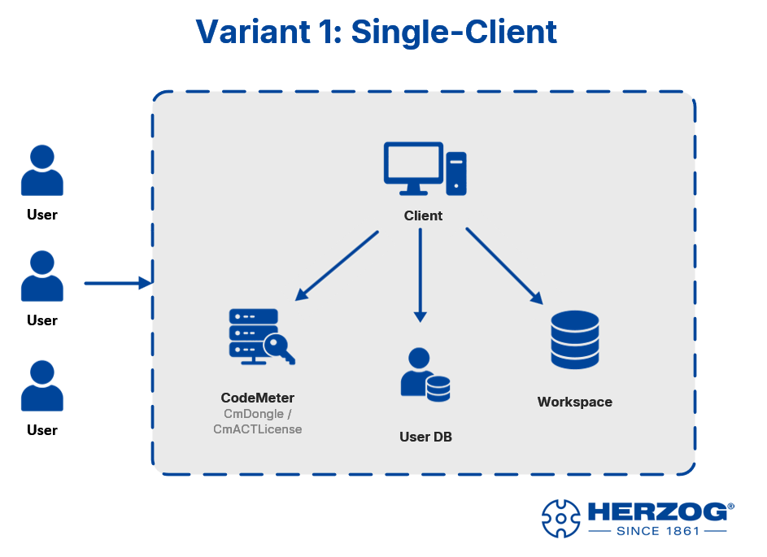
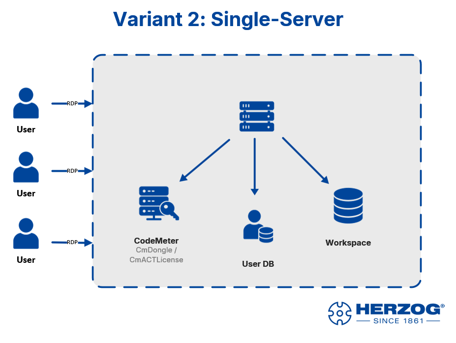
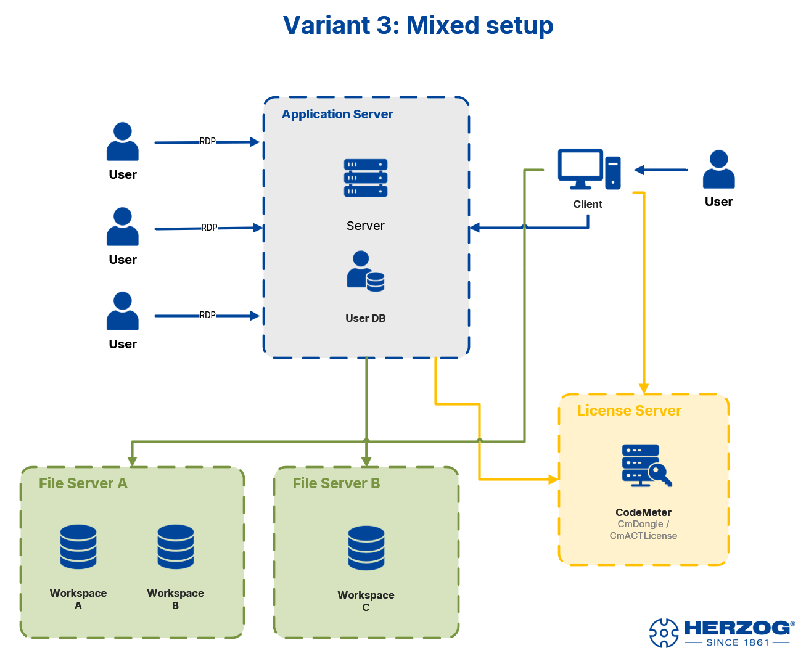

# Einsatz-Szenarien

Bevor Sie loslegen, lohnt sich ein Blick auf die typischen Aufbauten.
Herzog CAB hat eine eingebaute Userverwaltung — **mehrere Bediener
können sich also in jeder Variante mit eigenem Konto anmelden**. Die
spannende Frage ist nicht „wie viele Bediener?", sondern **wo läuft was**:

* **Programm** — auf jedem PC einzeln oder zentral auf einem Server?
* **Workspace** (Aufträge, Stammdaten, Druckvorlagen) — lokal oder
  auf einem Datei-Server?
* **Benutzer-DB** — pro PC oder zentral auf dem Anwendungs-Server?
* **Lizenz** — lokal pro Rechner (CmDongle / CmActLicense) oder zentral
  über einen **Wibu-Lizenzserver**?

Daraus ergeben sich drei Setups, die in der Praxis vorkommen.

---

## Variante 1 — Single-Client

Programm, Workspace, Benutzer-DB und Lizenz liegen alle auf demselben
Arbeitsplatz-PC. Egal ob ein Bediener allein arbeitet oder mehrere sich
im Schichtbetrieb anmelden — die Daten bleiben lokal.

!!! info "Userverwaltung"
    Benutzerkonten liegen unter `%ProgramData%\Herzog GmbH\Herzog Cab` —
    sie gehören zum **Rechner**. Mehrere Bediener teilen sich diese
    eine Benutzer-DB und melden sich beim Programmstart mit ihrem
    eigenen Konto an.

**Wann passend:** Konstruktion an einem festen Arbeitsplatz oder
Werkstatt-PC im Schichtbetrieb. Einfachster Aufbau, keine Server-
Infrastruktur nötig.

---

## Variante 2 — Single-Server (RDP-Zugriff)

Ein Server ist die zentrale Installation. Bediener verbinden sich von
ihren PCs / Tablets / Laptops per **Remote Desktop (RDP)** und arbeiten
in eigenen Sitzungen. Workspace, Benutzer-DB und CodeMeter-Lizenz
liegen ebenfalls auf dem Server.

!!! warning "Lizenz für Terminal-Server / RDP"
    Standard-Einzelplatz-Lizenzen (CmDongle oder CmActLicense) decken
    **keine parallelen RDP-Sitzungen** ab. Wenn mehrere Anwender
    gleichzeitig Herzog CAB über RDP nutzen sollen, muss die Lizenz
    explizit als **Terminal-Server-Lizenz** mit der gewünschten
    Sitzungs-Anzahl ausgestellt sein. Sprechen Sie das mit Ihrem
    Herzog-Ansprechpartner ab, bevor Sie diese Variante aufbauen.

**Wann passend:** Bediener mit eigenen Geräten (auch Tablets oder
Laptops außerhalb des Werks), die auf eine zentrale Installation
zugreifen sollen. Updates und Backups konzentrieren sich auf den einen
Server.

---

## Variante 3 — Mixed Setup

Die anspruchsvollste Variante kombiniert mehrere Strategien:

* **Application Server**: Herzog CAB läuft hier in RDP-Sitzungen für
  die Bediener, die Benutzer-DB liegt direkt daneben.
* **Lokaler Client**: einzelne Anwender (z. B. die Konstruktion) haben
  Herzog CAB lokal auf ihrem PC installiert und greifen direkt auf die
  Server zu.
* **File Server**: ein oder mehrere Datei-Server stellen mehrere
  Workspaces bereit (z. B. ein Workspace pro Werk oder Projektgruppe).
* **License Server**: ein zentraler Wibu-Lizenzserver verwaltet einen
  Pool von Floating-Lizenzen. Sowohl der Application Server als auch
  die lokalen Clients holen sich von hier ihre Lizenz.

!!! info "Wann lohnt sich ein License Server?"
    Lizenzserver sind sinnvoll, wenn deutlich **mehr Bediener als
    parallel benötigte Lizenzen** existieren — z. B. 10 Bediener, aber
    nie mehr als 3 gleichzeitig im Programm. Statt 10 Einzellizenzen
    kommen Sie dann mit 3 Floating-Lizenzen aus.

!!! warning "Mehrere Workspaces"
    Wenn Sie mit mehreren Workspaces arbeiten (z. B. einer pro Werk
    oder Projektgruppe), wechseln Sie sie über das **Profil-Menü** in
    Herzog CAB. Jedes Profil zeigt auf einen anderen Workspace-Pfad.

!!! warning "Hinweise zu Workspaces auf Netzlaufwerken"
    * Alle Bediener brauchen **Schreibrechte** auf den Shares.
    * **Nicht zwei Bediener gleichzeitig** denselben Auftrag öffnen —
      Änderungen können sich überschreiben.
    * Eine **stabile Netzwerkverbindung** ist Pflicht. Bei Aussetzern
      können Auftragsdateien beschädigt werden.
    * **Backup nicht vergessen** — der Workspace ist jetzt der einzige
      Ort, an dem Ihre Daten liegen.

**Wann passend:** Größere Werke mit professioneller IT-Infrastruktur,
bei denen Konstruktion (lokal) und Werkstatt-Bediener (per RDP)
parallel auf gemeinsame Daten zugreifen, mit zentraler Lizenz- und
Datei-Verwaltung.

---

## Welche Variante ist die richtige?

| Ihre Situation                                                      | Empfehlung   |
|---------------------------------------------------------------------|--------------|
| Ein einzelner PC, keine Server-Infrastruktur nötig                  | Variante 1   |
| Bediener mit eigenen Geräten, alles zentral auf einem Server        | Variante 2   |
| Bestehende Server-Landschaft, RDP + lokale Clients, Floating-Lizenz | Variante 3   |

Im Zweifel sprechen Sie kurz mit Ihrem Herzog-Ansprechpartner — die
Entscheidung wirkt sich auch auf die Lizenz-Bestellung aus (Single,
Terminal-Server oder Floating) und ist nachträglich aufwendiger zu
ändern.

## Nächster Schritt

Wenn Sie wissen, welche Variante zu Ihrem Setup passt, geht es weiter
mit der [CodeMeter-Installation](codemeter.md).
