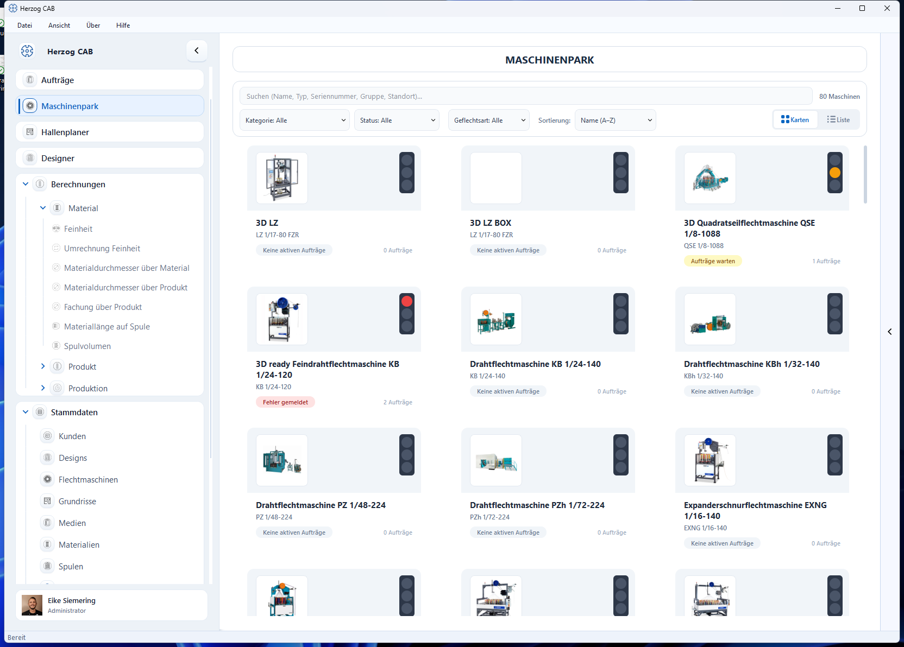
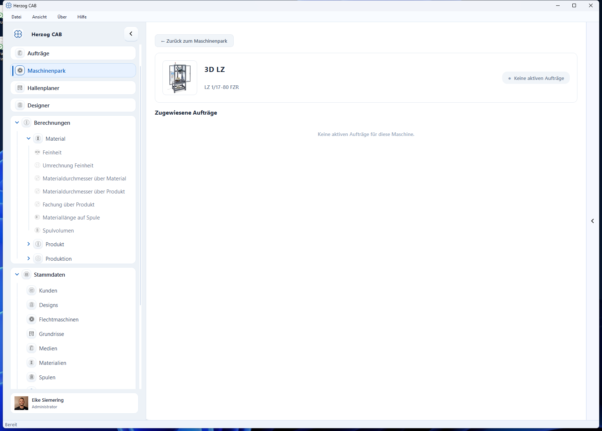

# Maschinenpark

!!! abstract "Referenz — Betriebsübersicht aller Flecht- und Spulmaschinen mit Ampelstatus und zugewiesenen Aufträgen"

## Wofür Sie diesen Bereich nutzen

Der **Maschinenpark** ist die Flotten-Übersicht Ihrer Produktion: Er zeigt alle
angelegten [Flechtmaschinen](../master-data/braiding-machines.md) und
[Spulmaschinen](../master-data/winding-machines.md) auf einen Blick — mit Bild,
Typ, Standort und einer Status-Ampel, die sich aus den aktuellen
[Aufträgen](../orders/index.md) ergibt. Typische Fragen, die Sie hier
beantworten: *Welche Maschine meldet einen Fehler? Wo läuft gerade Produktion?
Welche Aufträge sind dieser Maschine zugewiesen?*

Die Anzeige aktualisiert sich automatisch, sobald sich Maschinen- oder
Auftragsdaten ändern — Sie müssen die Seite nicht neu laden.

!!! info "Maschinen anlegen"
    Neue Maschinen legen Sie nicht hier an, sondern in den Stammdaten unter
    [Flechtmaschinen](../master-data/braiding-machines.md),
    [Spulmaschinen](../master-data/winding-machines.md),
    [Aufwickler](../master-data/take-up-machines.md),
    [Abwickler](../master-data/pay-off-machines.md) bzw.
    [Gatter](../master-data/creels.md) — oder direkt aus dem
    [Herzog-Katalog](../catalog/index.md) (Navigationspunkt **Katalog**
    direkt unter dem Maschinenpark). Der Maschinenpark stellt sie
    anschließend übersichtlich dar.

## Der Bildschirm im Überblick

!!! warning "📷 Screenshot fehlt"
    **Motiv:** Maschinenpark-Übersicht (Kartenansicht) mit der aktuellen Filterzeile inklusive Filter **Maschinenart** und einem gemischten Park aus Flecht- und Spulmaschinen
    **So erzeugen:** *Maschinenpark* öffnen; Datenbestand mit mindestens einer Spulmaschine, damit der Filter „Maschinenart" relevant ist; Kartenansicht aktiv
    **Ziel-Datei:** `assets/screenshots/machine-park/maschinenpark.png`

Der Bildschirm besteht aus drei Bereichen:

1. **Werkzeugleiste** (oben) — Suchfeld, Trefferzähler, Filter, Sortierung und
   der Umschalter zwischen Karten- und Listenansicht.
2. **Maschinen-Übersicht** (Mitte) — alle Maschinen als Karten-Raster oder
   Tabelle.
3. **Detailansicht** — öffnet sich per Klick auf eine Maschine und zeigt deren
   zugewiesene Aufträge.

## Bedienelemente im Detail

### Suchfeld und Trefferzähler

Das Suchfeld durchsucht **Name, Typ, Seriennummer, Gruppe und Standort** der
Maschinen; die Übersicht filtert sich während der Eingabe. Rechts daneben zeigt
der Trefferzähler, wie viele Maschinen aktuell sichtbar sind (z. B.
*12 von 80 Maschinen*).

### Filterzeile

Alle Filter lassen sich frei kombinieren und wirken sofort:

| Filter | Auswahl | Hinweis |
|---|---|---|
| **Maschinenart** | Alle · Flechtmaschinen · Spulmaschinen · Aufwickler · Abwickler · Gatter | Immer sichtbar. Aufwickler, Abwickler und Gatter ab Version 2.1.0. |
| **Kategorie** | Baureihen/Kategorien der vorhandenen Maschinen | Einträge ergeben sich aus Ihrem Maschinenbestand. |
| **Status** | Alle · Fehler gemeldet · In Produktion · Aufträge warten · Keine aktiven Aufträge | Filtert nach der Status-Ampel (siehe unten). |
| **Gruppe** | Ihre Maschinengruppen | Nur sichtbar, wenn mindestens einer Maschine eine Gruppe zugewiesen ist. |
| **Geflechtsart** | Rundgeflecht · Litzengeflecht | Nur sichtbar, wenn Geflechtsarten gepflegt sind. |
| **Standort** | Ihre Standorte | Nur sichtbar, wenn Standorte gepflegt sind. |

### Sortierung

Die Auswahlliste **Sortierung** ordnet die Übersicht:

* **Name (A–Z)** — alphabetisch (Standard).
* **Status (Fehler zuerst)** — Reihenfolge Fehler → wartende Aufträge →
  in Produktion → ohne aktive Aufträge.
* **Maschinentyp** — nach Typbezeichnung.
* **Standort** — nach Standort; Maschinen ohne Standort stehen am Ende.

### Ansichts-Umschalter Karten / Liste

Rechts in der Werkzeugleiste schalten Sie zwischen zwei Darstellungen um:

* **Karten** — ein Raster aus Maschinenkarten. Jede Karte zeigt das
  Maschinenbild, eine Status-Ampel (oben rechts), den Maschinennamen, Typ und
  Standort, ein farbiges Status-Abzeichen sowie die Anzahl der aktiven
  Aufträge. Die Spaltenzahl passt sich der Fensterbreite an.
* **Liste** — eine kompakte Tabelle mit den Spalten Vorschaubild,
  **Maschine** (Name und Typ), **Standort**, **Status**, **Aufträge** und
  einem farbigen Status-Punkt.

In beiden Ansichten öffnet ein Klick auf eine Maschine ihre Detailansicht.

### Die Status-Ampel

Der Status jeder Maschine wird automatisch aus ihren zugewiesenen Aufträgen
abgeleitet:

| Ampel | Status-Abzeichen | Bedeutung |
|---|---|---|
| 🔴 Rot | **Fehler gemeldet** | Mindestens ein Auftrag dieser Maschine steht auf *Fehler*. |
| 🟢 Grün | **In Produktion** | Mindestens ein Auftrag läuft in Produktion (und kein Fehler gemeldet). |
| 🟡 Gelb | **Aufträge warten** | Es gibt freigegebene Aufträge, aber keiner läuft. |
| ⚪ Grau | **Keine aktiven Aufträge** | Der Maschine ist kein aktiver Auftrag zugewiesen. |

Ein gemeldeter Fehler hat immer Vorrang: Die Ampel zeigt Rot, auch wenn
gleichzeitig andere Aufträge laufen. Der **Auftragszähler** neben dem
Abzeichen zählt die aktiven Aufträge (in Produktion, freigegeben oder mit
Fehler).

### Detailansicht einer Maschine

Per Klick auf eine Karte bzw. Zeile öffnen Sie die Detailansicht:

* **← Zurück zum Maschinenpark** — kehrt zur Übersicht zurück.
* **Kopfbereich** — Maschinenbild, Name, Typbezeichnung, dazu (sofern
  gepflegt) Seriennummer, Gruppe und Standort sowie rechts die Status-Anzeige
  als farbige Pille.
* **Zugewiesene Aufträge** — Liste aller aktiven Aufträge dieser Maschine.
  Jeder Eintrag zeigt das Status-Abzeichen des Auftrags, den Auftragsnamen
  (bzw. die Auftragsnummer), Auftragsnummer und Kunde sowie das
  Produktionsdatum. Abgeschlossene oder noch nicht freigegebene Aufträge
  erscheinen hier nicht — Sie finden sie in der
  [Auftragsübersicht](../orders/index.md).

Hat die Maschine keine aktiven Aufträge, zeigt die Ansicht den Hinweis
*Keine aktiven Aufträge für diese Maschine.*

## Verwandte Seiten

* [Flechtmaschinen](../master-data/braiding-machines.md),
  [Spulmaschinen](../master-data/winding-machines.md),
  [Aufwickler](../master-data/take-up-machines.md),
  [Abwickler](../master-data/pay-off-machines.md) und
  [Gatter](../master-data/creels.md) — Maschinen anlegen und pflegen
  (Stammdaten).
* [Herzog-Katalog](../catalog/index.md) — Maschinen von Herzog als eigene
  Maschine anlegen.
* [Aufträge](../orders/index.md) — hier entstehen die Aufträge, aus denen sich
  die Ampel ableitet.
* [Hallenplaner](../hall-planner/index.md) — Maschinen maßstäblich auf dem
  Hallen-Grundriss anordnen.
* [Suchen und Filtern](../basics/search-filter.md) — allgemeine Bedienkonzepte
  für Listen und Filter.
