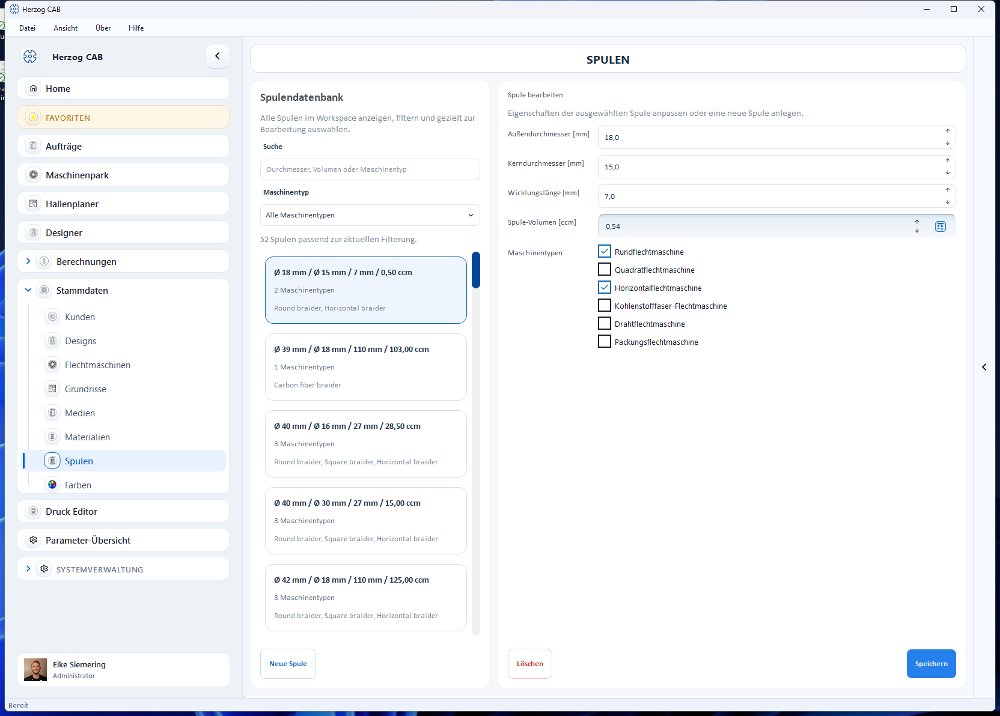

# Spulen

Im **Spulen-Editor** pflegen Sie die Spulentypen (Bobbins), die auf Ihren
Flechtmaschinen zum Einsatz kommen. Über die Spulenabmessungen ermittelt
Herzog CAB anschließend Materiallängen, Standzeiten und Wechselintervalle.

## Aufbau der Seite

* **Spulendatenbank** (links) – Suchfeld und Liste aller Spulen. Jede Karte
  zeigt Außen-/Kerndurchmesser, Wicklungslänge, Volumen und die zugeordneten
  Maschinentypen.
* **Spule bearbeiten** (rechts) – die Eigenschaften der gewählten Spule.

## Eigenschaften einer Spule

| Feld | Einheit | Beschreibung |
|---|---|---|
| **Außendurchmesser** | mm | Durchmesser der voll bewickelten Spule. |
| **Kerndurchmesser** | mm | Durchmesser des leeren Spulenkerns. |
| **Wicklungslänge** | mm | Nutzbare Wickelbreite zwischen den Flanschen. |
| **Spule-Volumen** | ccm | Aufnahmevolumen der Spule. Lässt sich aus den drei Maßen automatisch berechnen (Schaltfläche neben dem Feld), bleibt aber manuell überschreibbar. |
| **Maschinentypen** | – | Mehrfachauswahl der Maschinentypen, auf denen die Spule eingesetzt wird (z. B. Rundflechtmaschine, Quadratflechtmaschine …). |

!!! tip "Volumen automatisch berechnen lassen"
    Tragen Sie Außendurchmesser, Kerndurchmesser und Wicklungslänge ein und
    nutzen Sie die Berechnen-Schaltfläche am Feld **Spule-Volumen**. So bleibt
    das Volumen konsistent zu den Abmessungen.

## Spule anlegen, bearbeiten oder löschen

1. Mit **Neue Spule** (unten links) legen Sie eine Spule an.
2. Eine vorhandene Spule wählen Sie in der Liste an, ändern die Werte rechts
   und sichern mit **Speichern**.
3. **Löschen** entfernt die gewählte Spule (mit Sicherheitsabfrage).

## Verwendung in Berechnungen

Spulen werden in folgenden Berechnungen herangezogen:

* [Spulvolumen](../calculations/bobbins/bobbin-volume.md)
* [Materiallänge auf Spule](../calculations/bobbins/material-length.md)
* [Maschinenlaufzeit pro Spule-Satz](../calculations/machine/run-time-bobbin-set.md)
