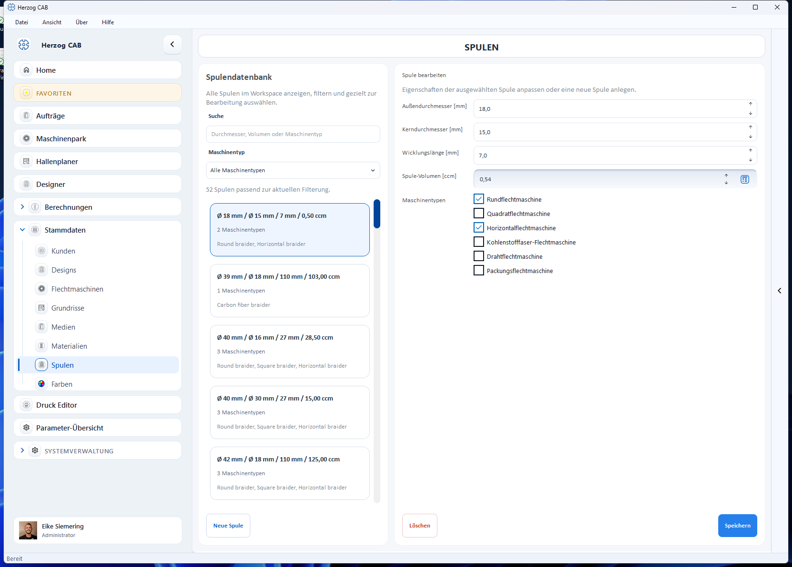

# Spulen

!!! abstract "Referenz — Spulenformate (Abmessungen und Volumen) pflegen und ihren Maschinentypen zuordnen; die Werte fließen in Materiallängen- und Standzeit-Berechnungen ein."

## Wofür Sie diesen Bereich nutzen

Im **Spulen-Editor** pflegen Sie die Spulenformate (Bobbins), die auf Ihren
Flechtmaschinen zum Einsatz kommen. Über die Spulenabmessungen ermittelt Herzog
CAB anschließend Materiallängen, Standzeiten und Wechselintervalle.

## Der Bildschirm im Überblick

* **Spulendatenbank** (links) – Suchfeld, ein Filter **Maschinentyp** und die
  Liste aller Spulen. Jede Karte zeigt Außen-/Kerndurchmesser, Wicklungslänge,
  Volumen und die zugeordneten Maschinentypen.
* **Spule bearbeiten** (rechts) – die Eigenschaften der gewählten Spule.

## Bedienelemente im Detail

### Suche und Filter

* **Suche** – filtert nach Durchmesser, Volumen oder Maschinentyp.
* **Maschinentyp** – Auswahlfeld, das die Liste auf Spulen eines bestimmten
  Maschinentyps einschränkt (Standard: *Alle Maschinentypen*).

### Felder einer Spule

| Feld | Einheit | Beschreibung |
|---|---|---|
| **Außendurchmesser** | mm | Durchmesser der voll bewickelten Spule. |
| **Kerndurchmesser** | mm | Durchmesser des leeren Spulenkerns. |
| **Wicklungslänge** | mm | Nutzbare Wickelbreite zwischen den Flanschen. |
| **Spule-Volumen** | ccm | Aufnahmevolumen der Spule. Lässt sich aus den drei Maßen automatisch berechnen (Schaltfläche neben dem Feld), bleibt aber manuell überschreibbar. |
| **Maschinentypen** | – | Mehrfachauswahl der Maschinentypen, auf denen die Spule eingesetzt wird. Mindestens ein Typ ist erforderlich. |

Die zur Auswahl stehenden **Maschinentypen** sind:

* Rundflechtmaschine
* Quadratflechtmaschine
* Horizontalflechtmaschine
* Kohlenstofffaser-Flechtmaschine
* Drahtflechtmaschine
* Packungsflechtmaschine

!!! tip "Volumen automatisch berechnen lassen"
    Tragen Sie Außendurchmesser, Kerndurchmesser und Wicklungslänge ein und
    nutzen Sie die Berechnen-Schaltfläche am Feld **Spule-Volumen**. So bleibt
    das Volumen konsistent zu den Abmessungen. Sobald Sie das Volumen von Hand
    ändern, wird nicht mehr automatisch nachgerechnet.

### Neue Spule, Speichern und Löschen

* **Neue Spule** (unten links) – legt eine Spule an. Der Anlege-Dialog *Neue
  Spule in der Datenbank anlegen* enthält dieselben Felder.
* **Speichern** – sichert die Änderungen an der gewählten Spule.
* **Löschen** – entfernt die gewählte Spule (mit Sicherheitsabfrage).

## Verwendung in Berechnungen

Spulen werden in folgenden Berechnungen herangezogen:

* [Spulvolumen](../calculations/material/bobbin-volume.md)
* [Materiallänge auf Spule](../calculations/material/material-length.md)
* [Maschinenlaufzeit pro Spule-Satz](../calculations/production/run-time-bobbin-set.md)

## Verwandte Seiten

* [Flechtmaschinen](braiding-machines.md) – zulässige Spulen einer Maschine
  zuordnen
* [Spulmaschinen](winding-machines.md) – passende Spulen einer Spulmaschine
  zuordnen
