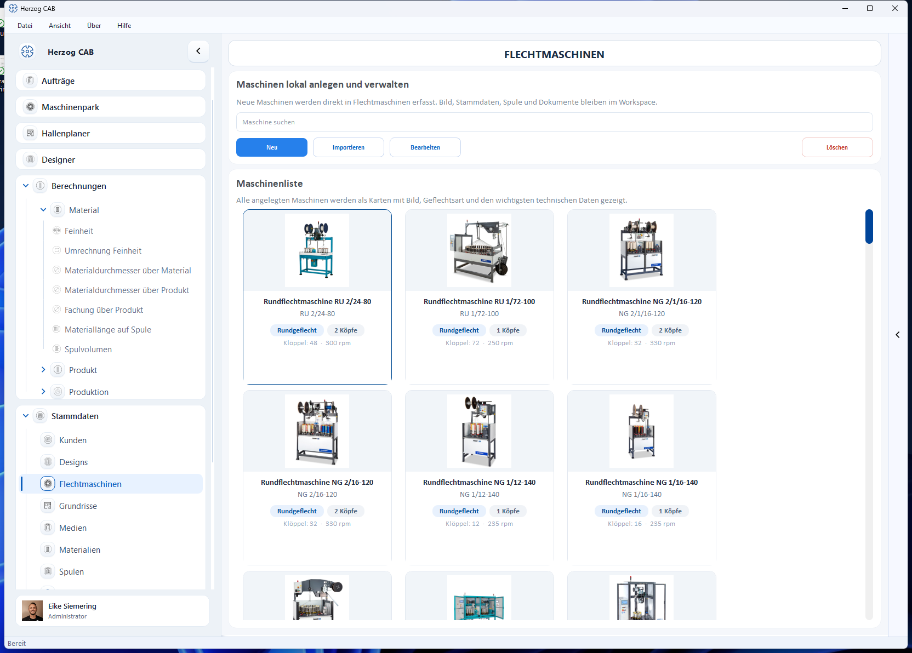

# Flechtmaschinen

!!! abstract "Referenz — Flechtmaschinen des Werks anlegen und pflegen: technische Daten, Bild, zulässige Spulen und Dokumente. Die Daten werden in Maschinenpark, Hallenplaner, Aufträgen und Berechnungen herangezogen."

## Wofür Sie diesen Bereich nutzen

Unter *Stammdaten > Flechtmaschinen* legen Sie die Flechtmaschinen Ihres Werks
an und verwalten sie. Pro Maschine speichert Herzog CAB technische Daten,
optional ein Bild, Ansichts-Bilder für die Halle sowie Dokumente wie
Abzugstabellen oder Betriebsanleitungen. Diese Stammdaten werden im
[Maschinenpark](../machine-park/index.md), im [Hallenplaner](../hall-planner/index.md),
in [Aufträgen](../orders/braiding-order.md) und in den
[Berechnungen](../calculations/index.md) verwendet.

!!! note "Stammdaten hier – Betriebsstatus im Maschinenpark"
    Auf dieser Seite pflegen Sie die *Stammdaten* der Maschine (was sie kann).
    Den aktuellen *Betriebsstatus* (welche Aufträge laufen, Ampel) sehen Sie im
    [Maschinenpark](../machine-park/index.md); auf einem Hallen-Grundriss ordnen
    Sie die Maschinen im [Hallenplaner](../hall-planner/index.md) an.

## Der Bildschirm im Überblick

Oben steht eine Werkzeugleiste, darunter die **Maschinenliste** als Karten. Jede
Karte zeigt Bild, Kategorie, Geflechtsart, Köpfe und die wichtigsten
technischen Daten (Klöppelzahl, Drehzahl).

### Werkzeugleiste

| Schaltfläche | Wirkung |
|---|---|
| **Suche** | Filtert die Liste nach Name, Typ, Kategorie oder Standort. |
| **Neu** | Öffnet den Dialog *Neue Maschine erstellen* (siehe unten). |
| **Importieren** | Übernimmt Maschinen aus einer CSV-Datei (Bilder im selben Ordner wie die CSV). |
| **Bearbeiten** | Öffnet die gewählte Maschine zum Ändern. |
| **Löschen** | Entfernt die gewählte(n) Maschine(n) mit Sicherheitsabfrage. |

Ein Rechtsklick auf eine Karte öffnet ein Kontextmenü mit **Öffnen**,
**Bearbeiten**, **Duplizieren** und **Löschen**. **Öffnen** zeigt die
Maschinendetails (Metadaten und technische Angaben, dazu Abzug und Zubehör)
in einer Leseansicht.

## Der Dialog „Neue Maschine erstellen"

!!! warning "📷 Screenshot fehlt"
    **Motiv:** Der Dialog *Neue Maschine erstellen* mit Bild, dem Formular
    „Maschinendaten" und dem Abschnitt „Dokumente".
    **So erzeugen:** In **Flechtmaschinen** auf **Neu** klicken und den Dialog
    mit Demo-Daten „Musterbetrieb" ausfüllen.
    **Ziel-Datei:** `assets/screenshots/master-data/flechtmaschine-neu-dialog.png`

Der Dialog ist in mehrere Abschnitte gegliedert (von oben nach unten).

### Bild

* **Bild hochladen** – wählt ein Maschinenbild aus der
  [Medienbibliothek](media.md).
* **Bild aus Katalog übernehmen** – erscheint nur, solange die Maschine
  kein Bild hat und ihr **Maschinentyp** einem Modell aus dem
  [Herzog-Katalog](../catalog/index.md) entspricht. Lädt das Katalogbild
  aus dem Internet (ab Version 2.1.0, nicht in Herzog CAB Designer).
* **Bild entfernen** – nimmt das Bild wieder weg.

Das Bild wird beim Speichern in den Arbeitsbereich kopiert und mit der Maschine
verknüpft.

!!! tip "Flechtmaschine aus dem Herzog-Katalog"
    Herzog-Flechtmaschinen legen Sie am schnellsten über den
    [Herzog-Katalog](../catalog/index.md) an: Technik, Stich und Bild kommen
    von dort, Abzug, Besetzung und Zubehör wählen Sie per Klick.

### Maschinendaten

Die Felder werden **kategorieabhängig** angeboten – je nach gewählter Kategorie
ändern sich die Auswahllisten für Köpfe, Einschnitte und Klöppel (siehe
[Kategorieabhängige Felder](#kategorieabhangige-felder)).

| Feld | Bedeutung |
|---|---|
| **Name** | Anzeigename der Maschine. Pflichtfeld. |
| **Maschinentyp** | Typbezeichnung (z. B. „SENG 1/40-140"). Pflichtfeld. Aus dem Typ leitet das Programm bei Bedarf die Kategorie ab. |
| **Kategorie** | Maschinenkategorie aus der Auswahlliste (z. B. Rundflechtmaschine, Seilflechtmaschine, Soutacheflechtmaschine, Quadratflechtmaschine, Packungsflechtmaschine …) oder *Nicht gesetzt*. |
| **Seriennummer** | Seriennummer der Maschine. |
| **Gruppe** | Frei vergebbare Gruppierung (z. B. Maschinengruppe). |
| **Standort** | Halle/Werk/Abteilung (z. B. „Halle 2, Werk Nord"). Auch für den Hallenplaner. |
| **Geflechtsart** | **Rundgeflecht** oder **Litzengeflecht**. |
| **Einschnitte Endflügelrad** | Nur bei Litzengeflecht sichtbar; Auswahl der Einschnittzahl (Standard 5 oder 6). |
| **Baujahr** | Baujahr der Maschine (oder *Nicht gesetzt*). |
| **Max. Klöppel pro Kopf** | Höchstzahl der Klöppel je Flechtkopf. |
| **Köpfe** | Anzahl der Flechtköpfe. |
| **Stich** | Stich (Teilung) der Maschine. |
| **Klöppelart** | Bezeichnung der verwendeten Klöppelart (frei). |
| **Aufwicklung** | **Ja** oder **Nein** – ob die Maschine eine Aufwicklung hat. |
| **Abzug** | Der Abzug der Maschine, z. B. *Abzugsscheibe Ø 313 x 76 mm*. Frei beschreibbar; entspricht der Maschinentyp einem Modell aus dem Herzog-Katalog, bietet die Liste dessen Abzüge zur Auswahl an. Leer lassen, wenn nichts festgelegt ist. |
| **Ölmenge** | Ölmenge (oder *Nicht gesetzt*). |
| **Spulen** | Mehrfachauswahl der zulässigen Spulentypen aus den [Spulen-Stammdaten](bobbins.md). Mindestens eine Spule ist erforderlich. |
| **Drehzahl** | Höchstdrehzahl in U/min (oder *Nicht gesetzt*). |
| **Meterzähler** | **Ja** oder **Nein**. |
| **Länge / Breite / Höhe** | Maschinenmaße in cm (u. a. für die Grundfläche im Hallenplaner). |

!!! tip "Maße überschlägig berechnen"
    Neben den Maßfeldern liegt die Schaltfläche **Maße berechnen**. Sie schätzt
    Länge und Breite überschlägig aus Köpfen, Klöppeln und Stich – dieselbe
    Logik wie die Berechnung [Maschinendimensionierung](../calculations/production/dimensions.md).
    Dafür sind mindestens 3 Klöppel pro Kopf nötig.

### Zubehör

Das Zubehör der Maschine zum Ankreuzen, zweispaltig:

* **Vorschläge aus dem Herzog-Katalog** – entspricht der **Maschinentyp**
  einem Katalogmodell, stehen dessen
  Zubehörteile gruppiert zur Auswahl (z. B. *Überwachung und Steuerung*,
  *Schutz und Kabine*). Ändern Sie den Maschinentyp, wechseln die Vorschläge
  mit; bereits Angekreuztes bleibt angekreuzt.
* **Eigenes Zubehör** – was nicht im Katalog steht. Tragen Sie es in das Feld
  unter der Liste ein und klicken Sie auf **Hinzufügen** (oder drücken Sie
  ++enter++); es erscheint angekreuzt in der Liste, neben Katalogvorschlägen
  unter der Überschrift *Eigenes Zubehör*.

Gespeichert wird, was angekreuzt ist. Ohne Katalogmodell steht dort
*Noch kein Zubehör hinterlegt.*, bis Sie eigenes Zubehör eintragen.

### Box-Ansichten (Bilder)

Für die Darstellung im 3D-Hallenplaner können Sie der Maschine eine
**Ersatz-Box** mit Ansichts-Bildern geben. Über **Box-Ansichten bearbeiten…**
öffnet sich ein Editor mit Live-Vorschau, in dem Sie bis zu **fünf** Bilder
zuweisen:

* **Vorderseite**
* **Rückansicht**
* **Linke Seite**
* **Rechte Seite**
* **Draufsicht (oben)**

Ein Statustext zeigt, wie viele der fünf Bilder hinterlegt sind. Die Bilder
werden im 3D-Hallenplaner auf die Maschinenbox gelegt.

### Dokumente

Zu jeder Maschine können Sie Unterlagen ablegen. Die Liste zeigt je Dokument
**Kategorie**, **Datei** und **Beschreibung**. Beim Hinzufügen wählen Sie eine
der folgenden Kategorien:

* Abzugstabelle
* Fadenspannfedertabelle
* Übersichtszeichnung
* Bedienungsanleitung
* Wartungsblatt
* Schaltplan
* Prüfprotokoll
* Sonstiges

Über die Schaltflächen darunter verwalten Sie die Liste:

* **Dokument hinzufügen** – Datei wählen, Kategorie und optionale Beschreibung
  vergeben.
* **Öffnen** – das gewählte Dokument im zugehörigen Programm öffnen.
* **Dokument entfernen** – das gewählte Dokument aus der Liste nehmen.

Die Dokumente werden beim Speichern in den Arbeitsbereich kopiert (siehe
[Speicherorte](../appendix/file-locations.md)).

### Speichern

Unten schließen Sie den Dialog mit **Maschine erstellen** ab oder verwerfen ihn
mit **Abbrechen**. Beim Bearbeiten heißt die Schaltfläche **Speichern**.

## Kategorieabhängige Felder

Die meisten Maschinen folgen der Rund-/Litzenlogik. Vier Kategorien bringen
eigene Wertelisten für **Köpfe**, **Einschnitte** und **max. Klöppel pro Kopf**
mit – die Auswahllisten passen sich automatisch an, sobald Sie die Kategorie
wählen:

| Kategorie | Köpfe | Einschnitte | Klöppel pro Kopf |
|---|---|---|---|
| **Standard** (Rund-/Litzenflechter) | 1, 2 | 5, 6 (nur bei Litzengeflecht) | Standardlogik |
| **Soutache** (ST) | 1, 2, 3, 4, 6, 8 | 3, 5, 7, 9, 11 | 3, 5, 7, 9, 11 |
| **Quadrat** (QU, QSE) | 1, 2 | 4, 6 | 4, 6, 8, 10, 12, 14, 16 |
| **Packung** (PA) | 1 | 4, 9 | 8, 12, 36 |

!!! info "Hinweis zur Darstellung im Designer"
    Im Dialog erscheint bei bestimmten Kombinationen ein Hinweis, ob sich die
    Maschine im [Designer](../designer/index.md) darstellen lässt – z. B. beim
    Quadratflechter das 8er-Quadratgeflecht, beim Packungsflechter das 3×3
    (12 Klöppel) und 4×4 (36 Klöppel) als Packungsgeflecht.

## Maschinendaten und Auftrag passen zusammen

!!! info "Abgleich beim Auftrag"
    Die Maschinendaten (Klöppelzahl, Besetzung, Geflechtsart) bestimmen, welche
    Designs und Produkte gefertigt werden können. Herzog CAB gleicht diese Werte
    beim Anlegen eines [Auftrags](../orders/braiding-order.md) ab.

## Verwandte Seiten

* [Maschinenpark](../machine-park/index.md) – Flotten- und Betriebsübersicht
* [Hallenplaner](../hall-planner/index.md) – Maschinen auf dem Grundriss anordnen
* [Spulen](bobbins.md) – zulässige Spulentypen der Maschine
* [Spulmaschinen](winding-machines.md) – Stammdaten der Spulmaschinen
* [Aufwickler](take-up-machines.md) · [Abwickler](pay-off-machines.md) · [Gatter](creels.md) – die übrigen Maschinenarten
* [Herzog-Katalog](../catalog/index.md) – Flechtmaschinen von Herzog übernehmen
* [Auftrag auf den Maschinenschein](../tasks/order-to-machine-sheet.md) – Ablauf
  vom Auftrag zur Maschine
