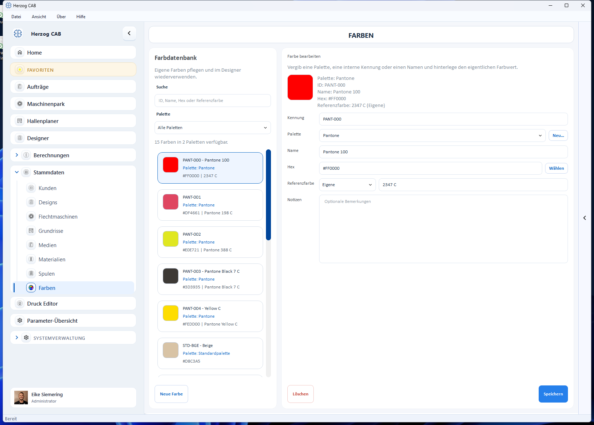

# Farben

In den **Farben-Stammdaten** pflegen Sie eine Farb-Palette, die Sie im
[Designer](../design/designer.md) wiederverwenden. Jede Farbe kann zusätzlich
zu ihrem Bildschirm-Farbwert (Hex) eine Referenzfarbe aus einem genormten
System (Pantone oder RAL) tragen.

## Aufbau der Seite

* **Farbdatenbank** (links) – Suchfeld, ein Auswahlfeld **Palette** zum
  Filtern sowie die Liste aller Farben. Jede Karte zeigt Farbfeld, Kennung,
  Palette, Hex-Wert und – falls vorhanden – die Referenzfarbe.
* **Farbe bearbeiten** (rechts) – die Eigenschaften der gewählten Farbe mit
  Farbvorschau.

## Eigenschaften einer Farbe

| Feld | Beschreibung |
|---|---|
| **Kennung** | Interne Kennung der Farbe (z. B. „PANT-000"). |
| **Palette** | Palette, der die Farbe zugeordnet ist. Über **Neu…** legen Sie eine weitere Palette an. |
| **Name** | Klartext-Name (z. B. „Pantone 100"). |
| **Hex** | Bildschirm-Farbwert. Über **Wählen** öffnen Sie den Farb-Picker. |
| **Referenzfarbe** | Genormte Referenz: System (**Pantone Solid Coated**, **RAL Classic** oder **Eigene**) und der zugehörige Wert (z. B. „2347 C"). |
| **Notizen** | Optionale Bemerkung. |

!!! info "Standardpalette und Standardfarben"
    Herzog CAB bringt eine **Standardpalette** mit. Programm-Standardfarben
    (Kennung beginnt mit „STD-") dienen als Grundausstattung; eigene Farben
    legen Sie zusätzlich an.

## Farbe anlegen, bearbeiten oder löschen

1. Mit **Neue Farbe** (unten links) legen Sie eine Farbe an.
2. Eine vorhandene Farbe wählen Sie in der Liste an, ändern die Felder rechts
   und sichern mit **Speichern**.
3. **Löschen** entfernt die gewählte Farbe (mit Sicherheitsabfrage).

## Verwendung

* Im **Designer** zum Entwerfen von Flechtmustern – siehe
  [Farben und Muster](../design/colors.md).
* Über Paletten lassen sich Farbsätze (z. B. je Kunde oder Produktlinie)
  getrennt halten.
