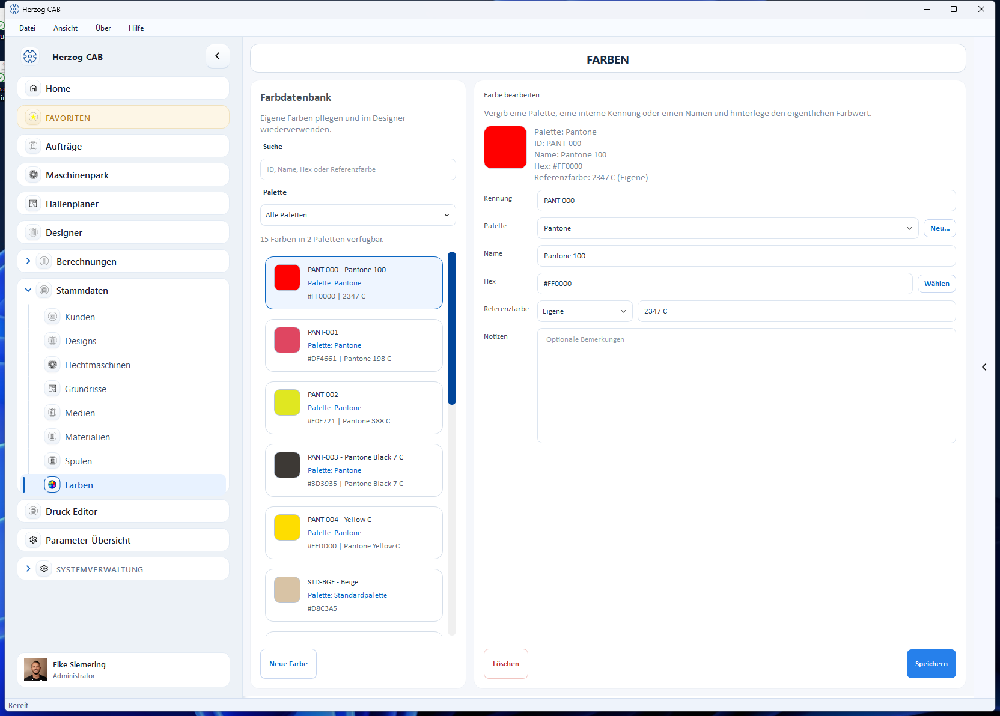

# Farben

!!! abstract "Referenz — eine Farbpalette für den Designer pflegen; jede Farbe kann zusätzlich zum Bildschirm-Farbwert eine genormte Referenzfarbe (RAL oder Pantone) tragen."

## Wofür Sie diesen Bereich nutzen

In den **Farben-Stammdaten** pflegen Sie eine Farbpalette, die Sie im
[Designer](../designer/index.md) zum Bemustern Ihrer Flechtmuster
wiederverwenden. Jede Farbe kann neben ihrem Bildschirm-Farbwert (Hex) eine
Referenzfarbe aus einem genormten System (Pantone oder RAL) tragen – so bleibt
der Bezug zu einem Farbfächer erhalten.

## Der Bildschirm im Überblick

* **Farbdatenbank** (links) – Suchfeld, ein Auswahlfeld **Palette** zum Filtern
  sowie die Liste aller Farben. Jede Karte zeigt Farbfeld, Kennung, Palette,
  Hex-Wert und – falls vorhanden – die Referenzfarbe.
* **Farbe bearbeiten** (rechts) – die Eigenschaften der gewählten Farbe mit
  Farbvorschau.

## Bedienelemente im Detail

### Suche und Palettenfilter

* **Suche** – filtert nach ID, Name, Hex-Wert oder Referenzfarbe.
* **Palette** – Auswahlfeld, das die Liste auf eine Palette einschränkt
  (Standard: *Alle Paletten*).

### Felder einer Farbe

| Feld | Beschreibung |
|---|---|
| **Kennung** | Interne Kennung der Farbe. Bleibt das Feld leer, vergibt das Programm automatisch eine Kennung. |
| **Palette** | Palette, der die Farbe zugeordnet ist. Über **Neu…** legen Sie eine weitere Palette an. |
| **Name** | Klartext-Name (z. B. „Herzog Rot"). |
| **Hex** | Bildschirm-Farbwert (z. B. „#D32F2F"). Über **Wählen** öffnen Sie den Farbwähler. |
| **Referenzfarbe** | Genormte Referenz: das **System** (*Pantone Solid Coated*, *RAL Classic* oder *Eigene*) und der zugehörige Wert (z. B. „186 C"). |
| **Notizen** | Optionale Bemerkung. |

### Referenzfarbe umrechnen

Neben dem Referenzfarben-Wert liegt die Schaltfläche **Umrechnen**. Sie sucht zum
aktuellen Hex-Wert die ähnlichsten Farben aus dem gewählten Referenzsystem und
zeigt sie im Dialog *Hex zu RAL Classic* bzw. *Hex zu Pantone Solid Coated*:

* Oben steht die **Ausgangsfarbe** (Ihr Hex-Wert).
* Darunter erscheinen die nächsten Treffer als Karten, jeweils mit Farbfeld,
  Hex-Wert und einem **Delta-E**-Wert (je kleiner, desto ähnlicher).
* Mit **Übernehmen** an einer Karte tragen Sie die Referenzfarbe in das Formular
  ein. **Schließen** verwirft die Auswahl.

### Löschen und Speichern

* **Speichern** – sichert die Änderungen an der gewählten Farbe.
* **Löschen** – entfernt die gewählte Farbe (mit Sicherheitsabfrage).

## Standardpalette und eigene Paletten

!!! info "Die Standardpalette ist fest im Programm hinterlegt"
    Herzog CAB bringt eine **Standardpalette** mit Grundfarben mit (Schwarz,
    Weiß, Grau, Beige, Braun, Rot, Blau, Gelb, Grün, Orange). Diese Palette
    lässt sich nicht ändern oder löschen. Für **eigene** Farben legen Sie über
    **Neu…** eine eigene Palette an; erst darin können Sie neue Farben speichern.

Über Paletten lassen sich Farbsätze (z. B. je Kunde oder Produktlinie) getrennt
halten.

## Verwendung

Die Farben stehen im [Designer](../designer/index.md) beim
[Bemustern](../designer/painting.md) zur Verfügung.

## Verwandte Seiten

* [Designer](../designer/index.md) – Flechtmuster entwerfen
* [Malen und Bemustern](../designer/painting.md) – Farben im Designer einsetzen
* [Designs](designs.md) – die Design-Bibliothek
