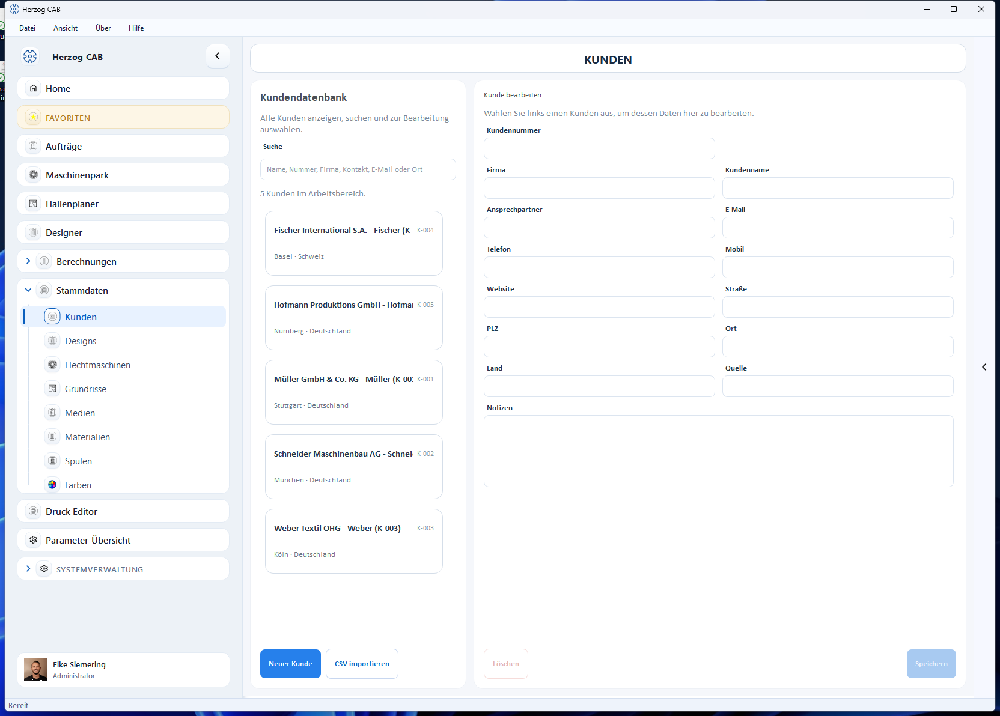

# Kunden

Im **Kunden-Modul** verwalten Sie die Stammdaten Ihrer Kunden. Diese Daten
stehen bei der Auftragsanlage zur Auswahl und werden in die Druckvorlagen
übernommen.

## Aufbau der Seite

* **Kundendatenbank** (links) – Suchfeld und Liste aller Kunden. Jede Karte
  zeigt Name, Kundennummer sowie Ort und Land.
* **Kunde bearbeiten** (rechts) – die Adress- und Kontaktdaten des gewählten
  Kunden.

## Eigenschaften eines Kunden

| Feld | Beschreibung |
|---|---|
| **Kundennummer** | Frei vergebbare Nummer (z. B. „K-001"). |
| **Firma** | Firmenname. |
| **Kundenname** | Bezeichnung / Anzeigename des Kunden. |
| **Ansprechpartner** | Name der Kontaktperson. |
| **E-Mail** | E-Mail-Adresse. |
| **Telefon** | Festnetznummer. |
| **Mobil** | Mobilnummer. |
| **Website** | Internetadresse. |
| **Straße** | Straße und Hausnummer. |
| **PLZ** | Postleitzahl. |
| **Ort** | Ort. |
| **Land** | Land. |
| **Quelle** | Herkunft des Kontakts (frei). |
| **Notizen** | Frei-Text. |

## Kunde anlegen, bearbeiten oder löschen

1. Mit **Neuer Kunde** (unten links) legen Sie einen Kunden an.
2. Einen vorhandenen Kunden wählen Sie in der Liste an, ändern die Felder
   rechts und sichern mit **Speichern**.
3. **Löschen** entfernt den gewählten Kunden (mit Sicherheitsabfrage).

## Kunden aus CSV importieren

Über **CSV importieren** (unten links) können Sie mehrere Kunden auf einmal
aus einer CSV-Datei übernehmen – praktisch beim Umstieg aus einem anderen
System.

## Verwendung in Aufträgen

Bei der Anlage eines [Auftrags](../orders/create.md) wählen Sie den Kunden
aus der Liste. Adresse und Ansprechpartner werden automatisch in die
Druckvorlagen übernommen.
