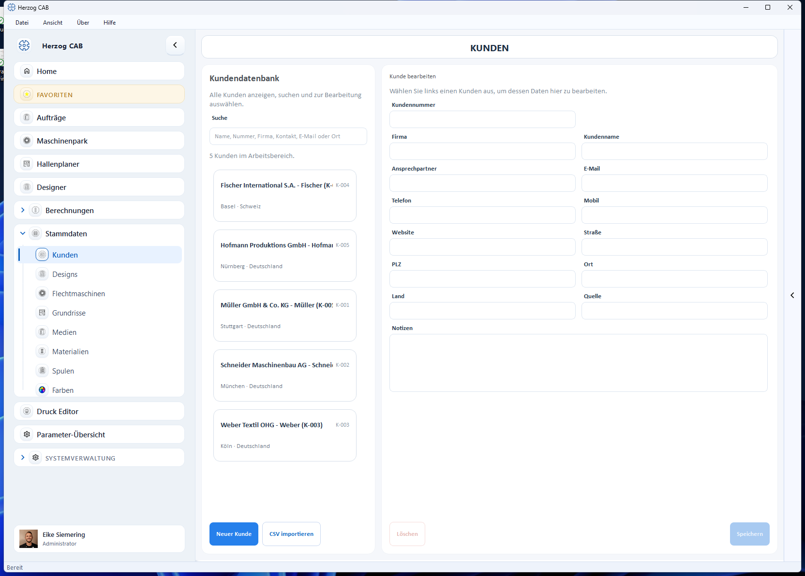

# Kunden

!!! abstract "Referenz — Kundenstammdaten anlegen, suchen und pflegen; sie stehen in Aufträgen zur Auswahl und fließen in die Druckvorlagen."

## Wofür Sie diesen Bereich nutzen

Im **Kunden-Modul** verwalten Sie die Stammdaten Ihrer Kunden. Diese Daten
stehen bei der Auftragsanlage zur Auswahl und werden in die Druckvorlagen
übernommen. Legen Sie wiederkehrende Kunden einmal an, statt Adresse und
Ansprechpartner in jedem Auftrag neu einzutippen.

## Der Bildschirm im Überblick

Die Seite ist zweigeteilt:

* **Kundendatenbank** (links) – Suchfeld und Liste aller Kunden. Jede Karte
  zeigt Name, Kundennummer sowie Ort und Land. Unter dem Suchfeld steht, wie
  viele Kunden zur aktuellen Suche passen.
* **Kunde bearbeiten** (rechts) – die Adress- und Kontaktdaten des in der Liste
  gewählten Kunden.

## Bedienelemente im Detail

### Suche

Über dem Listenbereich tippen Sie in das Feld **Suche** einen Namen, eine
Nummer, eine Firma, einen Kontakt, eine E-Mail oder einen Ort ein – die Liste
wird sofort gefiltert.

### Neuer Kunde

Die Schaltfläche **Neuer Kunde** öffnet den Dialog *Neuen Kunden in der
Datenbank anlegen*. Firma, Kundenname und Ansprechpartner sind dort immer
sichtbar; mindestens **Kundenname oder Firma** müssen Sie angeben. Bestätigen
Sie mit **Kunde anlegen**.

### CSV importieren

Über **CSV importieren** übernehmen Sie mehrere Kunden auf einmal aus einer
CSV-Datei – praktisch beim Umstieg aus einem anderen System.

### Felder eines Kunden

| Feld | Beschreibung |
|---|---|
| **Privatkunde** | Umschalter oben im Formular. Ist er aktiv, tritt der **Kundenname** an die Stelle der Firma; bei Firmenkunden führt die **Firma**. |
| **Kundennummer** | Frei vergebbare Nummer (z. B. „K-001"). Eine bereits vergebene Nummer weist das Programm zurück. |
| **Firma** | Firmenname (bei Firmenkunden der Hauptname). |
| **Kundenname** | Bezeichnung / Anzeigename des Kunden (bei Privatkunden der Hauptname). |
| **Ansprechpartner** | Name der Kontaktperson. |
| **E-Mail** | E-Mail-Adresse. |
| **Telefon** | Festnetznummer. |
| **Mobil** | Mobilnummer. |
| **Website** | Internetadresse. |
| **Straße** | Straße und Hausnummer. |
| **PLZ** | Postleitzahl. |
| **Ort** | Ort. |
| **Land** | Land. |
| **Quelle** | Herkunft des Kontakts (frei). |
| **Notizen** | Freitext-Bemerkungen. |

### Löschen und Speichern

Unten im Bearbeitungsbereich stehen zwei Schaltflächen:

* **Speichern** – sichert die Änderungen am gewählten Kunden.
* **Löschen** – entfernt den gewählten Kunden (mit Sicherheitsabfrage).

!!! info "Kunde direkt aus dem Auftrag anlegen"
    Beim Anlegen eines Flechtauftrags können Sie über **Neuer Kunde** einen
    Kunden anlegen, ohne die Auftragsmaske zu verlassen. Es öffnet sich derselbe
    Kunden-Editor; der neue Kunde erscheint anschließend automatisch in der
    Kundenliste und in der Auswahl des Auftrags.

## Verwendung in Aufträgen

Beim Anlegen eines [Flechtauftrags](../orders/braiding-order.md) oder
[Spulauftrags](../orders/winding-order.md) wählen Sie den Kunden aus der Liste.
Adresse und Ansprechpartner werden automatisch in die
[Druckvorlagen](../print-templates/index.md) übernommen.

## Verwandte Seiten

* [Suchen und Filtern](../basics/search-filter.md) – wie die Listensuche
  überall funktioniert
* [Flechtauftrag](../orders/braiding-order.md) – Kunde einem Auftrag zuordnen
* [Firma](../admin/company.md) – Ihre eigenen Firmenstammdaten für den Druck
