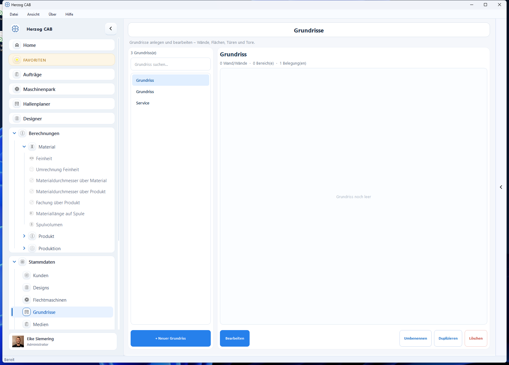

# Grundrisse

In den **Grundrissen** legen Sie die Hallenflächen an, auf denen der
[Hallenplaner](hall-planner.md) Ihre Maschinen anordnet. Ein Grundriss besteht
aus **Wänden**, **Flächen/Bereichen** sowie **Türen und Toren**.

## Aufbau der Seite

* **Liste** (links) – alle vorhandenen Grundrisse (suchbar).
* **Grundriss** (rechts) – die Zeichenfläche; oben steht die Zusammenfassung
  (Anzahl Wände, Bereiche, Belegungen).

## Grundriss anlegen und bearbeiten

1. Mit **+ Neuer Grundriss** legen Sie einen Grundriss an.
2. Über **Bearbeiten** zeichnen Sie Wände, Flächen, Türen und Tore ein.
3. **Umbenennen**, **Duplizieren** und **Löschen** verwalten den gewählten
   Grundriss.

!!! tip "Erst Grundriss, dann Hallenplaner"
    Legen Sie zuerst den Grundriss an und platzieren Sie anschließend im
    [Hallenplaner](hall-planner.md) die Maschinen darauf.
