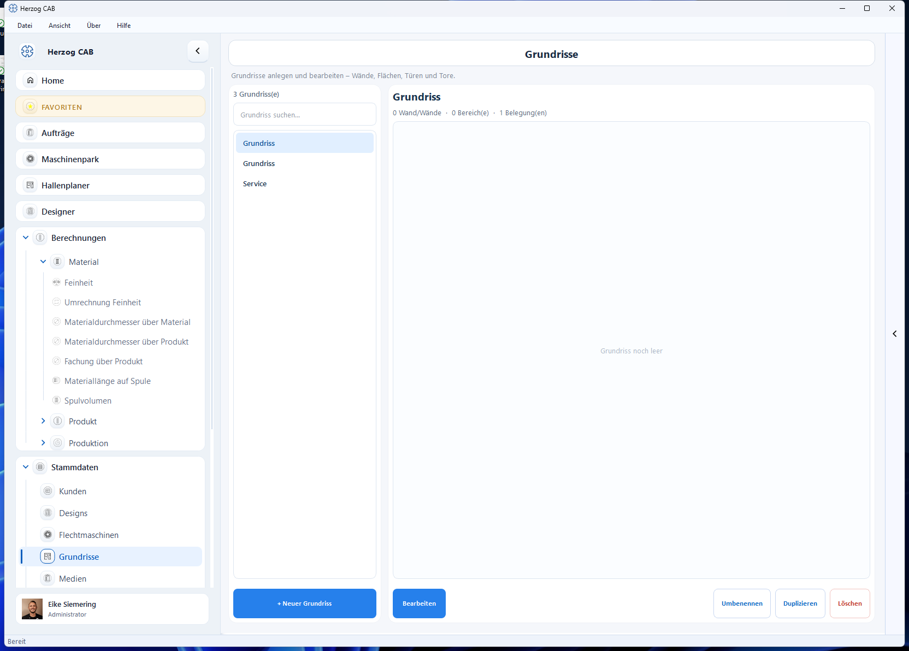

# Grundrisse

!!! abstract "Referenz — Hallen-Grundrisse (Wände und Flächen) anlegen und verwalten; sie bilden die Zeichenfläche für den Hallenplaner."

## Wofür Sie diesen Bereich nutzen

In den **Grundrissen** legen Sie die Hallenflächen an, auf denen der
[Hallenplaner](../hall-planner/index.md) Ihre Maschinen anordnet. Ein Grundriss
beschreibt die **Geometrie** einer Halle – im Wesentlichen **Wände** und
**Flächen/Bereiche**. Die eigentliche Maschinen-Bestückung erfolgt später im
Hallenplaner.

!!! info "Grundriss und Hallenplaner öffnen denselben Editor"
    Die Geometrie eines Grundrisses zeichnen Sie im
    [Hallenplaner-Editor](../hall-planner/editor.md) – hier im Modus
    *Geometrie bearbeiten*, im Hallenplaner im Modus *Bestücken*. Legen Sie also
    zuerst hier den Grundriss an und platzieren Sie danach im Hallenplaner die
    Maschinen darauf.

## Der Bildschirm im Überblick

* **Liste** (links) – alle vorhandenen Grundrisse, durchsuchbar über das
  Suchfeld.
* **Grundriss** (rechts) – die Zusammenfassung des gewählten Grundrisses (u. a.
  Anzahl Wände, Bereiche und zugehörige Belegungen).

## Bedienelemente im Detail

| Schaltfläche | Wirkung |
|---|---|
| **+ Neuer Grundriss** | Legt einen neuen, leeren Grundriss an. |
| **Bearbeiten** | Öffnet den [Hallenplaner-Editor](../hall-planner/editor.md), um Wände und Flächen zu zeichnen. |
| **Umbenennen** | Benennt den gewählten Grundriss um. |
| **Duplizieren** | Legt eine Kopie des gewählten Grundrisses an. |
| **Löschen** | Entfernt den gewählten Grundriss (mit Sicherheitsabfrage). |

## Verwandte Seiten

* [Hallenplaner](../hall-planner/index.md) – Maschinen auf dem Grundriss anordnen
* [Hallenplaner-Editor](../hall-planner/editor.md) – Wände, Flächen und
  Bestückung im Detail
* [Eine Halle aufbauen](../tasks/build-hall.md) – Ablauf von Grundriss bis
  Bestückung
