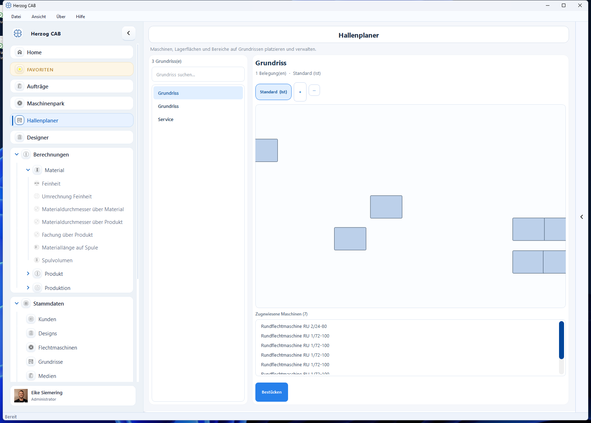

# Hallenplaner

Im **Hallenplaner** platzieren und verwalten Sie Ihre Maschinen, Lagerflächen
und Bereiche auf einem Hallen-Grundriss. So entsteht ein maßstäbliches Abbild
Ihrer Produktion.

## Aufbau

* **Grundriss-Auswahl** (links) – die vorhandenen [Grundrisse](floor-plans.md);
  oben suchen, mit **+** / **−** Belegungen hinzufügen/entfernen.
* **Grundriss-Canvas** (Mitte) – die Hallenfläche mit den platzierten Maschinen
  als Kacheln. Grundlage der Kachelgröße sind die Maschinenmaße aus den
  [Flechtmaschinen](machines.md)-Stammdaten.
* **Zugewiesene Maschinen** (unten) – Liste der auf diesem Grundriss verplanten
  Maschinen; über **Bestücken** weisen Sie weitere Maschinen zu.

## Wozu der Hallenplaner?

* Überblick, welche Maschine wo steht.
* Planung von Stellflächen und Wegen.
* Grundlage für die Maschinenauslastung im Blick zu behalten.

!!! info "Grundlagen pflegen"
    Der Hallenplaner nutzt die [Grundrisse](floor-plans.md) (Wände, Flächen) und
    die Maße der [Flechtmaschinen](machines.md). Pflegen Sie diese zuerst, damit
    die Darstellung maßstäblich stimmt.
