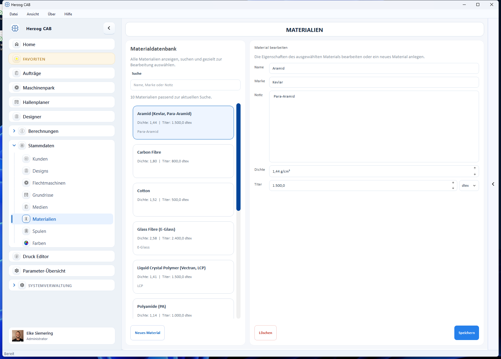

# Stammdaten

!!! abstract "Referenz — Übersicht aller Stammdaten-Bereiche"

In den **Stammdaten** legen Sie alle Daten ab, die Sie immer wieder in
Berechnungen, im Designer und in Aufträgen brauchen: Kunden, Designs, Maschinen,
Materialien, Spulen, Trommeln und Farben. Stammdaten gehören zum Arbeitsbereich – sie
werden also von allen Bedienern geteilt, die mit demselben Arbeitsbereich
arbeiten.

Sie erreichen die Bereiche über den Navigationspunkt **Stammdaten**. Dort öffnet
sich zunächst eine Übersicht mit einer Kachel je Stammdatenbereich.

## Die Bereiche

- :material-account-group: **Kunden**

    ---

    Firmen- und Kontaktdaten Ihrer Kunden für Aufträge und Druckvorlagen.

    [:octicons-arrow-right-24: Kunden](customers.md)

- :material-view-grid-outline: **Designs**

    ---

    Die Design-Bibliothek: gespeicherte Flechtmuster in Ordnern verwalten.

    [:octicons-arrow-right-24: Designs](designs.md)

- :material-robot-industrial: **Flechtmaschinen**

    ---

    Flechtmaschinen anlegen – mit Kategorie, Geflechtsart, Klöppeln, Bild und
    Dokumenten.

    [:octicons-arrow-right-24: Flechtmaschinen](braiding-machines.md)

- :material-floor-plan: **Grundrisse**

    ---

    Hallen-Grundrisse (Wände und Flächen) für den Hallenplaner zeichnen.

    [:octicons-arrow-right-24: Grundrisse](floor-plans.md)

- :material-image-multiple: **Medien**

    ---

    Zentrale Bildablage für Maschinen, Druckvorlagen und die Firma.

    [:octicons-arrow-right-24: Medien](media.md)

- :material-cube-outline: **Materialien**

    ---

    Garne, Drähte, Litzen und Fäden mit Dichte und Titer.

    [:octicons-arrow-right-24: Materialien](materials.md)

- :material-record-circle-outline: **Spulen**

    ---

    Spulenformate (Abmessungen und Volumen) und ihre Maschinentypen.

    [:octicons-arrow-right-24: Spulen](bobbins.md)

- :material-barrel: **Trommeln**

    ---

    Trommeln der Aufwickler mit Maßen, Spulvolumen und Leergewicht.

    [:octicons-arrow-right-24: Trommeln](drums.md)

- :material-reel: **Spulmaschinen**

    ---

    Spulmaschinen der Baureihen SP, SPA und HLM mit Wickeltechnik.

    [:octicons-arrow-right-24: Spulmaschinen](winding-machines.md)

- :material-tape-drive: **Aufwickler**

    ---

    Aufwickler mit Trommelmaßen, Traglast, Bauart und Haspel.

    [:octicons-arrow-right-24: Aufwickler](take-up-machines.md)

- :material-rotate-left: **Abwickler**

    ---

    Abwickler mit Trommelmaßen, Traglast, Trommelhub und Abwickelspannung.

    [:octicons-arrow-right-24: Abwickler](pay-off-machines.md)

- :material-view-grid-plus-outline: **Gatter**

    ---

    Ablaufgatter und Ablaufgestelle mit Ablaufstellen, Spulen und Fadenspannung.

    [:octicons-arrow-right-24: Gatter](creels.md)

- :material-palette: **Farben**

    ---

    Farbpalette für den Designer, mit RAL- und Pantone-Referenzfarben.

    [:octicons-arrow-right-24: Farben](colors.md)

## Allgemeine Bedienung

Die meisten Stammdaten-Editoren sind gleich aufgebaut:

* **Liste** auf der linken Seite – ein Suchfeld und alle vorhandenen Einträge
  als Karten. Unter dem Suchfeld steht, wie viele Einträge zur aktuellen Suche
  passen.
* **Detail-Ansicht** rechts – die Eigenschaften des in der Liste gewählten
  Eintrags.
* **Schaltflächen** – zum Anlegen (z. B. **Neues Material**, **Neue Spule**),
  **Speichern** und **Löschen** (mit Sicherheitsabfrage).

Wie Sie Listen durchsuchen und filtern, ist bereichsübergreifend in
[Suchen und Filtern](../basics/search-filter.md) beschrieben.

!!! info "Sonderfälle"
    Einige Bereiche weichen von diesem Aufbau ab: **Designs** ist eine
    Ordner-Bibliothek (wie ein Datei-Explorer); **Flechtmaschinen**,
    **Spulmaschinen**, **Aufwickler**, **Abwickler** und **Gatter** zeigen
    ihre Maschinen als Karten und öffnen zum Anlegen und Bearbeiten einen
    eigenen Dialog.

!!! tip "Spulen, Trommeln und Maschinen aus dem Herzog-Katalog"
    Seit Version 2.1.0 starten neue Arbeitsverzeichnisse ohne mitgelieferte
    Spulen und Trommeln. Herzog-Spulen und -Trommeln übernehmen Sie mit
    **Aus Herzog-Katalog …**, Herzog-Maschinen legen Sie direkt im
    [Herzog-Katalog](../catalog/index.md) an.

!!! warning "Berechtigung erforderlich"
    Zum Anlegen, Ändern oder Löschen von Stammdaten benötigen Sie die
    Berechtigung **Stammdaten bearbeiten**. Bediener mit reiner
    Leseberechtigung können die Daten nur ansehen. In der
    [Testversion](../basics/trial-quotas.md) sind Kunden, Designs und Maschinen
    zahlenmäßig begrenzt.
