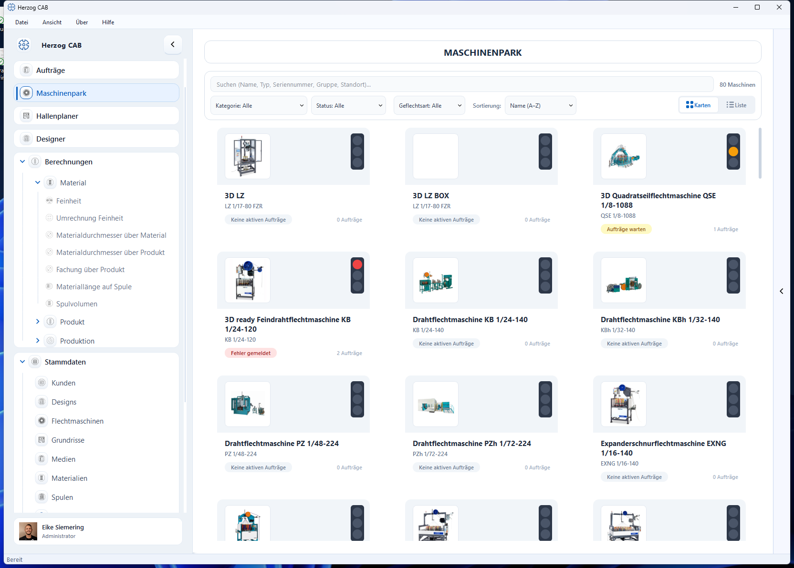
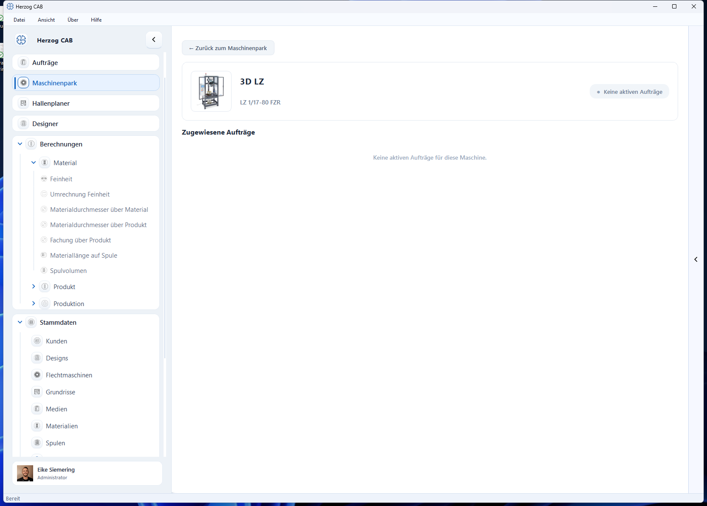

# Maschinenpark

Der **Maschinenpark** ist die Flotten-Übersicht: Er zeigt alle angelegten
[Flechtmaschinen](machines.md) auf einen Blick – mit Bild, Typ, Geflechtart und
Status.

## Übersicht und Filter

Jede Maschine erscheint als Karte. Über die Filter oben (**Kategorie**,
**Status**, **Geflechtart**, **Name**) und die Umschaltung zwischen **Karten-**
und **Listenansicht** finden Sie schnell die gesuchte Maschine.

## Maschinen-Detailseite

Per Klick auf eine Maschine öffnen Sie ihre Detailseite. Sie zeigt die Maschine
mit ihrer Typbezeichnung und die aktuell **zugewiesenen Aufträge**. Über
**← Zurück zum Maschinenpark** kehren Sie zur Übersicht zurück.

!!! info "Maschinen anlegen"
    Neue Maschinen legen Sie nicht hier, sondern in den Stammdaten unter
    [Flechtmaschinen](machines.md) an. Der Maschinenpark stellt sie anschließend
    übersichtlich dar.

!!! tip "Vom Maschinenpark in die Halle"
    Sind die Maschinenmaße gepflegt und [Grundrisse](floor-plans.md) angelegt,
    ordnen Sie die Maschinen im [Hallenplaner](hall-planner.md) auf der
    Hallenfläche an.
