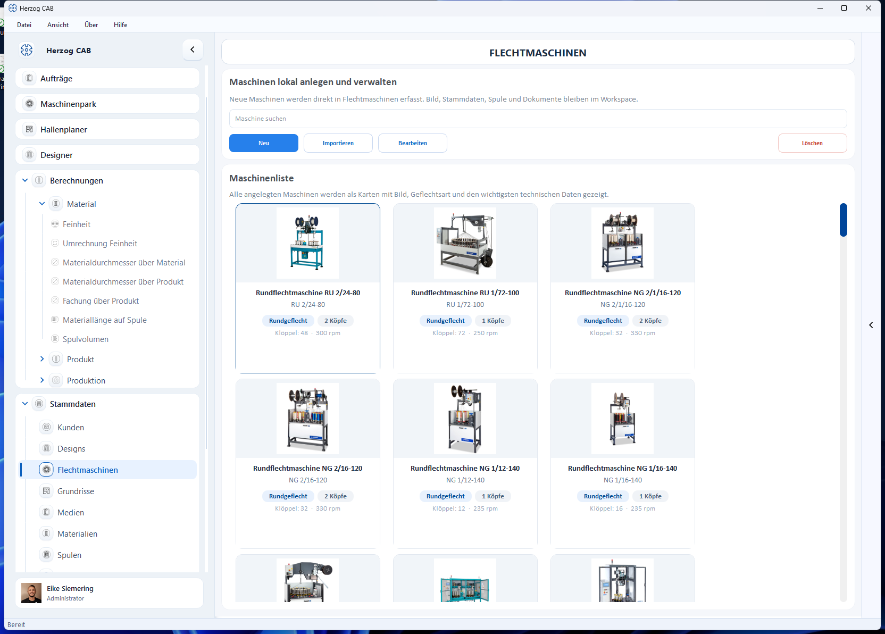

# Flechtmaschinen

Unter **Stammdaten → Flechtmaschinen** legen Sie die Flechtmaschinen Ihres Werks
an und verwalten sie. Pro Maschine speichert Herzog CAB technische Daten,
optional ein Bild, Dokumente (Datenblätter, Betriebsanleitungen) und die
zulässigen Spulen. Diese Daten werden im [Maschinenpark](machine-park.md), im
[Hallenplaner](hall-planner.md), in [Aufträgen](../orders/create.md) und in den
[Berechnungen](../calculations/index.md) herangezogen.

## Maschine anlegen und bearbeiten

Über die Maschinenliste legen Sie neue Maschinen an und bearbeiten bestehende.
Bild, Dokumente, Spule und Stammwerte werden im Workspace gespeichert.

## Eigenschaften einer Maschine

| Feld | Beschreibung |
|---|---|
| **Name** | Anzeigename der Maschine. |
| **Maschinentyp / Modell** | Typbezeichnung (z. B. „SENG 1/40-140"). |
| **Kategorie** | Maschinenkategorie (z. B. RU = Rund, SE = Seil, GL …). |
| **Geflechtart** | Rundgeflecht oder Litzengeflecht. |
| **Klöppel (gesamt / aktiv)** | Maximale und aktive Klöppelzahl; die aktive Zahl ergibt sich aus der Besetzung. |
| **Köpfe** | Anzahl der Flechtköpfe. |
| **Besetzung / Bindung** | Mögliche Besetzungsarten (Normal, Tandem, Halbe Besetzung). |
| **Max. Drehzahl** | Höchstdrehzahl in U/min. |
| **Spule(n)** | Zugeordnete Spulentypen aus den [Spulen-Stammdaten](bobbins.md). |
| **Baujahr / Seriennummer / Gruppe** | Identifikations- und Verwaltungsdaten. |
| **Standort** | Halle/Werk/Abteilung (auch für den Hallenplaner). |
| **Maße (L × B × H)** | Maschinenmaße in cm (u. a. für die Darstellung im Hallenplaner). |
| **Bild / Dokumente** | Maschinenbild und beliebige Dokumente (PDF, Datenblätter …). |

!!! info "Maschine, Auftrag und Design passen zusammen"
    Die Maschinendaten (Klöppelzahl, Besetzung, Geflechtart) bestimmen, welche
    Designs und Produkte gefertigt werden können. Herzog CAB gleicht diese Werte
    beim Anlegen eines Auftrags ab.

## Dokumente pro Maschine

Pro Maschine können Sie Dokumente ablegen (z. B. Betriebsanleitung,
Wartungspläne). Sie werden im Workspace unter dem Maschinen-Ordner gespeichert
(siehe [Speicherorte](../settings/file-locations.md)) und stehen an der Maschine
über die [mobile Auftragssicht](../orders/qr-code.md) zur Verfügung.

!!! note "Wo sehe ich meine Maschinen im Überblick?"
    Die Flotten-Übersicht aller Maschinen finden Sie im
    [Maschinenpark](machine-park.md); auf einem Hallen-Grundriss ordnen Sie sie
    im [Hallenplaner](hall-planner.md) an.
