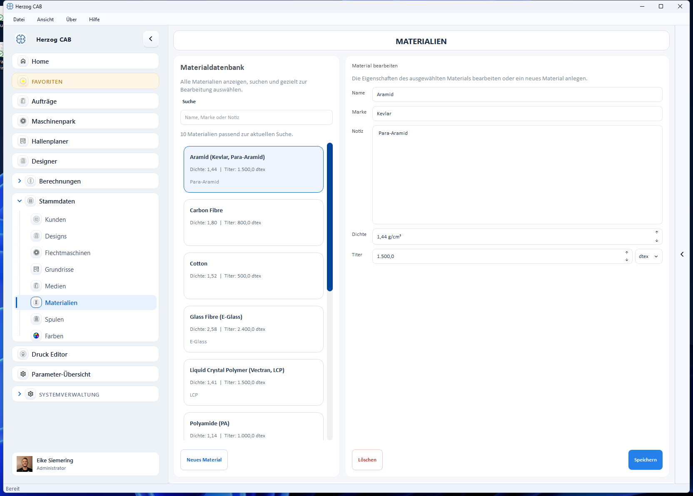
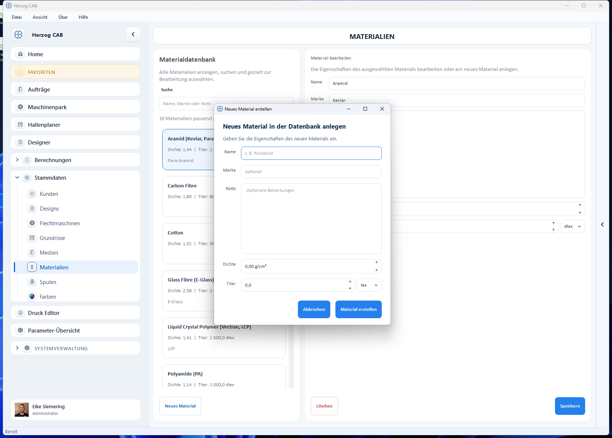

# Materialien

Im **Materialeditor** pflegen Sie alle Garne, Drähte, Litzen und Fäden, die
Sie immer wieder in Berechnungen und Aufträgen verwenden. Einmal angelegt,
lassen sich die hinterlegten Werte (Dichte und Titer) in jeder Berechnung
per Auswahl übernehmen – das spart Tipparbeit und vermeidet Eingabefehler.

## Aufbau der Seite

Wie alle Stammdaten-Editoren ist die Seite zweigeteilt:

* **Materialdatenbank** (links) – Suchfeld und Liste aller vorhandenen
  Materialien. Unter dem Suchfeld steht, wie viele Materialien zur
  aktuellen Suche passen. Jede Karte zeigt Name, Dichte und Titer.
* **Material bearbeiten** (rechts) – die Eigenschaften des in der Liste
  gewählten Materials.

## Eigenschaften eines Materials

| Feld | Einheit | Beschreibung |
|---|---|---|
| **Name** | – | Bezeichnung des Materials (z. B. „Aramid (Kevlar, Para-Aramid)"). |
| **Marke** | – | Optionaler Hersteller- oder Markenname (z. B. „Kevlar"). |
| **Notiz** | – | Optionale Bemerkung. |
| **Dichte** | g/cm³ | Materialdichte mit zwei Nachkommastellen. Grundlage u. a. für die Gewichtsberechnung. |
| **Titer** | tex, dtex, den, Nm, Ne | Feinheit (lineare Dichte) des Materials. Die Einheit wählen Sie im Auswahlfeld rechts daneben. |

!!! note "Ein Material hat keinen festen Durchmesser"
    Materialien werden über **Dichte** und **Titer** beschrieben, nicht
    über einen festen Durchmesser. Der Materialdurchmesser ergibt sich aus
    diesen Werten und wird bei Bedarf in der Berechnung
    [Materialdurchmesser](../calculations/material/material-diameter.md)
    ermittelt.

## Material anlegen

1. Klicken Sie unten links auf **Neues Material**.
2. Im Dialog *Neues Material in der Datenbank anlegen* tragen Sie Name,
   optional Marke und Notiz sowie Dichte und Titer ein.
3. Bestätigen Sie mit **Material erstellen**. Das neue Material erscheint
   sofort in der Liste.

## Material bearbeiten oder löschen

1. Wählen Sie das Material in der Liste an – seine Werte erscheinen rechts.
2. Ändern Sie die Felder und sichern Sie mit **Speichern**.
3. Mit **Löschen** entfernen Sie das Material (mit Sicherheitsabfrage).

## Materialien durchsuchen

Tippen Sie im Feld **Suche** einen Namen, eine Marke oder einen Teil der
Notiz ein – die Liste wird sofort gefiltert.

## Verwendung in Berechnungen

In vielen Berechnungen können Sie statt manueller Eingabe ein Material aus
der Datenbank wählen; Dichte und Titer werden dann automatisch übernommen.
Das betrifft z. B.:

* [Feinheit / Titer](../calculations/material/linear-density.md)
* [Materialdurchmesser](../calculations/material/material-diameter.md)
* [Produktgewicht](../calculations/product/rope-weight.md)

!!! tip "Häufige Materialien einmal sauber pflegen"
    Legen Sie wiederkehrende Materialien einmal mit korrekter Dichte und
    korrektem Titer an. Bei jeder Berechnung wählen Sie sie dann nur noch
    aus – das ist schneller und verlässlicher als die manuelle Eingabe.
