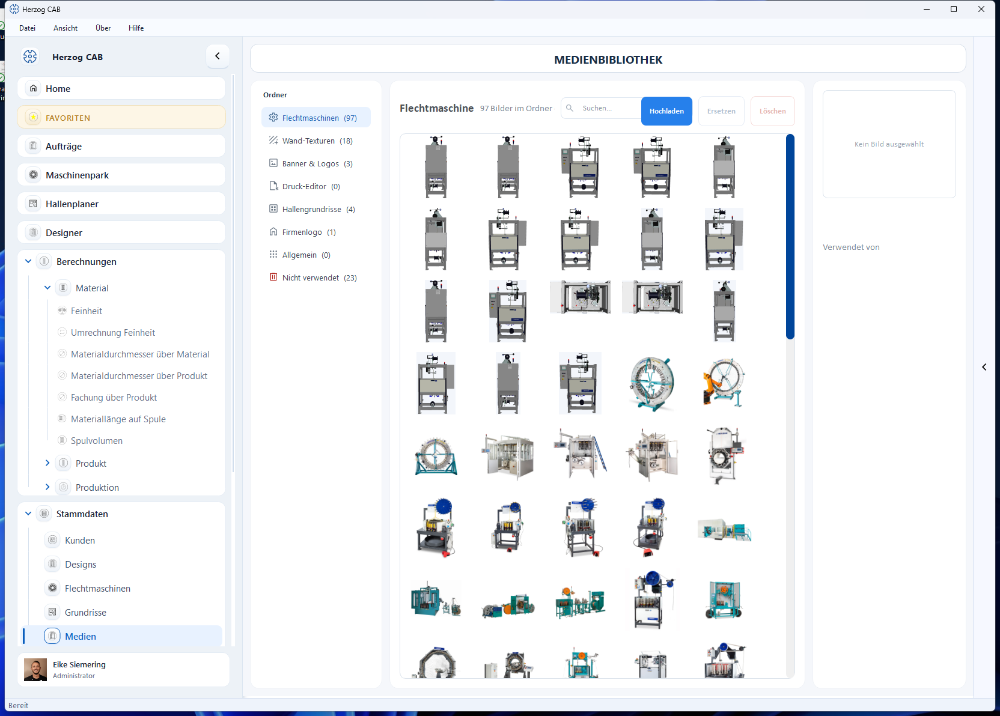

# Medien

Die **Medienbibliothek** verwaltet zentral alle Bilder und Dokumente, die Sie in
Herzog CAB verwenden – etwa Maschinenbilder, Datenblätter oder Logos für
Druckvorlagen.

## Aufbau

* **Ordner** (links) – thematische Ablage (z. B. *Flechtmaschinen*, *Druck Editor*,
  *Allgemein*), jeweils mit Anzahl der enthaltenen Medien.
* **Galerie** (rechts) – Vorschau der Medien im gewählten Ordner.

## Verwendung

Die hier abgelegten Medien stehen an den passenden Stellen zur Auswahl, z. B.:

* als **Maschinenbild** bei den [Flechtmaschinen](machines.md),
* als **Logo/Bild** in [Druckvorlagen](../print-templates/elements.md),
* als **Dokument** an einer Maschine (abrufbar über die
  [mobile Auftragssicht](../orders/qr-code.md)).

!!! info "Speicherort"
    Medien liegen im Arbeitsverzeichnis des aktiven Profils (siehe
    [Speicherorte](../settings/file-locations.md)) und sind damit für alle
    Bediener desselben Workspace verfügbar.
