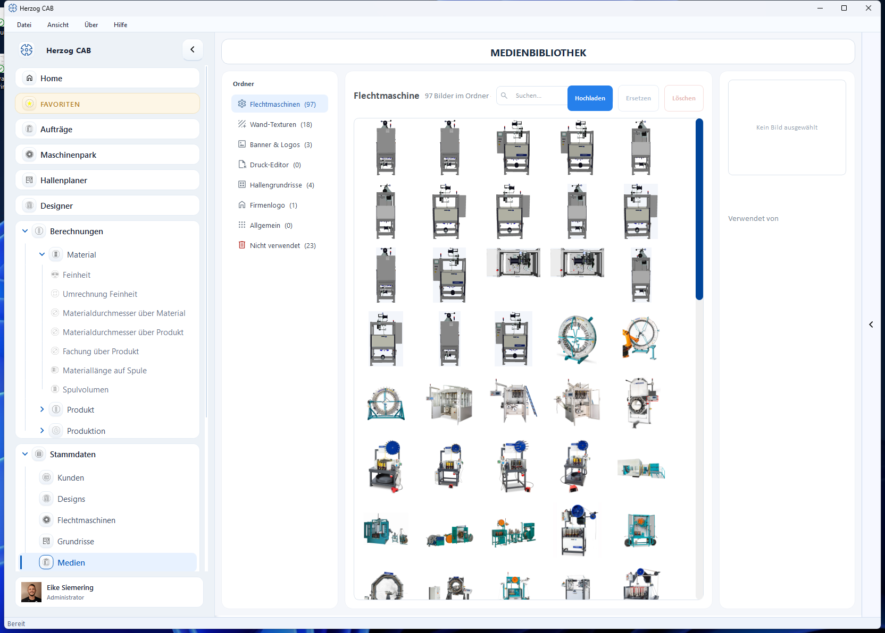

# Medien

!!! abstract "Referenz — die zentrale Medienbibliothek: Bilder hochladen, ersetzen, löschen und ihre Verwendung nachvollziehen."

## Wofür Sie diesen Bereich nutzen

Die **Medienbibliothek** verwaltet zentral alle Bilder, die Sie in Herzog CAB
verwenden – etwa Maschinenbilder, Box-Ansichten oder Logos für Druckvorlagen.
Statt Bilder mehrfach abzulegen, pflegen Sie sie einmal hier und wählen sie an
den passenden Stellen aus.

## Der Bildschirm im Überblick

* **Ordner** (links) – thematische Ablagen (z. B. für Flechtmaschinen,
  Spulmaschinen oder den Druck-Editor), jeweils mit Anzahl der enthaltenen
  Bilder. Ein zusätzlicher Eintrag **Nicht verwendet** filtert auf Bilder, die
  nirgends referenziert werden.
* **Galerie** (Mitte) – Vorschau der Bilder im gewählten Ordner, mit Suchfeld
  darüber.
* **Detail** (rechts) – zum ausgewählten Bild der Bereich **Verwendet von**, der
  zeigt, an welchen Stellen das Bild eingesetzt wird.

## Bedienelemente im Detail

| Schaltfläche | Wirkung |
|---|---|
| **Suchen** | Filtert die Galerie des aktuellen Ordners. |
| **Hochladen** | Fügt ein neues Bild in die Bibliothek ein. |
| **Ersetzen** | Tauscht das gewählte Bild gegen eine andere Datei aus – alle Verweise bleiben erhalten. |
| **Löschen** | Entfernt das gewählte Bild. Es erscheint der Dialog *Löschen bestätigen*. |

!!! tip "Vor dem Löschen: Verwendung prüfen"
    Der Bereich **Verwendet von** zeigt, wo ein Bild eingesetzt wird. Über den
    Ordner **Nicht verwendet** finden Sie Bilder, die Sie gefahrlos löschen
    können, weil sie nirgends mehr referenziert werden.

## Verwendung

Die hier abgelegten Bilder stehen an den passenden Stellen zur Auswahl – über
den Medien-Auswahldialog, z. B.:

* als **Maschinenbild** oder **Box-Ansicht** bei den
  [Flechtmaschinen](braiding-machines.md) und [Spulmaschinen](winding-machines.md),
* als **Bild/Logo** in [Druckvorlagen](../print-templates/elements.md),
* als **Firmenlogo** in den [Firmenstammdaten](../admin/company.md).

!!! info "Speicherort"
    Medien liegen im Arbeitsbereich (siehe [Speicherorte](../appendix/file-locations.md))
    und sind damit für alle Bediener desselben Arbeitsbereichs verfügbar.

## Verwandte Seiten

* [Flechtmaschinen](braiding-machines.md) und [Spulmaschinen](winding-machines.md) –
  Bilder und Box-Ansichten zuweisen
* [Druckvorlagen-Elemente](../print-templates/elements.md) – Bilder in Vorlagen
  einsetzen
