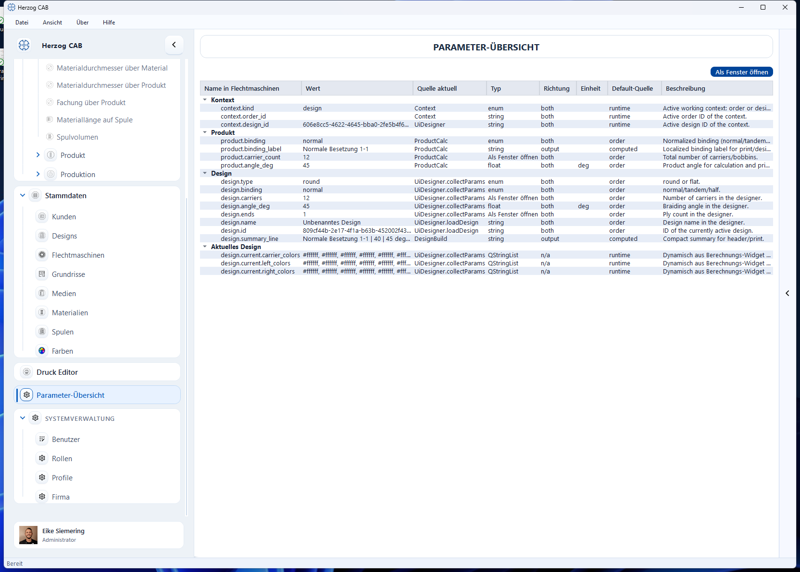

# Parameter-Übersicht

Die **Parameter-Übersicht** (Parameter Explorer) zeigt alle aktuellen Parameter
von Herzog CAB an einer Stelle – mit ihrem aktuellen Wert, ihrer Herkunft und
einer Beschreibung. Sie ist vor allem ein **Experten- und Diagnosewerkzeug**, um
nachzuvollziehen, wie Werte zwischen Auftrag, Berechnungen und Designer
zusammenhängen.

## Spalten der Tabelle

| Spalte | Bedeutung |
|---|---|
| **Name** | Bezeichnung des Parameters. |
| **Wert** | Aktueller Wert. |
| **Quelle aktuell** | Woher der aktuelle Wert stammt (z. B. Auftrag, Berechnung). |
| **Typ** | Datentyp des Parameters. |
| **Richtung** | Ob der Parameter Eingabe, Ausgabe oder beides ist. |
| **Default / Default-Quelle** | Vorgabewert und dessen Herkunft. |
| **Beschreibung** | Erläuterung des Parameters. |

Die Parameter sind nach Bereichen gruppiert (z. B. *Context*, *Produkt*,
*Design*).

!!! note "Für den Alltag selten nötig"
    Die normale Bedienung läuft über die [Berechnungen](../calculations/index.md)
    und den [Auftrag](../orders/create.md). Die Parameter-Übersicht hilft, wenn
    Sie ein Ergebnis nachvollziehen oder eine ungewöhnliche Wertkonstellation
    prüfen möchten.
