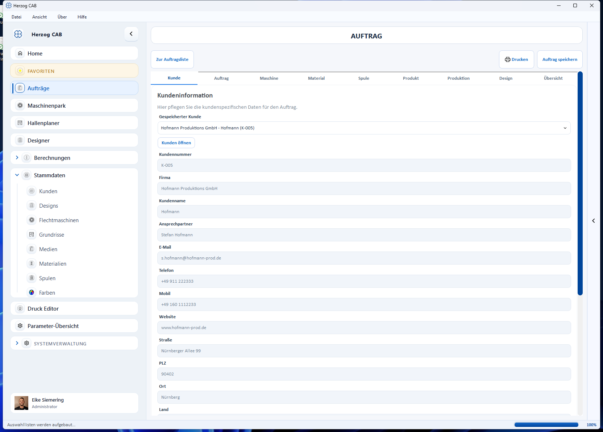
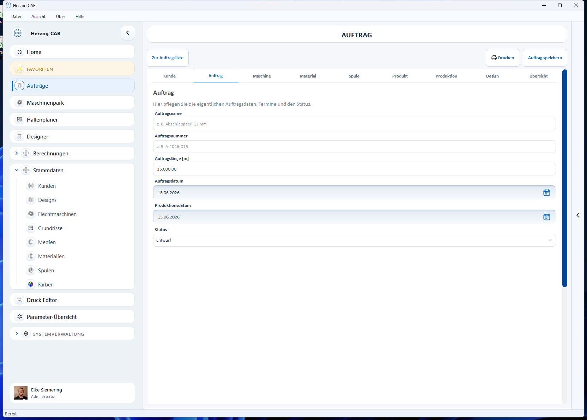
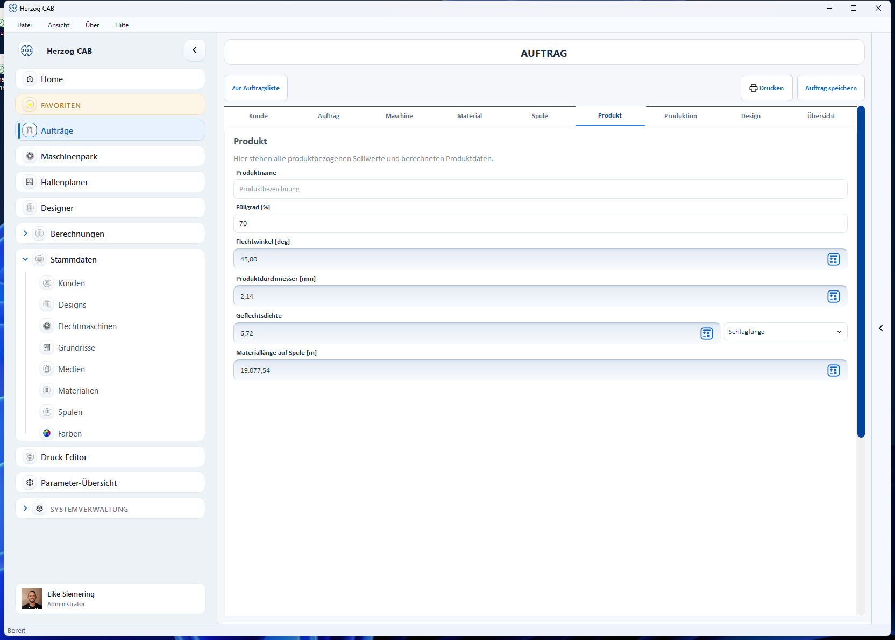
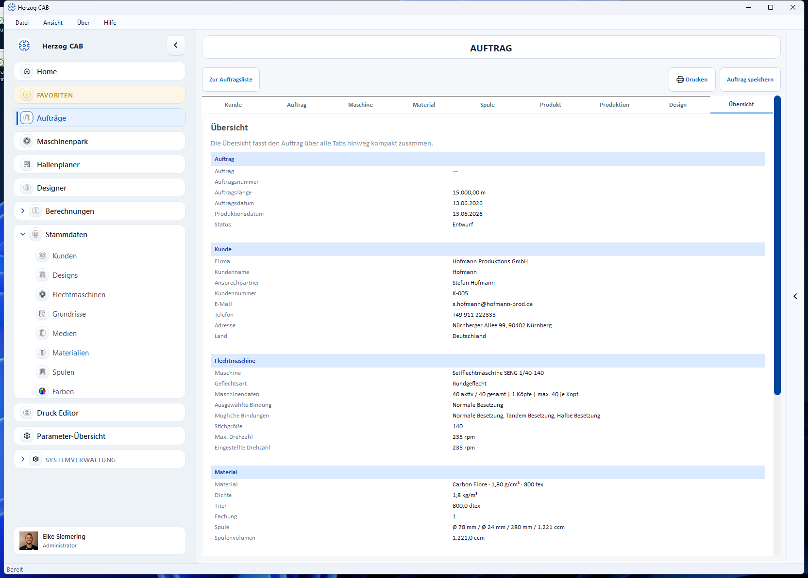

# Flechtauftrag-Editor

!!! abstract "Referenz — Flechtauftrag anlegen und bearbeiten: alle Tabs des Auftrags-Editors mit jedem Feld und jeder Schaltfläche."

## Wofür Sie diesen Bereich nutzen

Im Flechtauftrag-Editor pflegen Sie einen kompletten Flechtauftrag: Kunde,
Auftragsdaten, Flechtmaschine, Material, Spule, Produkt-Sollwerte,
Produktionswerte, Aufwickler und Trommel sowie das verknüpfte Design. Viele Werte müssen Sie nicht von
Hand eintragen — neben den Feldern sitzen **Rechner-Symbole**, die die
passende Berechnung öffnen und das Ergebnis in den Auftrag zurückschreiben.

Sie erreichen den Editor auf mehreren Wegen:

* In der [Auftragsübersicht](index.md) über **Neuer Auftrag** > *Neuer Flechtauftrag*,
* per **Öffnen** oder Doppelklick auf eine Flechtauftrags-Karte,
* über die Startseite ([Home](../basics/home.md)) und den Verlauf [Letzte Aufträge](../basics/history.md).

## Der Bildschirm im Überblick

Oben links bringt Sie **Zur Auftragsliste** zurück zur
[Auftragsübersicht](index.md). Oben rechts liegen **Drucken** (öffnet die
[Druckausgabe](print.md)) und **Auftrag speichern**. Die Schaltfläche
**Auftrag speichern** ist farblich hervorgehoben, solange ungespeicherte
Änderungen vorliegen.

Der Editor ist in zehn Tabs gegliedert, die Sie in beliebiger Reihenfolge
ausfüllen können:

| Tab | Inhalt |
|---|---|
| **Kunde** | Kunde aus den [Kundenstammdaten](../master-data/customers.md) wählen; Anzeige der Kundendaten. |
| **Auftrag** | Auftragsname, -nummer, Auftragslänge, Termine und Status. |
| **Maschine** | Flechtmaschine aus dem Maschinenpark; Geflechtsart, Bindung, Drehzahl, Maschinenbild. |
| **Material** | Material wählen; Dichte, Titer, Fachung. |
| **Spule** | Spulenformat wählen; Abmessungen und Spulvolumen. |
| **Produkt** | Produktbezogene Sollwerte mit eingebetteten Berechnungen. |
| **Produktion** | Geschwindigkeit, Laufzeit, Spulensätze und die Hochrechnung auf die Auftragslänge. |
| **Aufwicklung** | Aufwickler und Trommel wählen; Aufteilung der Auftragslänge auf die Trommeln mit Prüfung gegen den Aufwickler (ab Version 2.1.0). |
| **Design** | Verknüpftes Flechtdesign mit Vorschau und Klöppel-Tabelle. |
| **Übersicht** | Kompakte Zusammenfassung über alle Tabs. |

## Tab „Kunde"

Hier ordnen Sie dem Auftrag einen Kunden zu.

### Gespeicherter Kunde

Auswahlliste mit allen Kunden aus den
[Kundenstammdaten](../master-data/customers.md); der erste Eintrag ist
*Kein gespeicherter Kunde ausgewählt*. Bei der Auswahl übernimmt der Auftrag
alle Kundendaten in die Anzeigefelder darunter.

### Schaltfläche „Kunden öffnen"

Öffnet die **Kundenverwaltung** in einem eigenen Fenster. Dort können Sie
Kunden anlegen, ändern oder löschen; ein **Doppelklick** auf einen Kunden
übernimmt ihn direkt in den Auftrag und schließt das Fenster.

### Anzeigefelder

**Kundennummer**, **Firma**, **Kundenname**, **Ansprechpartner**, **E-Mail**,
**Telefon**, **Mobil**, **Website**, **Straße**, **PLZ**, **Ort**, **Land**,
**Quelle** und **Notizen** zeigen die Daten des gewählten Kunden. Die Felder
sind gesperrt — Änderungen an den Kundendaten nehmen Sie über
**Kunden öffnen** in der Kundenverwaltung vor.

!!! info "Der Auftrag merkt sich den Kundenstand"
    Beim Speichern legt der Auftrag eine Kopie der Kundendaten ab. Ändern Sie
    den Kunden später im Kundenstamm, bleibt der im Auftrag gespeicherte
    Stand erhalten.

## Tab „Auftrag"

| Feld | Bedeutung |
|---|---|
| **Auftragsname** | Frei wählbarer Name, z. B. *Abschleppseil 12 mm*. Erscheint als Titel auf der Auftragskarte. |
| **Auftragsnummer** | Ihre Auftrags- oder Belegnummer, z. B. *A-2026-015*. |
| **Auftragslänge [m]** | Insgesamt zu produzierende Geflechtslänge. Basis für die Hochrechnung im Tab **Produktion** (dort erscheint dasselbe Feld noch einmal — beide sind synchron). |
| **Auftragsdatum** | Datum des Auftragseingangs. Über das Kalendersymbol rechts im Feld wählen Sie das Datum aus einem Kalender. Vorbelegt mit dem aktuellen Datum. |
| **Produktion von** | Geplanter Produktionsbeginn, ebenfalls per Kalendersymbol wählbar. |
| **Produktion bis** | Geplantes Produktionsende. Entweder von Hand wählen oder mit **Produktionsende aus Hochrechnung übernehmen** berechnen lassen: Produktionsbeginn + Gesamtlaufzeit aus dem Tab **Produktion**, umgerechnet über die *Produktionsstunden je Arbeitstag* aus den [Einstellungen](../admin/settings/appearance.md#produktionsplanung) (Standard 8 h); Wochenenden werden übersprungen. Liegt noch keine Laufzeit-Hochrechnung vor, weist eine Meldung darauf hin. |
| **Status** | *Entwurf* (Standard), *Freigegeben*, *In Produktion*, *Abgeschlossen* oder *Fehler*. Der Status erscheint als farbiger Chip in der [Auftragsübersicht](index.md) und in den Status-Kacheln auf [Home](../basics/home.md). |

!!! tip "Status *Fehler*"
    Mit dem Status *Fehler* markieren Sie Aufträge, bei denen in der
    Produktion etwas schiefgelaufen ist. In der Auftragsübersicht finden Sie
    solche Aufträge über den Status-Filter *Alle Status*.

### Spulaufträge (Vorstufe)

Unter den Auftragsdaten listet der Bereich **Spulaufträge (Vorstufe)** alle
[Spulaufträge](winding-order.md), die mit diesem Flechtauftrag verknüpft
sind — mit Name bzw. Nummer, Status und Spulenzahl. Ein **Doppelklick**
öffnet den Spulauftrag. Solange keiner verknüpft ist, steht hier *Noch kein
Spulauftrag verknüpft*. Neue Spulaufträge legen Sie nach dem Speichern über
**Spulauftrag erstellen** in der [Auftragsübersicht](index.md) an; beim
Erzeugen aus dem Flechtauftrag terminiert Herzog CAB rückwärts — das
Spul-Ende liegt am Flechtbeginn.

## Tab „Maschine"

Hier wählen Sie die Flechtmaschine und prüfen ihre Grundkonfiguration. Die
meisten Felder sind Anzeigefelder — sie kommen aus den
[Flechtmaschinen-Stammdaten](../master-data/braiding-machines.md).

### Maschine

Auswahlliste Ihrer gespeicherten Flechtmaschinen (erster Eintrag:
*Keine Maschine ausgewählt*). Gehört die Maschine zu einer Gruppe, steht die
Gruppe in Klammern hinter dem Namen. Die Schaltfläche mit dem
Öffnen-Symbol daneben (**Flechtmaschinen öffnen**) zeigt den Maschinenpark in
einem eigenen Fenster; ein **Doppelklick** auf eine Maschine übernimmt sie in
den Auftrag.

### Geflechtsart

Auswahl zwischen **Rundgeflecht** und **Litzengeflecht**. Die Geflechtsart
beeinflusst, wie sich die aktiven Klöppel aus der Bindung ergeben, und welche
Designs im Tab **Design** angeboten werden.

### Anzeigefelder aus den Maschinendaten

| Feld | Bedeutung |
|---|---|
| **Seriennummer** | Seriennummer der gewählten Maschine. |
| **Gruppe** | Maschinengruppe (falls in den Stammdaten gepflegt). |
| **Köpfe** | Anzahl der Flechtköpfe der Maschine. |
| **Maximale Klöppel pro Kopf** | Klöppelplätze je Kopf. |
| **Klöppel gesamt** | Klöppelplätze über alle Köpfe. |
| **Aktive Klöppel (pro Kopf)** | Wird automatisch aus Geflechtsart und gewählter Bindung berechnet. |
| **Stichgröße** | Stichgröße der Maschine. |
| **Maximale Drehzahl [rpm]** | Höchstdrehzahl laut Stammdaten. |

Alle diese Felder tragen den Platzhaltertext *kommt aus der Maschine* bzw.
*ergibt sich aus Bindung* und sind nicht direkt editierbar.

### Eingestellte Drehzahl [rpm]

Zahlenfeld für die tatsächlich an der Maschine eingestellte Drehzahl; der
Wert 0 wird als *Nicht gesetzt* angezeigt. Diese Drehzahl fließt in die
Produktionsberechnungen ein.

### Geflechtsbindung

Drei sich gegenseitig ausschließende Optionen: **Normale Besetzung**,
**Tandem Besetzung**, **Halbe Besetzung**. Es sind nur die Besetzungen
wählbar, die die gewählte Maschine laut Stammdaten unterstützt. Die Auswahl
verändert das Feld **Aktive Klöppel (pro Kopf)** und die Design-Auswahl.

### Maschinenbild

Rechts neben den Feldern zeigt eine Karte das Bild der gewählten Maschine mit
einer Kurzinfo. Ohne Maschinenauswahl erscheint ein Platzhalter mit dem
Hinweis *Keine Maschine ausgewählt*.

## Tab „Material"

Hier legen Sie das Material des Auftrags fest. Die Materialdaten selbst
pflegen Sie in den [Material-Stammdaten](../master-data/materials.md).

### Material

Auswahlliste aller Materialien (erster Eintrag: *Kein Material ausgewählt*).
Zur besseren Unterscheidung zeigt jeder Eintrag zusätzlich Dichte und
Feinheit. **Material öffnen** daneben startet die Materialverwaltung in einem
eigenen Fenster.

### Felder

| Feld | Bedeutung |
|---|---|
| **Name** | Name des gewählten Materials (Anzeigefeld). |
| **Dichte [kg/m³]** | Materialdichte aus den Stammdaten (Anzeigefeld, Platzhalter *kommt aus dem Material*). |
| **Titer** | Feinheit des Materials mit Einheiten-Auswahl **tex**, **dtex**, **den**, **Nr. metrisch**, **Nr. englisch**. Wert und Einheit kommen aus den Stammdaten und sind im Auftrag gesperrt. Im Feld sitzt zusätzlich ein Rechner-Symbol (**Titer berechnen**). |
| **Marke** | Hersteller/Marke aus den Stammdaten (Anzeigefeld). |
| **Notiz** | Notiz aus den Stammdaten (Anzeigefeld). |
| **Fachung** | Anzahl der Fäden, die je Klöppel parallel verarbeitet werden (1–100, Standard 1). |

<!-- TODO(Verifikation): Das Rechner-Symbol „Titer berechnen" ist im aktuellen Stand gesperrt, sobald ein Material gewählt ist — prüfen, in welcher Situation es tatsächlich anklickbar ist, und die Beschreibung ggf. ergänzen. -->

## Tab „Spule"

Hier wählen Sie die zum Material gehörige Spule (das Spulenformat). Die
Spulenformate pflegen Sie in den [Spulen-Stammdaten](../master-data/bobbins.md).

### Spule

Auswahlliste der Spulenformate (erster Eintrag: *Keine Spule ausgewählt*).
Ist im Tab **Maschine** eine Maschine gewählt, zeigt die Liste **nur die zu
dieser Maschine passenden Spulen** (Zuordnung aus den
Maschinen-Stammdaten); die Standardspule der Maschine ist vorgewählt.
**Spule öffnen** daneben startet die Spulenverwaltung in einem eigenen
Fenster.

### Felder

| Feld | Bedeutung |
|---|---|
| **Name** | Name des gewählten Spulenformats (Anzeigefeld). |
| **Außendurchmesser [mm]** | Außendurchmesser der Spule. |
| **Kerndurchmesser [mm]** | Kerndurchmesser der Spule. |
| **Wickellänge [mm]** | Nutzbare Wickellänge der Spule. |
| **Spule-Volumen [ccm]** | Wickelvolumen — wird automatisch aus den drei Abmessungen berechnet. |

Ist eine Spule aus den Stammdaten gewählt, sind die Abmessungen gesperrt
(Platzhalter *kommt aus der Spule*). Trägt der Auftrag Spulenmaße ohne
Stammdaten-Spule (z. B. aus einem älteren Auftrag übernommen), lassen sich
die Abmessungen direkt bearbeiten; das Volumen rechnet dabei live mit.

## Tab „Produkt"

Hier stehen die produktbezogenen Sollwerte. Vier Felder besitzen ein
eingebettetes Rechner-Symbol — siehe
[Berechnungen direkt im Auftrag](#berechnungen-direkt-im-auftrag).

| Feld | Bedeutung |
|---|---|
| **Produktname** | Bezeichnung des zu fertigenden Produkts. |
| **Füllgrad [%]** | Füllgrad des Geflechts; bei neuen Aufträgen mit 70 vorbelegt. |
| **Flechtwinkel [deg]** | Flechtwinkel — manuell eintragen oder per Rechner-Symbol berechnen. |
| **Produktdurchmesser [mm]** | Durchmesser des fertigen Produkts — manuell oder aus der Berechnung. |
| **Geflechtsdichte** | Geflechtsdichte mit Einheiten-Auswahl **Schlaglänge**, **Flechten pro 10 Millimeter**, **Flechten pro Zoll**, **Flechten pro französisch Zoll** — manuell oder aus der Berechnung. |
| **Materiallänge auf Spule [m]** | Wie viel Material auf eine Spule passt — manuell oder aus der Berechnung. Basis für die Spulensatz-Rechnung im Tab **Produktion**. |

## Tab „Produktion"

Der Tab ist in zwei Abschnitte gegliedert (bei schmalem Fenster
untereinander).

!!! warning "📷 Screenshot fehlt"
    **Motiv:** Tab „Produktion" mit den beiden Abschnitten „Produktionswerte" (links) und „Hochrechnung auf die Auftragslänge" (rechts), inklusive gefüllter berechneter Felder
    **So erzeugen:** Flechtauftrag mit Auftragslänge, Maschine, Material, Spule und ausgeführter Laufzeit-Berechnung öffnen; Tab *Produktion* wählen
    **Ziel-Datei:** `assets/screenshots/orders/auftrag-tab-produktion.png`

### Abschnitt „Produktionswerte"

| Feld | Bedeutung |
|---|---|
| **Produktionsgeschwindigkeit [m/h]** | Fertigungsgeschwindigkeit — mit Rechner-Symbol. |
| **Laufzeit [h]** | Laufzeit je Spulensatz — mit Rechner-Symbol (die Berechnung liefert auch die drei folgenden Werte). |
| **Produktlänge pro Spule-Satz [m]** | Produzierbare Länge mit einem Spulensatz (Anzeigefeld, kommt aus der Laufzeit-Berechnung). |
| **Verkürzung [%]** | Materialverkürzung durch das Verflechten (Anzeigefeld, kommt aus der Laufzeit-Berechnung). |
| **Produktgewicht [kg]** | Gewicht des Produkts — mit Rechner-Symbol. |

### Abschnitt „Hochrechnung auf die Auftragslänge"

| Feld | Bedeutung |
|---|---|
| **Auftragslänge [m]** | Dasselbe Feld wie im Tab **Auftrag** — beide Eingaben sind synchron. |
| **Genutzte Köpfe** | Nur bei Maschinen mit mehr als einem Kopf sichtbar: Wie viele Köpfe dasselbe Produkt für diesen Auftrag fertigen. Fährt ein Kopf ein anderes Produkt, gehört das in einen eigenen Auftrag. |
| **Spule-Satz-Wechsel (pro Kopf)** | Wie oft je Kopf ein neuer Spulensatz aufgelegt werden muss (Anzeigefeld). |
| **Spule-Sätze gesamt** | Benötigte Spulensätze über alle genutzten Köpfe (Anzeigefeld). Dieser Wert speist die Zielspulenzahl eines verknüpften [Spulauftrags](winding-order.md). |
| **Gesamtlaufzeit [h]** | Laufzeit für die komplette Auftragslänge (Anzeigefeld). |
| **Restlänge letzter Satz [m]** | Produktlänge, die mit dem letzten Spulensatz noch zu fertigen ist (Anzeigefeld, pro Kopf). |
| **Gesamtgewicht [kg]** | Produktgewicht, auf die Auftragslänge hochgerechnet (Anzeigefeld). Bei Kern-Mantel-Seilen zählt die Seele aus dem Tab **Aufwicklung** mit. |

Die Anzeigefelder ergeben sich aus Auftragslänge, Geschwindigkeit und
Spulensatz-Länge; sie füllen sich, sobald die zugrunde liegenden Werte
vorhanden sind.

## Tab „Aufwicklung"

Hier wählen Sie Aufwickler und Trommel für den Auftrag. Die Auftragslänge
wird auf die Trommeln aufgeteilt und gegen den Aufwickler geprüft. Die
Angaben werden mit dem Auftrag gespeichert und erscheinen im Tab
**Übersicht**, in der Webansicht und als Platzhalter in den
[Druckvorlagen](../print-templates/elements.md).

!!! warning "📷 Screenshot fehlt"
    **Motiv:** Tab „Aufwicklung" mit gewähltem Aufwickler und gewählter Trommel, links die Abschnitte „Aufwickler und Trommel" und „Seele (Kern-Mantel-Seil)" mit der Schaltfläche **Vorschlag berechnen**, rechts „Aufteilung der Auftragslänge" mit grüner Prüfzeile.
    **So erzeugen:** Flechtauftrag mit Auftragslänge, Produktdurchmesser und Produktgewicht öffnen (mindestens ein Aufwickler und eine Trommel in den Stammdaten), Tab *Aufwicklung* wählen und **Vorschlag berechnen** klicken.
    **Ziel-Datei:** `assets/screenshots/orders/auftrag-tab-aufwicklung.png`

!!! info "Neu ab Version 2.1.0"
    Aufwickler kommen aus den Stammdaten
    [Aufwickler](../master-data/take-up-machines.md), Trommeln aus den
    [Trommeln](../master-data/drums.md). Die Rechnung dahinter ist dieselbe
    wie in der Berechnung
    [Trommel- und Aufwicklerwahl](../calculations/product/drum-take-up-selection.md).

### Abschnitt „Aufwickler und Trommel"

| Feld | Bedeutung |
|---|---|
| **Aufwickler** | Aufwickler aus dem Maschinenpark (Vorgabe: *Kein Aufwickler ausgewählt*). Darunter stehen seine Grenzen, z. B. Trommel-Ø, Verlegebreite, Traglast und Produkt-Ø, bei einem Haspelaufwickler das Haspelvolumen. Die Schaltfläche **Aufwickler öffnen** zeigt die Aufwickler in einem eigenen Fenster; dort lassen sie sich anlegen und ändern, ein Doppelklick übernimmt einen in den Auftrag. |
| **Trommel** | Trommel aus den Trommel-Stammdaten (Vorgabe: *Keine Trommel ausgewählt*). Darunter stehen Außen- und Kerndurchmesser, Verlegeweite, Volumen und Leergewicht (oder *Leergewicht fehlt*). **Trommeln öffnen** zeigt die Trommeln in einem eigenen Fenster; ein Doppelklick übernimmt eine Trommel. Wickelt der Aufwickler auf seine Haspel, entfällt die Trommel. |
| **Lieferlänge je Trommel [m]** | Länge je Trommel, wenn der Kunde sie vorgibt. Leer lassen, dann wird die Auftragslänge nach der gewählten Aufteilung verteilt. |
| **Aufteilung** | *Gleich große Teilmengen*, *Volle Trommeln + Rest* oder *Rest auf kleinerer Trommel* — wie in der [Trommel- und Aufwicklerwahl](../calculations/product/drum-take-up-selection.md#der-vorschlag). Mit Lieferlänge gilt die Aufteilung nur für den Rest. |
| **Füllgrad auf der Trommel [%]** | Anteil des Wickelraums, der mit Produkt gefüllt wird; die Hohlräume des runden Geflechts stecken darin. Leer gilt 75 %. |
| **Randabstand zum Flansch [mm]** | Abstand der obersten Lage zur Flanschkante. 0 = Spulvolumen aus der Trommel-Datenbank. |

### Abschnitt „Seele (Kern-Mantel-Seil)"

Nur bei Produkten mit Seele. Material und Produktgewicht gelten dann für
den Mantel; die Seele kommt wie bei
[Kern-Mantel-Produkt](../calculations/product/core-sheath.md) zum
Metergewicht dazu — und damit zur Traglast und zum **Gesamtgewicht** im
Tab **Produktion**.

| Feld | Bedeutung |
|---|---|
| **Anteil Seele [%]** | Anteil der Seele am Querschnitt des Produkts. Leer = ohne Seele. Der Seelendurchmesser folgt aus dem Produktdurchmesser. |
| **Material der Seele** | Übernimmt die Dichte des Materials. |
| **Dichte der Seele [g/cm³]** | Dichte der Seele. |
| **Füllungsgrad der Seele [%]** | Füllungsgrad wie bei *Kern-Mantel-Produkt*. |

### Schaltfläche „Vorschlag berechnen"

Sucht einen Aufwickler aus dem Maschinenpark und eine Trommel aus der
Datenbank, die zu Produkt und Länge passen, und trägt beide ein. Mit
Lieferlänge sucht sie die kleinste Trommel für genau diese Länge, sonst für
die Auftragslänge je Kopf. Eine Meldung nennt das Ergebnis
(*Vorschlag übernommen: … mit ….*) oder den Grund, warum es keinen gibt,
etwa *Für den Vorschlag fehlt der Produktdurchmesser (Reiter Produkt).*
Ist im Maschinenpark kein Aufwickler angelegt, schlägt sie nur die Trommel
vor.

### Abschnitt „Aufteilung der Auftragslänge"

Oben steht die Grundlage der Rechnung: Produkt-Ø, Metergewicht (mit Anteil
der Seele) und Auftragslänge (bei mehreren Köpfen auch je Kopf). Fehlt
etwas, steht dort, wo es einzutragen ist, z. B. *Metergewicht fehlt
(Produktgewicht und Spule-Satz im Reiter Produktion)*.

| Feld | Bedeutung |
|---|---|
| **Kapazität je Trommel [m]** | Produktlänge, die auf die gewählte Trommel passt. |
| **Trommeln gesamt** | Anzahl der Trommeln; bei mehreren Köpfen z. B. *„6 (3 je Kopf)"*. Die Auftragslänge wird je Kopf aufgeteilt. |
| **Länge je Trommel** | Die Aufteilung, z. B. *„2 × 500 m + 1 × 180 m"*; liegt der Rest auf einer anderen Trommel, steht sie in Klammern dahinter. |
| **Schwerste Trommel** | Gewicht der schwersten bestückten Trommel; ohne Leergewicht *„… kg + Leergewicht"*. |
| **Prüfung** | Farbige Zeilen: grün *Aufwickler und Trommel passen.*, rot z. B. *Passt nicht: …* oder *Das Produkt passt nicht in den Wickelraum der Trommel.*, gelb *Nicht prüfbar: …*, grau Hinweise wie *Ohne Aufwickler ist nur die Kapazität der Trommel geprüft.* oder *Jeder Kopf braucht einen eigenen Aufwickler.* |

Was im Einzelnen geprüft wird, steht unter
[Aufwickler — Welche Angaben geprüft werden](../master-data/take-up-machines.md#welche-angaben-gepruft-werden).

## Tab „Design"

Hier verknüpfen Sie ein Flechtdesign aus dem [Designer](../designer/index.md)
mit dem Auftrag und sehen dessen Vorschau samt Klöppel-Tabelle.

!!! warning "📷 Screenshot fehlt"
    **Motiv:** Tab „Design" mit verknüpftem Design: Feld „Verknüpftes Design" mit den drei Schaltflächen, Vorschau-Miniatur mit Design-Infos und geöffneter Unter-Tab „Klöppel-Tabelle" mit farbigen Zellen
    **So erzeugen:** Flechtauftrag mit verknüpftem mehrfarbigem Design öffnen; Tab *Design*, Unter-Tab *Klöppel-Tabelle* wählen
    **Ziel-Datei:** `assets/screenshots/orders/auftrag-tab-design.png`

### Verknüpftes Design

Anzeigefeld mit dem Namen des verknüpften Designs (Platzhalter:
*Noch kein Design verknüpft*). Im Feld liegen drei Schaltflächen:

| Schaltfläche | Wirkung |
|---|---|
| **Design laden** | Speichert den Auftrag und öffnet die Design-Auswahl. Angeboten werden nur Designs, die zur Maschine passen (gleiche Geflechtsart, Bindung und Klöppelzahl). Mit **Übernehmen** verknüpfen Sie das markierte Design, mit **Schließen** bleibt alles unverändert. |
| **Design öffnen** | Öffnet das verknüpfte Design im Designer-Fenster. **Speichern & Übernehmen** sichert Änderungen, aktualisiert die Verknüpfung und schließt das Fenster; **Schließen** beendet das Fenster ohne weiteres Speichern. |
| **Neues Design** | Öffnet einen leeren Designer, vorbelegt mit den Maschinendaten des Auftrags. **Speichern & Übernehmen** legt das Design an und verknüpft es mit dem Auftrag. |

!!! info "Jedes Speichern verknüpft (ab Version 2.1.0)"
    Speichern Sie im Fenster *Neues Design* oder *Design öffnen* über die
    Werkzeugleiste des Designers und schließen es danach mit
    **Schließen**, ist das Design trotzdem mit dem Auftrag verknüpft. Ohne
    Speichern bleibt der Auftrag unverändert. Bricht der Speichervorgang
    bei **Speichern & Übernehmen** ab (z. B. in der Ordnerauswahl), bleibt
    das Fenster offen.

### Vorschau

Unter dem Feld zeigt eine Miniatur das Design mit Eckdaten (Name,
Geflechtsart, Klöppel). Ein Klick auf Miniatur oder Text öffnet das
verknüpfte Design.

### Unter-Tabs „Übersicht" und „Klöppel-Tabelle"

* **Übersicht** — große Design-Vorschau; Klick öffnet das Design.
* **Klöppel-Tabelle** — die Besetzungstabelle des Designs: Spalte **Nr.**
  plus eine Farbspalte je Gangbahn (bei Rundgeflechten mit zwei Gangbahnen
  zwei Farbspalten). Der Zellhintergrund entspricht der Klöppelfarbe, die
  Schrift wechselt automatisch für guten Kontrast. Ein **Doppelklick** auf
  die Tabelle öffnet das Design.

Über die Auswahl **Anzeige** legen Sie fest, welche Farbbezeichnung in den
Zellen steht: **Farbname**, **Kennung**, **Hex-Wert** oder **Pantone** (Werte
aus den [Farb-Stammdaten](../master-data/colors.md)). Die Einstellung gilt
auch für die Farbaufschlüsselung im [Spulauftrag](winding-order.md) und für
den Ausdruck.

!!! info "Wann der Design-Tab gesperrt ist"
    Übersteigt die Klöppelzahl der gewählten Maschine den im Designer
    darstellbaren Umfang, wird der Tab **Design** deaktiviert und eine
    bestehende Verknüpfung entfernt. Wählen Sie eine passende Maschine oder
    Bindung, um den Tab wieder freizuschalten.

## Tab „Übersicht"

Die Übersicht fasst den Auftrag über alle Tabs hinweg zusammen — gegliedert
in die Abschnitte **Auftrag**, **Kunde**, **Flechtmaschine**, **Material**,
**Produkt**, **Produktion**, **Aufwicklung** und **Design**. Leere Felder erscheinen als
Strich, sodass Lücken sofort auffallen.

!!! tip "Endkontrolle vor dem Druck"
    Prüfen Sie den Auftrag im Tab **Übersicht**, bevor Sie ihn
    [drucken](print.md) oder freigeben.

## Berechnungen direkt im Auftrag

Felder mit einem **Rechner-Symbol** öffnen die passende Berechnungsseite als
Fenster — vorbefüllt mit den Werten des Auftrags. Nach dem ersten Berechnen
wird **Übernehmen** aktiv: Ein Klick schreibt das Ergebnis in das
Auftragsfeld zurück und schließt das Fenster. **Schließen** verwirft das
Ergebnis. Der gemeinsame Aufbau der Berechnungsseiten ist unter
[So sind Berechnungsseiten aufgebaut](../basics/calc-page-anatomy.md)
beschrieben.

| Feld im Auftrag | Berechnung |
|---|---|
| **Flechtwinkel [deg]** (Tab Produkt) | [Flechtwinkel](../calculations/product/braid-angle.md) |
| **Produktdurchmesser [mm]** (Tab Produkt) | [Produktdurchmesser](../calculations/product/product-diameter.md) |
| **Geflechtsdichte** (Tab Produkt) | [Geflechtsdichte](../calculations/product/lay-length.md) |
| **Materiallänge auf Spule [m]** (Tab Produkt) | [Materiallänge auf Spule](../calculations/material/material-length.md) |
| **Produktionsgeschwindigkeit [m/h]** (Tab Produktion) | [Produktionsgeschwindigkeit](../calculations/production/production-speed.md) |
| **Laufzeit [h]** (Tab Produktion) | [Laufzeit und Spulensatz](../calculations/production/run-time-bobbin-set.md) |
| **Produktgewicht [kg]** (Tab Produktion) | [Produktgewicht](../calculations/product/rope-weight.md) |
| **Titer** (Tab Material) | [Feinheit](../calculations/material/linear-density.md) |

## Speichern und ungespeicherte Änderungen

* **Auftrag speichern** (oben rechts) sichert den Auftrag; eine kurze
  Erfolgsmeldung bestätigt das Speichern. Erst dann ist ein neuer Auftrag
  dauerhaft in der Übersicht vorhanden.
* Verlassen Sie den Editor mit ungespeicherten Änderungen (z. B. über
  **Zur Auftragsliste** oder die Navigation), fragt Herzog CAB nach:
  **Speichern**, **Nicht speichern** oder **Abbrechen**.
* Das Speichern setzt das Recht voraus, Aufträge zu bearbeiten — siehe
  [Rollen und Rechte](../admin/roles.md).

## Verwandte Seiten

* [Auftragsübersicht](index.md) — Aufträge suchen, duplizieren, löschen
* [Spulauftrag-Editor](winding-order.md) — die Spulen-Vorstufe zum Flechtauftrag
* [Drucken](print.md) — Vorlagenwahl, Druckvorschau, QR-Code
* [Vom Auftrag zum Maschinenschein](../tasks/order-to-machine-sheet.md) — der Ablauf als Anleitung
* [Designer](../designer/index.md) — Flechtdesigns entwerfen und bearbeiten
* [Kunden](../master-data/customers.md) · [Flechtmaschinen](../master-data/braiding-machines.md) · [Materialien](../master-data/materials.md) · [Spulen](../master-data/bobbins.md) · [Aufwickler](../master-data/take-up-machines.md) · [Trommeln](../master-data/drums.md) · [Designs](../master-data/designs.md) — die zugehörigen Stammdaten
* [Trommel- und Aufwicklerwahl](../calculations/product/drum-take-up-selection.md) — dieselbe Rechnung als eigene Berechnung
