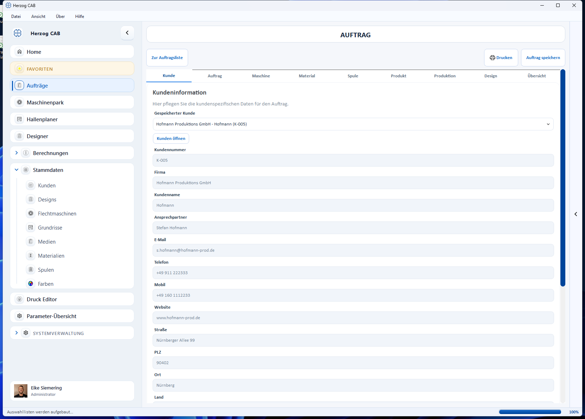
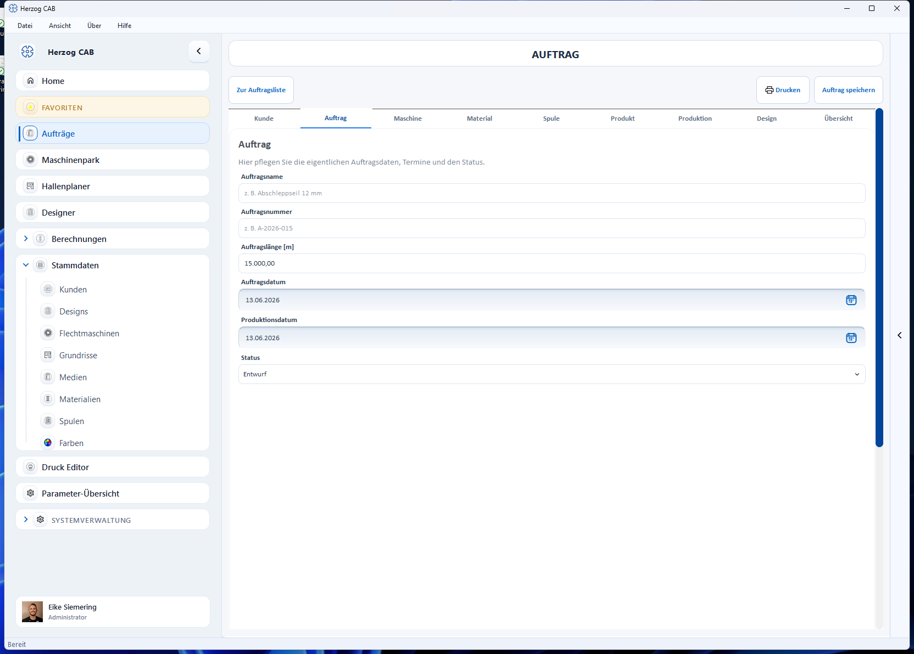
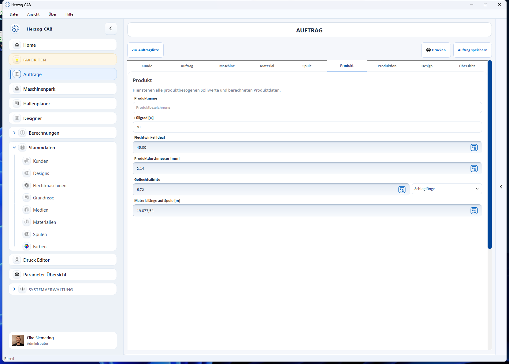
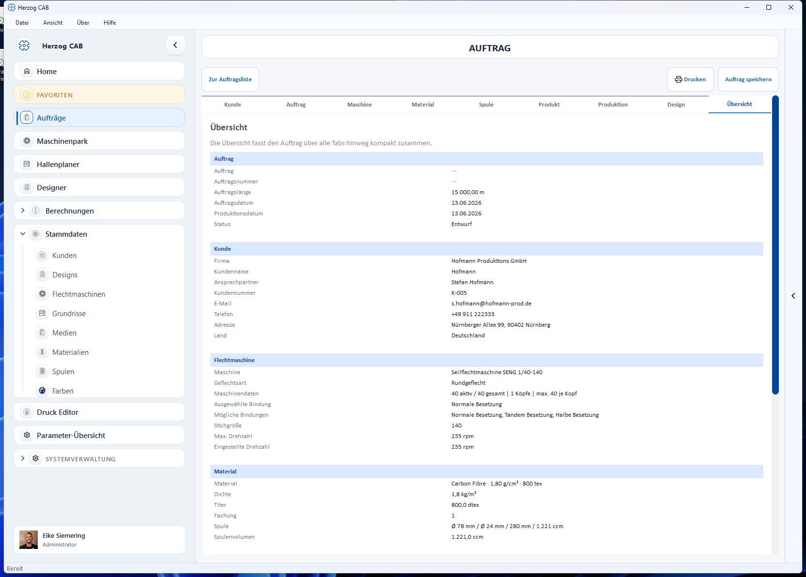

# Auftrag anlegen

Klicken Sie in der [Auftragsübersicht](index.md) auf **Neuer Auftrag**. Der
**Auftrags-Editor** öffnet sich. Er ist in Tabs gegliedert, die Sie der Reihe
nach (oder in beliebiger Reihenfolge) ausfüllen.

Oben rechts finden Sie jederzeit **Drucken** und **Auftrag speichern**; oben
links bringt Sie **Zur Auftragsliste** zurück zur Übersicht.

## Die Tabs im Überblick

| Tab | Inhalt |
|---|---|
| **Kunde** | Kunde aus den [Kundenstammdaten](../master-data/customers.md) wählen oder Daten direkt eingeben. |
| **Auftrag** | Auftragsname, Auftragsnummer, Auftragslänge, Termine und Status. |
| **Maschine** | Flechtmaschine aus dem Maschinenpark wählen; Klöppelzahl, Köpfe, Bindung, Drehzahl. |
| **Material** | Material und Spule wählen, Fachung festlegen. |
| **Spule** | Spulendaten der gewählten Spule. |
| **Produkt** | Produktbezogene Sollwerte und berechnete Werte (s. u.). |
| **Produktion** | Geschwindigkeit, Laufzeit, Spulensätze, Verkürzung. |
| **Design** | Verknüpftes Flechtdesign aus dem [Designer](../design/designer.md). |
| **Übersicht** | Kompakte Zusammenfassung über alle Tabs. |

## Tab „Auftrag"

Hier pflegen Sie die eigentlichen Auftragsdaten:

* **Auftragsname** und **Auftragsnummer**
* **Auftragslänge [m]**
* **Auftragsdatum** und **Produktionsdatum** (über das Kalendersymbol wählbar)
* **Status** (Entwurf, Freigegeben, In Produktion, Abgeschlossen)

## Tab „Produkt" – Berechnungen direkt im Auftrag

Im Tab **Produkt** stehen die produktbezogenen Soll- und berechneten Werte.
Neben vielen Feldern sehen Sie ein **Rechner-Symbol**: Damit öffnen Sie die
passende Berechnung direkt aus dem Auftrag heraus – das Ergebnis wird in den
Auftrag zurückgeschrieben.

| Feld | Berechnung |
|---|---|
| **Flechtwinkel [deg]** | [Flechtwinkel](../calculations/braid-geometry/braid-angle.md) |
| **Produktdurchmesser [mm]** | [Produktdurchmesser](../calculations/product/product-diameter.md) |
| **Geflechtsdichte** | [Flechtdichte umrechnen](../calculations/braid-geometry/picks-density.md) |
| **Materiallänge auf Spule [m]** | [Materiallänge auf Spule](../calculations/bobbins/material-length.md) |

Zusätzlich legen Sie hier **Produktname** und **Füllgrad [%]** fest.

## Speichern

Sichern Sie den Auftrag mit **Auftrag speichern** (oben rechts). Erst dann ist
er in der Übersicht dauerhaft vorhanden.

!!! tip "Alles auf einen Blick prüfen"
    Im Tab **Übersicht** sehen Sie den kompletten Auftrag zusammengefasst –
    ideal zur Endkontrolle vor dem Speichern oder Drucken.

    
