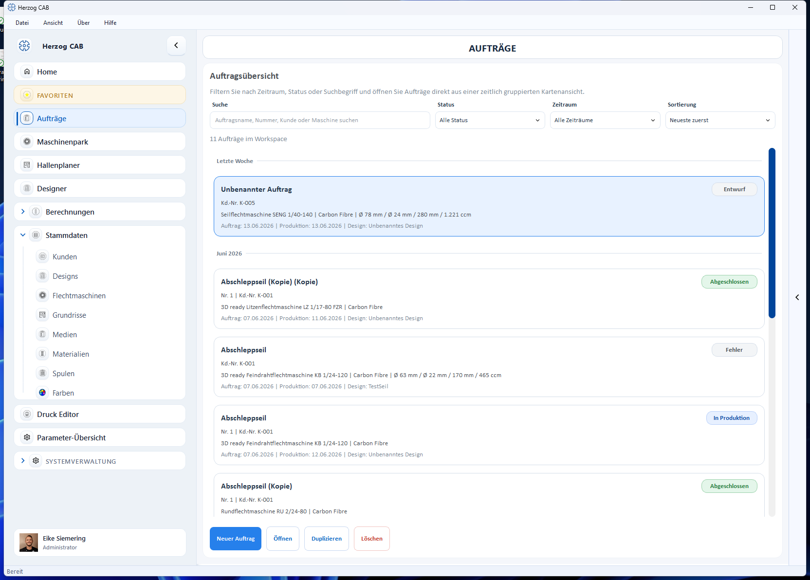

# Aufträge

Im **Auftragsmodul** fassen Sie Kunde, Maschine, Material, Spule, Produkt und
Design zu einem konkreten Kundenauftrag zusammen. Der Auftrag ist die zentrale
Arbeitsmappe in Herzog CAB: Aus ihm heraus starten Sie Berechnungen, verknüpfen
ein Design und drucken den Produktionsbegleitschein.

## Auftragsübersicht

Über den Navigationspunkt **Aufträge** öffnen Sie die Übersicht. Sie zeigt alle
Aufträge als Karten mit Kunde, Maschine, Material, Design und Status. Oben
filtern und sortieren Sie die Liste (z. B. nach Status oder Datum).

Unten stehen die Aktionen:

* **Neuer Auftrag** – einen Auftrag anlegen → [Auftrag anlegen](create.md)
* **Öffnen** – den gewählten Auftrag im Editor öffnen → [Auftrag bearbeiten](edit.md)
* **Duplizieren** – den gewählten Auftrag als Kopie anlegen
* **Löschen** – den gewählten Auftrag entfernen (mit Sicherheitsabfrage)

## Status eines Auftrags

Jeder Auftrag durchläuft einen Status, den Sie im Tab **Auftrag** setzen:

| Status | Bedeutung |
|---|---|
| **Entwurf** | In Bearbeitung, noch nicht freigegeben. |
| **Freigegeben** | Zur Produktion freigegeben. |
| **In Produktion** | Wird aktuell gefertigt. |
| **Abgeschlossen** | Fertiggestellt. |

Die Startseite (**Home**) zeigt die Anzahl der Aufträge je Status sowie die
anstehenden Produktionen der nächsten 14 Tage.

## In diesem Kapitel

* [Auftrag anlegen](create.md) – der Editor mit seinen Tabs
* [Auftrag bearbeiten](edit.md) – öffnen, ändern, duplizieren, löschen
* [QR-Code für die Maschine](qr-code.md) – mobile Auftragssicht
* [Drucken](print.md) – Produktionsbegleitschein und Vorlagen
