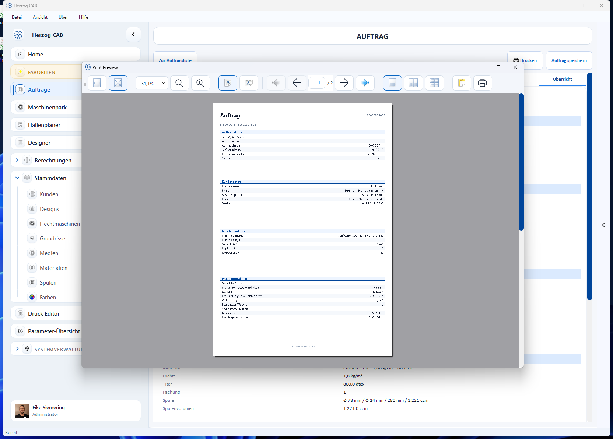

# Drucken

Einen Auftrag drucken Sie direkt aus dem [Auftrags-Editor](create.md) über die
Schaltfläche **Drucken** (oben rechts). Es öffnet sich eine **Druckvorschau**.

## Druckvorschau

In der Vorschau können Sie

* zwischen den Seiten blättern,
* die Zoomstufe anpassen und das Seitenlayout (Hoch-/Querformat, ein-/mehrseitig) wählen,
* und über das Drucker-Symbol den eigentlichen Druck starten bzw. als PDF ausgeben.

Der Standard-Ausdruck enthält die wichtigsten Abschnitte des Auftrags:
**Auftragsdaten**, **Kundendaten**, **Maschinendaten** und **Produktdaten**.

## Eigene Druckvorlagen

Aussehen und Inhalt des Ausdrucks bestimmen Sie über **Druckvorlagen**. Dort
gestalten Sie z. B. Produktionsbegleitschein, Materialliste oder Etiketten mit
Logo, Tabellen und Platzhaltern.

→ Siehe [Druckvorlagen](../print-templates/index.md).

!!! tip "Begleitschein an der Maschine"
    Für die Werkstatt empfiehlt sich ein Produktionsbegleitschein mit den
    wichtigsten Maschinen- und Produktdaten. Ergänzen Sie ihn um den
    [QR-Code](qr-code.md), damit der Bediener die mobile Auftragssicht direkt
    am Smartphone öffnen kann.
