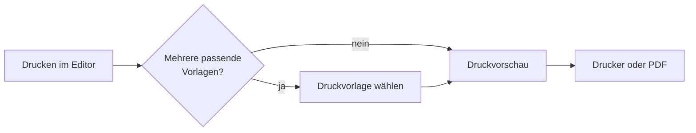
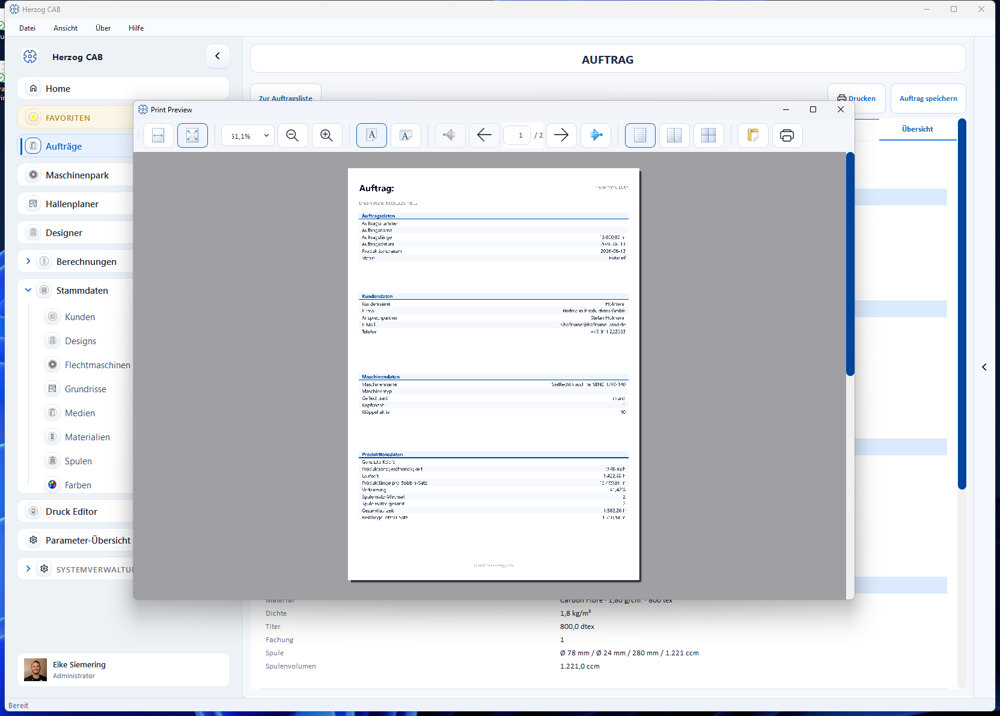

# Auftrag drucken

!!! abstract "Referenz — Druckausgabe eines Auftrags: Druckvorlage wählen, Druckvorschau nutzen und den QR-Code für die mobile Auftragssicht einsetzen."

## Wofür Sie diesen Bereich nutzen

Der Ausdruck bringt den Auftrag in die Werkstatt: als
Produktionsbegleitschein („Maschinenzettel") an der Flechtmaschine oder als Arbeitsblatt für die
Spulerei. Sie drucken direkt aus dem [Flechtauftrag-Editor](braiding-order.md)
oder dem [Spulauftrag-Editor](winding-order.md) über die Schaltfläche
**Drucken** (oben rechts).

## Ablauf beim Drucken

```mermaid
flowchart LR
  A[Drucken im Editor] --> B{Mehrere passende<br>Vorlagen?}
  B -->|ja| C[Druckvorlage wählen]
  B -->|nein| D[Druckvorschau]
  C --> D
  D --> E[Drucker oder PDF]
```

### Druckvorlage wählen

Gibt es mehrere passende Druckvorlagen, erscheint zuerst der Dialog
**Druckvorlage wählen** mit einer Auswahlliste. Herzog CAB zeigt nur
Vorlagen an, die zur Situation passen, und wählt die passende
Standardvorlage vor:

| Situation | Vorgewählte Standardvorlage |
|---|---|
| Flechtauftrag mit Design bis 48 Klöppel | Auftrags-Standardvorlage (Auftragsdaten + eine Design-Seite). |
| Flechtauftrag mit Design ab 49 Klöppeln | Große Auftragsvorlage (Auftragsdaten + zweiseitige Design-Darstellung mit großer Übersicht). |
| Spulauftrag | Spulauftrags-Standardvorlage (inkl. Sollwerten und Farbaufschlüsselung). |

Ihre eigenen Vorlagen aus dem [Druckvorlagen-Editor](../print-templates/index.md)
erscheinen immer zusätzlich in der Liste. Existiert nur eine passende
Vorlage, entfällt der Dialog und die Druckvorschau öffnet sich direkt.

!!! warning "📷 Screenshot fehlt"
    **Motiv:** Dialog „Druckvorlage wählen" mit Auswahlliste (Standardvorlage vorgewählt, eine eigene Vorlage zusätzlich sichtbar)
    **So erzeugen:** Im Flechtauftrag-Editor **Drucken** klicken; vorher unter *Druck Editor* eine eigene Auftragsvorlage anlegen, damit der Dialog erscheint
    **Ziel-Datei:** `assets/screenshots/orders/auftrag-druckvorlage-waehlen.png`

!!! info "Keine Vorlagen vorhanden"
    Sind gar keine Druckvorlagen vorhanden, bietet Herzog CAB an, den
    einfachen **Standarddruck** zu verwenden.

### Druckvorschau

In der Vorschau sehen Sie den fertigen Ausdruck Seite für Seite. Über die
Werkzeugleiste können Sie

* zwischen den Seiten blättern,
* die Zoomstufe anpassen und die Seitenansicht (einzeln, nebeneinander, Übersicht) wählen,
* das Papierformat einrichten
* und über das Drucker-Symbol den Druck starten — dort wählen Sie auch einen
  PDF-Drucker, um den Auftrag als PDF-Datei auszugeben.

Der Standard-Ausdruck eines Flechtauftrags enthält **Auftragsdaten**,
**Kundendaten**, **Maschinendaten** und **Produktionsdaten** sowie — bei
verknüpftem Design — die Design-Seite mit Vorschau und Klöppel-Tabelle. Die
Farbbezeichnungen folgen der Einstellung **Anzeige** (Farbname, Kennung,
Hex-Wert oder Pantone) aus dem
[Design-Tab](braiding-order.md#unter-tabs-ubersicht-und-kloppel-tabelle).

## Eigene Druckvorlagen

Aussehen und Inhalt des Ausdrucks bestimmen Sie über **Druckvorlagen**: Dort
gestalten Sie z. B. Produktionsbegleitschein, Materialliste oder Etiketten
mit Logo, Tabellen und Platzhaltern und legen Papierformat und Ausrichtung
fest.

→ Siehe [Druckvorlagen](../print-templates/index.md).

## QR-Code für die Maschine

Herzog CAB bringt einen **eingebauten Webserver** mit, über den Auftrags-
und Maschinendaten am Smartphone oder Tablet abrufbar sind — ideal direkt an
der Flechtmaschine. Den Zugang stellt ein **QR-Code** her: einmal mit der
Handykamera gescannt, öffnet sich die mobile Sicht im Browser.

So funktioniert es:

1. Der Webserver wird in den
   [Einstellungen > Webserver und QR-Code](../admin/settings/web-server.md)
   aktiviert. Dort wird auch der **QR-Code** angezeigt.
2. Der Bediener scannt den QR-Code mit dem Smartphone.
3. Es öffnet sich die mobile Sicht mit Maschinen- und Auftragsinformationen
   (Besetzung, Bestückung, Dokumente, Maschinendaten).

!!! info "Voraussetzung: Webserver aktiv"
    Die mobile Sicht funktioniert nur, wenn der Webserver läuft und sich
    Smartphone und PC im selben Netzwerk befinden. Aktivierung, IP-Auswahl
    und Passwortschutz sind unter
    [Webserver und QR-Code](../admin/settings/web-server.md) beschrieben.

!!! tip "QR-Code aufs Papier"
    Nehmen Sie den QR-Code in eine
    [Druckvorlage](../print-templates/elements.md) auf, damit jeder
    ausgedruckte Produktionsbegleitschein direkt zur mobilen Auftragssicht
    führt.

## Verwandte Seiten

* [Flechtauftrag-Editor](braiding-order.md) und [Spulauftrag-Editor](winding-order.md) — hier starten Sie den Druck
* [Druckvorlagen](../print-templates/index.md) — Vorlagen anlegen und gestalten
* [Vorschau und Druck](../print-templates/preview-and-print.md) — Druckausgabe aus Sicht der Vorlagen
* [Webserver und QR-Code](../admin/settings/web-server.md) — mobile Auftragssicht einrichten
* [Probleme beim Drucken](../help/print-problems.md) — wenn der Ausdruck nicht klappt
