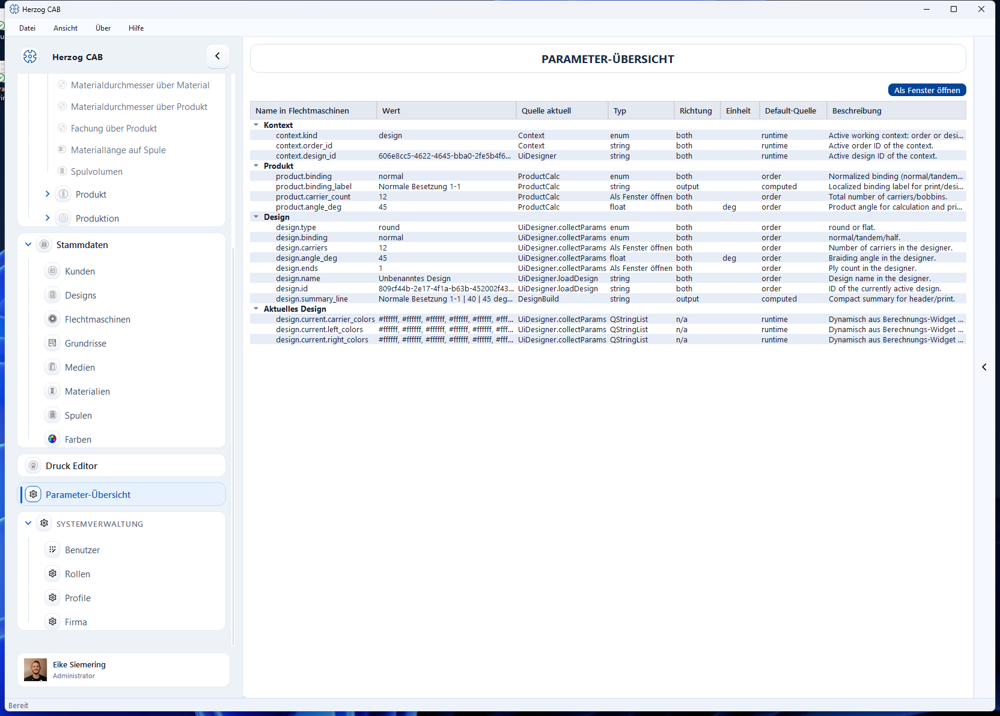

# Parameter-Übersicht

!!! abstract "Referenz — Alle aktuell aktiven Programmwerte mit Wert, Quelle und Beschreibung"

## Wofür Sie diesen Bereich nutzen

Die **Parameter-Übersicht** (in der App auch „Parameter Explorer“ genannt)
zeigt alle Programmwerte, die Herzog CAB gerade im Kontext aktiv hält, an
einer einzigen Stelle – mit ihrem aktuellen Wert, ihrer Herkunft und einer
Beschreibung. Sie ist vor allem ein **Experten- und Diagnosewerkzeug**, um
nachzuvollziehen, wie Werte zwischen Auftrag, Berechnungen und Designer
zusammenhängen, und um genau die Programmwerte zu finden, die Sie z. B. in
einer [Druckvorlage](../print-templates/elements.md) als Platzhalter
verwenden möchten.

## Der Bildschirm im Überblick

Sie erreichen die Parameter-Übersicht über den gleichnamigen
Navigationspunkt. Oben rechts steht die Schaltfläche **Als Fenster öffnen**,
darunter die Baumtabelle mit allen Parametern, gruppiert nach Bereich.

## Bedienelemente im Detail

### Als Fenster öffnen

Öffnet die Parameter-Übersicht zusätzlich in einem eigenen, unabhängigen
Fenster (z. B. um sie auf einen zweiten Bildschirm zu ziehen, während Sie an
anderer Stelle weiterarbeiten). Ein erneuter Klick bringt ein bereits
geöffnetes Fenster nur wieder in den Vordergrund, statt ein zweites zu öffnen.

### Baumtabelle

Die Parameter sind nach Bereich gruppiert und aufgeklappt dargestellt, z. B.
**Kontext**, **Auftrag**, **Kunde**, **Maschine**, **Design**, **Aktuelles
Design**, **Designbibliothek**, **Berechnungen** (mit einer Untergruppe je
zuletzt genutzter Berechnung) und **Laufzeitwerte** für Werte, die zur
Laufzeit aus einem Berechnungs-Baustein übernommen wurden. Nur Parameter, für
die aktuell ein Wert vorliegt, erscheinen in der Liste.

| Spalte | Bedeutung |
|---|---|
| **Parameter-ID** | Eindeutiger technischer Name des Parameters (z. B. `winding.line_speed_m_per_min`). |
| **Wert** | Aktueller Wert. Wurde er geändert, ohne dass die zugehörige Berechnung schon neu ausgeführt wurde, erscheint er kursiv mit dem Zusatz „(dirty)“. |
| **Quelle aktuell** | Woher der aktuelle Wert stammt (z. B. eine Berechnung, der Auftrag oder eine manuelle Eingabe). |
| **Typ** | Datentyp des Parameters (`int`, `float`, `bool`, `string`, `enum` oder `string_list`). |
| **Richtung** | Ob der Parameter eine Eingabe (`input`), ein Ergebnis (`output`) oder beides (`both`) ist. |
| **Einheit** | Maßeinheit des Werts, sofern vorhanden. |
| **Default-Quelle** | Woher der Vorgabewert stammt. |
| **Beschreibung** | Kurzerläuterung des Parameters. |

Die Übersicht aktualisiert sich automatisch, sobald sich ein Parameterwert
ändert – ein manuelles Neuladen ist nicht nötig.

!!! warning "Berechtigung erforderlich"
    Zum Öffnen der Parameter-Übersicht benötigen Sie die Berechtigung
    **Parameter Explorer öffnen** (Gruppe „Spezialwerkzeuge“). Mehr dazu unter
    [Rollen](../admin/roles.md).

!!! note "Für den Alltag selten nötig"
    Die normale Bedienung läuft über die [Berechnungen](../calculations/index.md)
    und den [Flechtauftrag](../orders/braiding-order.md). Die Parameter-Übersicht
    hilft, wenn Sie ein Ergebnis nachvollziehen, eine ungewöhnliche
    Wertkonstellation prüfen oder den technischen Namen eines Werts für eine
    [Druckvorlage](../print-templates/elements.md) nachschlagen möchten.

## Verwandte Seiten

* [Elemente und Platzhalter](../print-templates/elements.md) – Programmwerte als Platzhalter in Druckvorlagen verwenden
* [Berechnungen](../calculations/index.md) – die Rechner, aus denen viele Parameter stammen
* [Rollen](../admin/roles.md) – Berechtigungen verwalten
