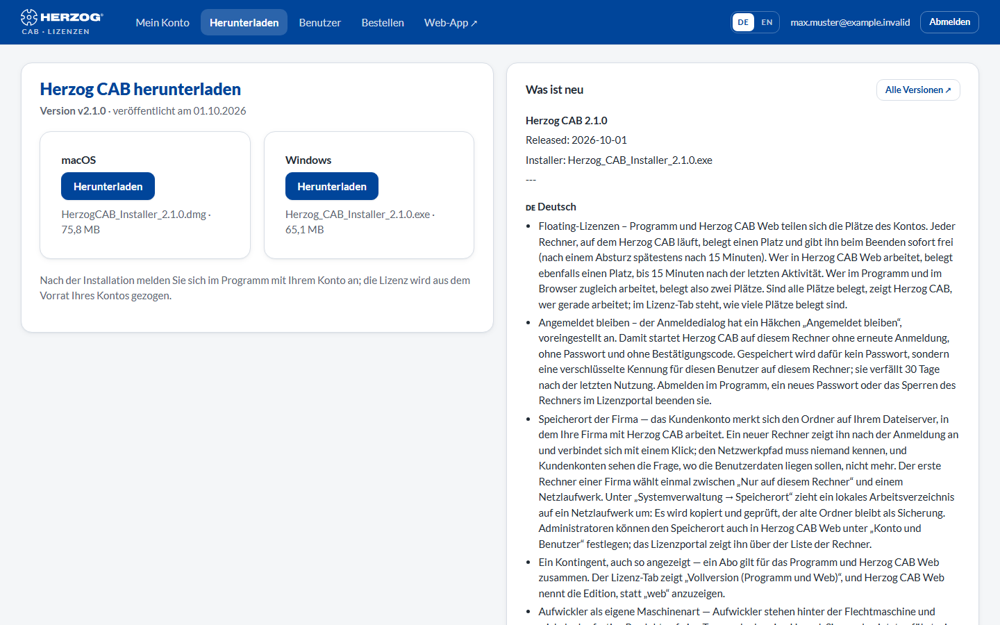

# Herunterladen

!!! abstract "Referenz — Die Seite „Herunterladen" im Lizenzportal: die neueste Version der Desktop-App für Windows"

## Wofür Sie diesen Bereich nutzen

Hier laden Sie den aktuellen **Installer der Desktop-App** — für die
Erstinstallation ebenso wie für ein Update ohne Maintenance-Tool. Ein
Installationspaket per E-Mail oder USB-Stick ist damit nicht mehr nötig.

## Der Bildschirm im Überblick

| Element | Bedeutung |
|---|---|
| **Version** und Datum | Die neueste veröffentlichte Version von Herzog CAB und ihr Veröffentlichungsdatum. |
| **Herunterladen** (Windows) | Lädt `Herzog_CAB_Installer_<Version>.exe`. |
| **macOS** | Für Version 2 gibt es kein macOS-Paket. Die Karte zeigt dann *Für diese Version noch nicht verfügbar*. macOS gibt es auf Anfrage beim Vertrieb. |
| **Was ist neu** | Die Neuerungen der Version in Kurzform; die vollständigen Versionshinweise stehen auf der Release-Seite (Link **Alle Versionen**). |

Nach der Installation melden Sie sich im Programm mit Ihrem Konto an — die
Lizenz wird aus dem Vorrat Ihres Kontos gezogen. Wie das geht, steht unter
[Herzog CAB installieren](../setup/installer.md) und
[Anmelden und Lizenz beziehen](../setup/activate-license.md).

!!! info "Ein Installer für alle Editionen"
    Vollversion, Designer-Edition und Testversion nutzen denselben Installer;
    die Bausteine Ihres Kontos entscheiden, was nach der Anmeldung
    freigeschaltet ist.

## Verwandte Seiten

* [Updates installieren](../setup/update.md) — der Weg über das Maintenance-Tool
* [Versionshinweise](../appendix/changelog.md) — was sich je Version geändert hat
* [Systemvoraussetzungen](../setup/system-requirements.md)
