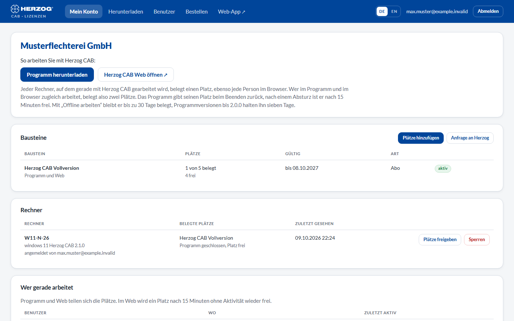

# Lizenzportal

!!! abstract "Referenz — Das Lizenzportal unter license.herzog-cab.com: Kundenkonto, Bausteine, Rechner, Benutzer und Anfragen an einem Ort"

## Wofür Sie diesen Bereich nutzen

Im **Lizenzportal** verwalten die Administratoren Ihrer Firma das
[Kundenkonto](../setup/account.md): Welche Bausteine sind freigeschaltet,
welche Rechner belegen Plätze, wer darf sich anmelden, und welche Anfragen
laufen gerade bei Herzog. Jeder Benutzer kann dort außerdem sein Passwort
ändern, einen zweiten Faktor einrichten und die neueste Programmversion
laden.

Sie erreichen das Portal unter **[license.herzog-cab.com](https://license.herzog-cab.com)**
— aus der Desktop-App auch über *Einstellungen > Lizenz > Lizenzportal
öffnen*, aus der Web-App über *Benutzermenü > Konto und Benutzer >
Lizenzportal öffnen*.

- :material-view-dashboard-outline: **Mein Konto**

    ---

    Bausteine mit Plätzen und Laufzeit, angemeldete Rechner, wer gerade
    arbeitet, laufende Anfragen.

    [:octicons-arrow-right-24: Mein Konto](licenses.md)

- :material-account-multiple-plus-outline: **Benutzer**

    ---

    Kollegen einladen, Rollen vergeben, Zugänge deaktivieren, Einladungen
    erneuern.

    [:octicons-arrow-right-24: Benutzer](users.md)

- :material-cart-outline: **Bestellen**

    ---

    Jahresabo bestellen, Plätze dazukaufen oder verlängern. Der Ablauf ist
    derselbe wie in der Web-App.

    [:octicons-arrow-right-24: Abo und Bestellung](../web/subscription.md)

- :material-cart-plus: **Lizenz anfordern**

    ---

    Mehr Plätze, eine Verlängerung oder einen anderen Baustein direkt bei
    Herzog anfragen.

    [:octicons-arrow-right-24: Lizenz anfordern](requests.md)

- :material-download: **Herunterladen**

    ---

    Die neueste Version der Desktop-App für Windows und macOS samt
    Versionshinweisen.

    [:octicons-arrow-right-24: Herunterladen](download.md)

- :material-shield-key-outline: **Passwort und zweiter Faktor**

    ---

    Passwort ändern und die Anmeldung in zwei Schritten mit einer
    Authenticator-App einrichten.

    [:octicons-arrow-right-24: Passwort und zweiter Faktor](security.md)

## Anmelden

Das Portal fragt **E-Mail-Adresse** und **Passwort** Ihres Kontobenutzers
ab — dieselben Zugangsdaten wie in der Desktop-App und der Web-App. Ist für
Ihren Benutzer ein [zweiter Faktor](security.md) eingerichtet, folgt eine
zweite Seite, auf der Sie den sechsstelligen Code aus der Authenticator-App
eintragen.

| Element | Bedeutung |
|---|---|
| **E-Mail-Adresse** / **Passwort** | Ihre Zugangsdaten im Kundenkonto. |
| **Anmelden** | Meldet Sie an; bei eingerichtetem zweiten Faktor folgt die Code-Abfrage. |
| **Passwort vergessen** | Fordert einen Link zum Setzen eines neuen Passworts an (siehe unten). |

Einen Zugang legen Sie nicht selbst an: Herzog richtet das Konto ein und
lädt den ersten Administrator ein, weitere Benutzer lädt ein Administrator
Ihres Kontos ein — siehe [Kundenkonto und Einladung](../setup/account.md).

### Passwort vergessen

1. Klicken Sie auf der Anmeldeseite auf **Passwort vergessen**.
2. Tragen Sie Ihre E-Mail-Adresse ein und klicken Sie auf **Link anfordern**.
3. Gibt es zu dieser Adresse einen Zugang, erhalten Sie eine E-Mail mit
   einem Link. Er gilt **eine Stunde**.
4. Über den Link setzen Sie ein neues Passwort (mindestens 10 Zeichen).

Das neue Passwort gilt sofort auch für die Desktop-App und die Web-App.

## Der Bildschirm im Überblick

Nach der Anmeldung zeigt das Portal oben eine Menüleiste, darunter die
Seite **Mein Konto**.

| Menüpunkt | Inhalt |
|---|---|
| **Mein Konto** | Startseite: Firma, Kundennummer, [Bausteine, Rechner, wer gerade arbeitet, Anfragen](licenses.md). |
| **Herunterladen** | [Neueste Version der Desktop-App](download.md). Nur mit einem Baustein für das Programm. |
| **Benutzer** | [Benutzerliste, Einladungen, Rollen](users.md). |
| **Bestellen** | Jahresabo bestellen, Plätze dazukaufen oder verlängern, wie unter [Abo und Bestellung](../web/subscription.md) beschrieben. Bestellen können nur Administratoren. |
| **Web-App** | Öffnet [app.herzog-cab.com](https://app.herzog-cab.com) in einem neuen Tab. Nur, wenn das Konto die Web-App nutzen darf. |
| **Sprache** | Deutsch oder Englisch — die Wahl gilt für Ihren Benutzer. |
| **Passwort und zweiter Faktor** | [Sicherheitseinstellungen](security.md) Ihres Benutzers. |
| **Abmelden** | Beendet die Portal-Sitzung. |

!!! info "Wer sieht was?"
    **Administratoren** sehen und verwalten alles. **Bearbeiter** und
    **Betrachter** sehen das Konto und ihre eigenen Sicherheitseinstellungen,
    können aber weder Rechner freigeben noch Benutzer einladen, bestellen
    oder Lizenzen anfragen. Das Portal blendet die entsprechenden
    Schaltflächen aus.

## Verwandte Seiten

* [Kundenkonto und Einladung](../setup/account.md) — das Konzept hinter Konto, Bausteinen und Plätzen
* [Anmelden und Lizenz beziehen](../setup/activate-license.md) — Rechner am Konto anmelden
* [Lizenz und Cloud (Einstellungen)](../admin/settings/license.md) — Lizenzstatus in der Desktop-App
* [Web-App](../web/index.md) — Herzog CAB im Browser
* [Lizenzprobleme](../help/license-problems.md)
