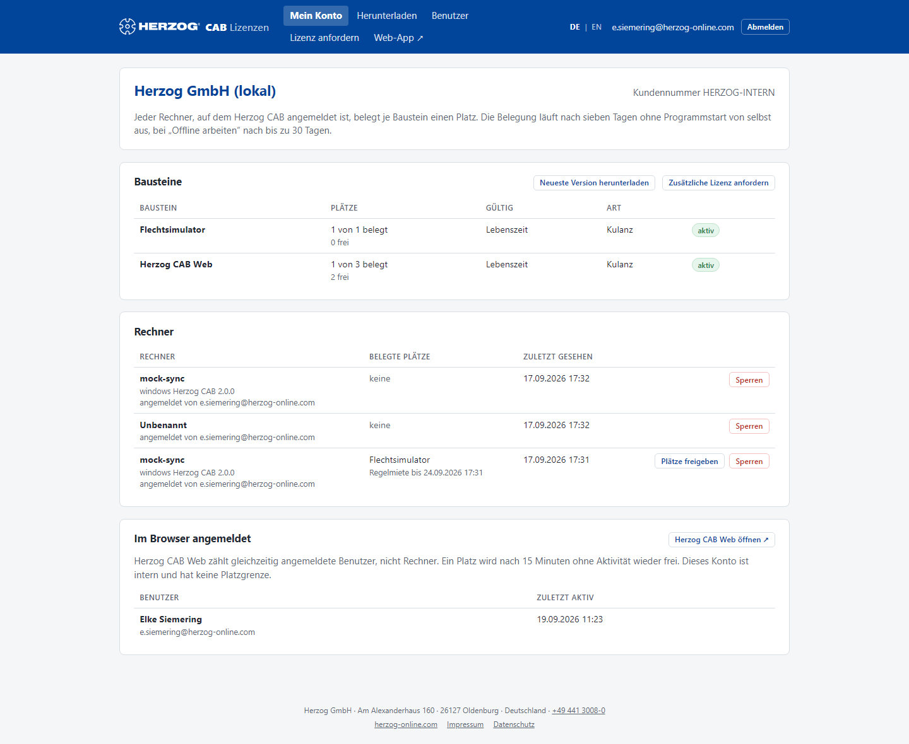

# Mein Konto — Bausteine, Rechner und Plätze

!!! abstract "Referenz — Die Startseite des Lizenzportals: Bausteine mit Plätzen, angemeldete Rechner, Benutzer im Browser und Ihre Anfragen"

## Wofür Sie diesen Bereich nutzen

**Mein Konto** ist die Übersicht Ihres Kundenkontos. Hier sehen Sie auf
einen Blick, welche Bausteine Ihre Firma hat, wie viele Plätze davon belegt
sind, welche Rechner sie belegen und wer gerade in der Web-App arbeitet.
Administratoren geben hier Plätze frei, sperren Rechner und verfolgen den
Stand ihrer Anfragen an Herzog.

## Der Bildschirm im Überblick

Die Seite besteht aus vier Karten, von oben nach unten:

| Karte | Inhalt |
|---|---|
| **Firma** | Firmenname, Kundennummer und der Hinweis, wie Plätze belegt und wieder frei werden. Ist das Konto gesperrt, steht hier eine rote Meldung — dann gibt der Lizenzserver keine neuen Lizenzen mehr aus. |
| **Bausteine** | Tabelle aller Freischaltungen mit Plätzen und Laufzeit; Schaltflächen **Neueste Version herunterladen** und **Zusätzliche Lizenz anfordern**. |
| **Rechner** | Alle Rechner, die sich mit Herzog CAB am Konto angemeldet haben, mit belegten Plätzen und Miete. |
| **Im Browser angemeldet** | Benutzer, die gerade in der Web-App arbeiten (nur mit Web-Baustein). |
| **Anfragen** | Ihre Lizenzanfragen an Herzog mit Status und Antwort. |

## Bedienelemente im Detail

### Bausteine

| Spalte | Bedeutung |
|---|---|
| **Baustein** | Name des Bausteins (z. B. *Herzog CAB Vollversion*, *Herzog CAB Web*), darunter ggf. Ihre Bestellreferenz. Welche Bausteine es gibt, steht unter [Kundenkonto und Einladung](../setup/account.md#bausteine). |
| **Plätze** | *belegt von gesamt* und darunter die Zahl der freien Plätze. Ein Platz ist bei Desktop-Bausteinen ein Rechner, bei Web-Bausteinen ein gleichzeitig angemeldeter Benutzer. |
| **Gültig** | *Lebenszeit* oder *bis &lt;Datum&gt;*. Läuft eine Freischaltung in **30 Tagen oder weniger** ab, steht das gelb dabei und Administratoren sehen die Schaltfläche **Verlängern**. |
| **Art** | Woher die Freischaltung stammt: *Kauf*, *Abo*, *Testversion*, *Dongle-Ersatz* oder *Kulanz*. |
| Status | **aktiv**, **abgelaufen** (Laufzeit vorbei) oder **beendet** (von Herzog beendet). |

| Schaltfläche | Wirkung |
|---|---|
| **Neueste Version herunterladen** | Wechselt zu [Herunterladen](download.md). |
| **Zusätzliche Lizenz anfordern** | Wechselt zu [Lizenz anfordern](requests.md) — nur für Administratoren. |
| **Verlängern** | Öffnet die Anfrage *Laufzeit verlängern* für diese Freischaltung, vorbelegt mit +12 Monaten. |

!!! info "Erinnerung vor dem Ablauf"
    Läuft eine Freischaltung ab, erhalten die Administratoren des Kontos
    **30 Tage und 7 Tage** vorher eine E-Mail von Herzog. Verlängern Sie rechtzeitig — nach dem
    Ablauf startet die Desktop-App mit diesem Baustein nicht mehr und die
    Web-App verweigert die Anmeldung.

### Rechner

Jeder Rechner, auf dem Herzog CAB am Konto angemeldet ist, erscheint hier
mit seinem Windows-Rechnernamen.

| Spalte | Bedeutung |
|---|---|
| **Rechner** | Rechnername (ohne Namen: *Unbenannt*), darunter *angemeldet von &lt;E-Mail&gt;* — der Benutzer, der den Rechner zuletzt angemeldet hat. Gesperrte oder abgemeldete Rechner sind entsprechend markiert. |
| **Belegte Plätze** | Die Bausteine, für die dieser Rechner je einen Platz hält. |
| **Zuletzt gesehen** | Wann sich der Rechner zuletzt beim Lizenzserver gemeldet hat. |
| Miete | *Regelmiete bis &lt;Zeit&gt;* oder *Offline bis &lt;Zeit&gt;* — solange gilt die Lizenz auf dem Rechner auch ohne Verbindung. |

| Schaltfläche | Wirkung |
|---|---|
| **Plätze freigeben** | Gibt alle Plätze dieses Rechners sofort frei, z. B. wenn ein Rechner ausgemustert wurde, ohne sich vorher abzumelden. Beim nächsten Programmstart holt er sich neue Plätze, sofern welche frei sind. |
| **Sperren** | Der Rechner bekommt keine Lizenz mehr, bis er entsperrt wird — etwa bei einem verlorenen Laptop. Seine Plätze werden frei. |
| **Entsperren** | Hebt die Sperre wieder auf. |

Die Schaltflächen sehen nur Administratoren. Solange noch kein Rechner
angemeldet ist, steht hier *„Noch kein Rechner angemeldet. Nach der
Anmeldung im Programm erscheint er hier."*

!!! tip "Plätze werden auch von selbst frei"
    Ein Rechner, der **sieben Tage** nicht gestartet wurde, verliert seine
    Regelmiete und damit seine Plätze automatisch; eine
    [Offline-Miete](../admin/settings/license.md) endet nach spätestens
    30 Tagen. **Plätze freigeben** brauchen Sie nur, wenn es schneller gehen
    muss.

### Im Browser angemeldet

Diese Karte erscheint, sobald das Konto einen Web-Baustein hat. Sie listet
die Benutzer, die gerade in der [Web-App](../web/index.md) angemeldet sind,
mit dem Zeitpunkt ihrer letzten Aktivität. Ein Web-Platz wird nach
**15 Minuten ohne Aktivität** wieder frei. Interne Konten haben keine
Platzgrenze. Über **Herzog CAB Web öffnen** gelangen Sie direkt zur Web-App.

### Anfragen

Alle [Lizenzanfragen](requests.md) Ihres Kontos mit **Datum**, Inhalt und
**Status**:

| Status | Bedeutung |
|---|---|
| **in Bearbeitung** | Herzog hat die Anfrage erhalten. |
| **erledigt** | Die Freischaltung wurde angepasst — sie erscheint sofort in der Tabelle **Bausteine**. |
| **abgelehnt** | Herzog hat die Anfrage nicht ausgeführt; die Begründung steht unter *Antwort von Herzog*. |

Zu jeder erledigten oder abgelehnten Anfrage erhalten die Administratoren
auch eine E-Mail.

## Verwandte Seiten

* [Kundenkonto und Einladung](../setup/account.md) — was Bausteine und Plätze sind
* [Lizenz anfordern](requests.md) — mehr Plätze, Verlängerung, weiterer Baustein
* [Benutzer](users.md) — wer sich anmelden darf
* [Lizenz und Cloud (Einstellungen)](../admin/settings/license.md) — Offline-Miete und Abmelden in der Desktop-App
* [Lizenzprobleme](../help/license-problems.md) — *Kein freier Platz* und andere Meldungen
