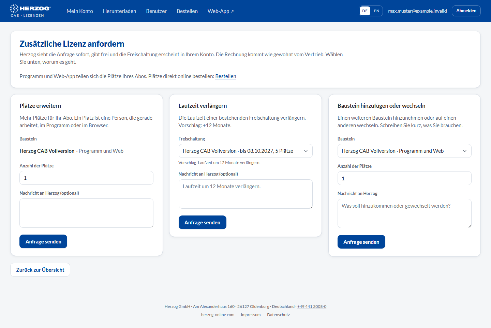

# Lizenz anfordern

!!! abstract "Referenz — Die Seite „Lizenz anfordern" im Lizenzportal: mehr Plätze, eine Verlängerung oder einen weiteren Baustein bei Herzog anfragen"

## Wofür Sie diesen Bereich nutzen

Braucht Ihre Firma mehr Plätze, läuft eine Freischaltung ab oder soll ein
weiterer Baustein dazukommen, müssen Sie nicht anrufen: Administratoren
schicken die Anfrage direkt aus dem Portal. Herzog sieht sie sofort,
schaltet frei, und die Änderung erscheint in Ihrem Konto unter
[Mein Konto](licenses.md). Die Rechnung kommt wie gewohnt vom Vertrieb.

!!! info "Nur für Administratoren"
    Bearbeiter und Betrachter sehen statt des Formulars den Hinweis, sich an
    einen Administrator ihres Kontos zu wenden.

## Der Bildschirm im Überblick

Die Seite bietet drei Anfragearten als eigene Abschnitte. Sie füllen nur
den passenden aus und klicken dort auf **Anfrage senden**.

## Bedienelemente im Detail

### Mehr Plätze

Für einen Baustein, den Sie schon haben: ein Platz je Rechner, der
gleichzeitig arbeiten soll (bei Web-Bausteinen: je gleichzeitig
angemeldetem Benutzer).

| Feld | Bedeutung |
|---|---|
| **Baustein** | Auswahl unter Ihren aktiven Freischaltungen. |
| **Anzahl der Plätze** | Wie viele Plätze **zusätzlich** gewünscht sind. |
| **Nachricht an Herzog (optional)** | Freitext, z. B. Bestellnummer oder Rückfragen. |

### Laufzeit verlängern

Für eine befristete Freischaltung. Der Vorschlag lautet **+12 Monate**;
schreiben Sie in die Nachricht, wenn Sie etwas anderes möchten. Diesen
Abschnitt erreichen Sie auch direkt über **Verlängern** in der
Bausteintabelle unter [Mein Konto](licenses.md) — dann ist die
Freischaltung schon vorbelegt.

| Feld | Bedeutung |
|---|---|
| **Freischaltung** | Die zu verlängernde Freischaltung mit ihrem aktuellen Enddatum. Gibt es keine befristete aktive Freischaltung, ist der Abschnitt leer. |
| **Nachricht an Herzog** | Vorbelegt mit *„Laufzeit um 12 Monate verlängern."* |

### Weiterer Baustein

Einen Baustein hinzunehmen (z. B. die Web-App zur Desktop-Vollversion) oder
auf einen anderen wechseln (z. B. von der Testversion zur Vollversion).

| Feld | Bedeutung |
|---|---|
| **Nachricht an Herzog** | Beschreiben Sie kurz, was hinzukommen oder gewechselt werden soll und wie viele Plätze Sie brauchen. |

### Nach dem Absenden

* Die Anfrage erscheint unter [Mein Konto → Anfragen](licenses.md#anfragen)
  mit dem Status **in Bearbeitung**.
* Herzog erledigt oder beantwortet sie; Sie erhalten eine E-Mail, und der
  Status wechselt auf **erledigt** oder **abgelehnt** (mit Antworttext).
* Eine erledigte Anfrage wirkt sofort: Neue Plätze stehen beim nächsten
  Programmstart zur Verfügung, eine Verlängerung verschiebt das Enddatum,
  ein neuer Baustein erscheint in der Bausteintabelle.

!!! tip "Jahresabo direkt bestellen"
    Das Jahresabo bestellen, Plätze dazukaufen oder verlängern können Sie
    auch direkt. Im Lizenzportal geht das unter *Bestellen*, in der Web-App
    unter *Benutzermenü > Abo und Bestellung*. Siehe
    [Abo und Bestellung](../web/subscription.md).

## Verwandte Seiten

* [Mein Konto](licenses.md) — Stand der Anfragen, Bausteine und Plätze
* [Kundenkonto und Einladung](../setup/account.md) — welche Bausteine es gibt
* [Support kontaktieren](../help/support.md) — wenn Sie lieber sprechen möchten
