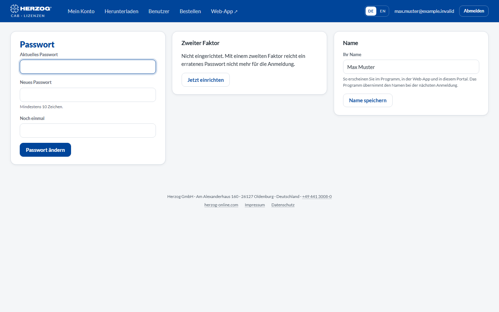

# Passwort, zweiter Faktor und Name

!!! abstract "Referenz — Die eigene Seite im Lizenzportal: Passwort ändern, die Anmeldung in zwei Schritten einrichten und den eigenen Namen ändern"

## Wofür Sie diesen Bereich nutzen

Ihr Konto-Passwort gilt für das Lizenzportal, die Desktop-App und die
Web-App gleichermaßen — geändert wird es **nur hier**. Außerdem richten Sie
hier den **zweiten Faktor** ein: Danach verlangt jede Anmeldung zusätzlich
einen sechsstelligen Code aus einer Authenticator-App, und ein erratenes
Passwort allein reicht nicht mehr. Und Sie ändern hier Ihren **Namen**, so
wie er im Programm, in der Web-App und im Portal erscheint.

Sie erreichen die Seite über **Ihre E-Mail-Adresse** rechts oben in der
Kopfleiste des Portals (Hinweis beim Zeigen darauf: *Passwort, zweiter
Faktor und Name*). Aus der Web-App führt *Einstellungen > Passwort und
Sicherheit* hierher.

## Der Bildschirm im Überblick

Die Seite besteht aus drei Karten: **Passwort**, **Zweiter Faktor** und
**Name**.

## Bedienelemente im Detail

### Passwort ändern

| Feld / Schaltfläche | Bedeutung |
|---|---|
| **Aktuelles Passwort** | Ihr bisheriges Passwort. |
| **Neues Passwort** | Mindestens **10 Zeichen**. |
| **Noch einmal** | Wiederholung des neuen Passworts. |
| **Passwort ändern** | Speichert das neue Passwort. Es gilt sofort — auch für die nächste Anmeldung in der Desktop-App und der Web-App. |

Kommen Sie über den Link aus einer Einladung zum ersten Mal hierher, fehlt
das Feld **Aktuelles Passwort**, und die Seite zeigt nur diese Karte mit dem
Hinweis *Bitte zuerst ein eigenes Passwort setzen.*

!!! warning "Desktop-App nach dem Passwortwechsel"
    Nach einem neuen Passwort verlangt die Desktop-App auf allen Rechnern,
    auf denen Sie angemeldet sind, eine neue Anmeldung, auch mit
    *Angemeldet bleiben*. Ein laufendes Programm arbeitet bis zum Ende
    seiner Miete weiter. Die Desktop-App merkt sich für die Offline-Anmeldung
    außerdem das Passwort der letzten **Online**-Anmeldung. Melden Sie sich
    deshalb einmal mit Internetverbindung an, damit auch der Offline-Weg das
    neue Passwort kennt.

### Zweiter Faktor

| Zustand | Was die Karte zeigt |
|---|---|
| **Nicht eingerichtet** | Hinweis und Schaltfläche **Jetzt einrichten**. Für Kundenbenutzer ist der zweite Faktor freiwillig, aber empfohlen — besonders für Administratoren. |
| **Eingerichtet** | Bestätigung, dass bei jeder Anmeldung der Code verlangt wird, und der Hinweis, dass Herzog den zweiten Faktor bei Bedarf zurücksetzt. |

#### So richten Sie den zweiten Faktor ein

1. Klicken Sie auf **Jetzt einrichten**. Die Seite **Zweiter Faktor
   einrichten** zeigt einen QR-Code.
2. Öffnen Sie eine Authenticator-App auf dem Handy — z. B. **1Password**,
   **Bitwarden**, **Microsoft Authenticator** oder **Google Authenticator**
   — und scannen Sie den Code. Kann die App nicht scannen, tragen Sie den
   darunter angezeigten **Schlüssel** von Hand ein; am Handy geht es auch
   über den Link **In der Authenticator-App öffnen**.
3. Tippen Sie zur Bestätigung den **aktuellen Code** aus der App in das
   Feld ein und klicken Sie auf **Einrichten**.

Ab jetzt fragen Portal, Desktop-App und Web-App nach Passwort **und** Code:

* Im **Portal** folgt nach dem Passwort eine eigene Seite für den Code.
* In der **Desktop-App** blendet der Anmeldedialog nach dem ersten Klick auf
  **Anmelden** das Feld **Code (Authenticator-App)** ein.
* In der **Web-App** wechselt die Anmeldekarte nach dem Passwort zu
  **Bestätigen** mit sechs Kästchen für den Code, siehe
  [Anmelden (Web-App)](../web/login.md#code-aus-der-authenticator-app).

!!! warning "Zugriff auf die App verloren?"
    Der zweite Faktor lässt sich nicht selbst abschalten. Ist das Handy weg,
    wenden Sie sich an Herzog — der Support setzt den zweiten Faktor für
    Ihren Benutzer zurück, danach können Sie ihn neu einrichten.

### Name

Hier ändern Sie Ihren eigenen Namen, zum Beispiel nach einem Tippfehler
in der Einladung.

| Feld / Schaltfläche | Bedeutung |
|---|---|
| **Ihr Name** | So erscheinen Sie im Programm, in der Web-App und im Portal. Höchstens 190 Zeichen. Bleibt das Feld leer, hat Ihr Benutzer keinen Namen; dann erscheint die E-Mail-Adresse. |
| **Name speichern** | Speichert den Namen. Das Portal bestätigt *Der Name ist gespeichert.* |

Die Desktop-App übernimmt den Namen bei der nächsten Anmeldung. Im
Programm selbst lässt sich der Name eines Kontobenutzers nicht dauerhaft
ändern, weil es ihn bei jeder Anmeldung aus dem Kundenkonto holt. Die Namen
anderer Benutzer ändern Administratoren auf der Seite
[Benutzer](users.md#benutzerliste).

## Verwandte Seiten

* [Lizenzportal](index.md) — Anmelden und *Passwort vergessen*
* [Anmelden und Abmelden (Desktop-App)](../admin/login.md)
* [Anmelden (Web-App)](../web/login.md)
* [Benutzer einladen und verwalten](users.md) — Namen anderer Benutzer ändern
* [Mein Profil (Desktop-App)](../admin/my-profile.md)
* [Login-Probleme](../help/login-problems.md)
